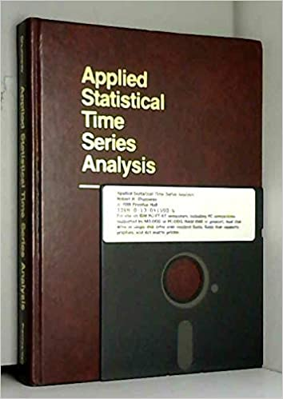

## This is the changelog for 

**more than just data ...**  
 

To update the package to the most recent version, you just need the following two lines:

> `install.packages("remotes")` 
> `remotes::install_github("nickpoison/astsa")`

Some notes on the installation.  If `astsa` is loaded, then detach it first: `detach(package:astsa)`.  If you get a warning to install Rtools, ignore it.
After successful installation, don't forget to reload  `astsa`. If you get an error, just restart R and reload `astsa`.

You can also install the package directly from the archive:
[astsa_1.12.tar.gz](https://github.com/nickpoison/astsa/blob/master/astsa_1.12.tar.gz). Download it (there's a button) and in R, use _Install package(s) from local files..._ 

---
---
### Version 1.12 - Dec 2020

 The main change  was to add a  simulation script `sarima.sim` for
seasonal ARIMA models. v1.12 is here and on CRAN.  The version here is
slightly updated with some streamlining of code- there are no output/input changes
though.

---
#### Version 1.11 -- in the garbage

Forget this version... 
In v1.10.6 and v1.11, the `sarima.sim` code had bloopers because we weren't 
counting from (power) 0 when multiplying the nonseasonal  with the seasonal polynomials. 
The pure nonseasonal or pure seasonal stuff was ok though (in case you used
it) and nothing will change in these cases. 

---

### Versions 1.10 - May 2020 

1.10.6 (Nov 2020 - Github)

+ added `sarima.sim` to simulate data from (possibly seasonal) ARIMA models ... as usual, it has simplified `astsa` syntax - the model is specified by the parameters, no lists are needed.  The script uses `polyMul` (also added) to obtain the appropriate autoregessive and moving average polynomials from the specified model.  

+ Changed any script that used colors as numbers to color names (due to change in R v4 palettes).

+ added PACF option to `acf1` so you can see the PACF alone

+ added `plot` option in `sarima.for`. 

+ added `spec.ic` which is similar to `spec.ar` but has option to base the AR spectral estimate on BIC and to `detrend` before the fit.

+ fixed `tsplot` - the minor ticks weren't changing on multiple plots

1.10 (May 2020 - CRAN)
Since Version 1.9, see the updates 1.9.1-4 below.  The major change was to fix routines
that produced graphics but  didn't work on Apple's OS. In addition, I made `tsplot` even more useful:

+ For `tsplot`, I added an argument (`byrow`) where you can plot row wise (`TRUE`) or 
column wise (`FALSE`) for multiple plots. 

+ Also, for `tsplot`, added an argument `gg` so if it's true the plot will *resemble* a ggplot ... e.g., `tsplot(climhyd, ncolm=2, gg=TRUE, col=rainbow(6,v=.8), lwd=2)`. 

------------------------------

### Versions 1.9 - May 2019  

1.9.4  

+ Added the polio data (`polio`) set from the gamlss.data package.  It is used in Chapter 6 problems. I added it because gamlss.data has data sets with names that are the same as those in astsa. I hate to see package fights.

1.9.3  

+ Updated correlation scripts: 

   - for `acf1` and `acf2`, `plot=TRUE` prints rounded values, but if `plot=FALSE` the returned values are not rounded by the scirpt.

    - and `ccf2`, the values are now returned invisibly.

1.9.2  

+ Updated `mvspec` due to possible plot error  being caused by use of `panel.first` (tries to draw `grid` before `plot` is called on some machines or OS).  Note to self: avoid `panel.first` dumb ass.

+ Updated `arma.spec` to avoid same problem as `mvspec`

+ While I'm here, updated `tsplot` to avoid similar problems.

1.9.1 

+ added the ability of `tsplot` to do multiple plots, for example,  
`tsplot(eqexp[,1:8], col=rainbow(8), ncolm=2, lwd=2, main='EQs')`   - there's no change for univariate time series. 

+ added ellipses ( &hellip; ) to `lag1.plot` and `lag2.plot` so you can change some of the graphical parameters; e.g., `lag1.plot(soi, max.lag=4, pch=20, cex=1.5, col=rgb(0,.5,1,.5))
`

+ fixed some man pages (after cRan submission)

1.9 (CRAN - May 2019)

+ This version is essentially version 1.8.8 but with changes made to pass the CRAN tests, which mainly deal with the man pages (help files). 

+ For the Springer text, you can see the difference between v1.8 and v1.9 by looking at the changelog below v1.8.8.  Some scripts have added capabilities, but it won't change any data analysis. The only real difference will be slight numerical differences in the reported ICs in `sarima`.     

-------------------------------------------
### Versions 1.8 - Dec 2017  

1.8.8 

+ Fixed &beta; reporting for `LagReg()` when `inverse=TRUE`... it is correct in the text example.

+ Added ability to fix parameters  in `sarima()` and `sarima.for()`. Works just like it does in the stat package `arima()` but `transform.pars` is set to `FALSE` automatically if parameters are fixed.

+ Added a little explanation of how ICs are calculated in the `sarima()` man page.

1.8.7 Added `Grid()` combining `grid(lty=1, col=gray(.9))` and `minor.ticks()` from Graphics and Hmisc packages.  It's used in most scripts that used to call `grid()`.

1.8.6 Added `ssm()` for fitting a simple univariate state space model. This will be used in the forthcoming text.

1.8.5 

+ `lag1.plot` and `lag2.plot` now have color option for the points with default `gray(.1)` for a little nicer display 
+  added `cardox` data set, an update to `co2` in the datasets package, which stopped in 1997 (now to the end of 2018) 
+ tweaked `sarima` residual analysis graphic so it has less white space - nothing else has changed

1.8.4 changed `mvspec` and `arma.spec` so the default is NOT to plot on a log scale and the graphics now have a grid ... also, for `mvspec`, added a `details` value, which is a matrix of *frequency, period, spectral ordinate*- e.g., `mvspec(soi)$details[1:45,]`

1.8.3 changed calculation of the ICs in `sarima` ... there will be a slight difference because I didn't remove the log(2&pi;) part.

1.8.2 (basically adding some new data sets)

+ added US GDP - quarterly adjusted to 1947-1 to 2018-3
+ slight change to `acf1` and `acf2` so user can change `ylim` 
+ `Hare` and `Lynx` the 90-year data sets of snowshoe hare and lynx pelts purchased by the Hudson's Bay Company of Canada - note `Lynx` differs from the R data set `lynx`. 
+ `gtemp_land`    land only - updated global temps to 2017
+ `gtemp_ocean`   open ocean only to 2017
+ added data set `salmon` 
+ added source of data to `gnp` man page
+ added `plot` option to `acf1` with default `TRUE` and a few additional minor changes

1.8.1 minor change to the way `acf2` calls `main` (cleaner)  - this was done at the beginning of v1.8 - it just never made it to CRAN 

<b> Time Series Analysis and Its Applications With R Examples -- Edition 4 was written under this version, so you don't need more recent updates to get through the text. </b>

+ Version 1.8 is on CRAN 

+ Version 1.8.1 is here on GitHub.

+ These versions are essentially version 1.7.11 but with some minor
changes to satisfy the CRANks. Also, the   GitHub version is slightly improved, so call it v1.8.1. The changes are things no one would notice in places where no one looks.

----------------------------
### Versions 1.7 - Dec 2016  

&starf; Just for historical record, version 1.7 was when CRAN maintainers got CRANky and started asking for arbirtary and stupid changes that no one would notice. I'm talking about asking to change one word in the DESCRIPTION file kind of stupid stuff.  This is when the GitHub versions started. 

1.7.11. 
       
+ added `ARMAtoAR` to give the pi-weights in the invertible representation of an ARMA model ... this is included mainly for pedagogical reasons
   
+ changed the `max.lag` default in `acf1` and `acf2` so if the series is
seasonal, you'll see at least 4 seasons by default ... I got tired of typing
`acf2(soi, 48)` in class ... now `acf2(soi)` is the same.  

1.7.10. in `sarima.for`, added the option to include regressors in the forecast

1.7.9. changed `na.action` to `na.pass` in `acf1`, `acf2`, and `ccf2`... these used to be `na.fail` which is the R stats package default

1.7.8. updated `tsplot` so the time index can be changed

1.7.7. added `tsplot` to give a nice plot of a univariate time series in one easy command ... works like `plot` for a `ts` object.

1.7.6. added `ccf2`, which plots the sample CCF of two series... it operates like `ccf` but the graphic is nicer

1.7.5. added `acf1` giving the sample ACF of a series without the  zero lag... it operates like `acf2` but doesn't give the PACF
	
1.7.4.  added data set `hor`, quarterly Hawaiian Occupancy Rate (% of rooms) ... 
    good for showing seasonal persistence - check this out [hawaii_occ_rate.r](https://github.com/nickpoison/tsa4/blob/master/hawaii_occ_rate.r)

1.7.3.  some additons to `acf2` allowing a plot title change, and
     an option not to produce a graphic (if you only want to use or see the
	 values in a nice form)

1.7.2.   added `plot.all` option to `sarima.for` so that if TRUE, all the data are plotted in the graphic; otherwise,
      only the last 100 observations are plotted.  The default is `plot.all=FALSE`  because it's easier to see 
      the forecasts if only 100 observations are plotted.

1.7.1.  minor changes to `sarima`   

  + diagnostic QQplot used to
     depend on `MASS` package until it gave warnings on some
	 simple examples ... now it's done "inhouse" 
+  changed degrees of freedom calculation (wasn't sure
	 the commands I used to get it were correct... now I'm sure).
+   made `details=FALSE` also shut off the diagnostic plot, so if you run 
 `dog <- sarima(cmort, 1,1,1, details=FALSE)`   
	 then everything (except the graphic) is stored in `dog` and you won't see any output.

	
1.7  On CRAN Dec 2016

+ fixed `x0n` and `P0n` in `Ksmooth0` and `Ksmooth1` (minor fix) 

+ add `box()` after `grid()` on some graphics 
   because the grid was overplotting the box =(
   
+ added title option to `sarima()` diagnostic plots indicating 
   model orders (there by default) ... now if you fit a few models, 
   it's easy to see which diagnostic plot goes with which model...

+ ... also added pointwise 99.9% confidence bounds to the innovations diagnostic QQ-plot based on asymptotic distn of iid normal order statistics ... and some minor tweaks to the Q-stat plot

+ now show ±1 and ±2 root MSPE bounds to `sarima.for()` and used transparent ribbons to display all error bounds because you can't be too pretty

+ added time series `cpg` (annual median cost per GB of storage) for an easy regression with autocorrelated errors exercise

+ added time series `UnempRate`, which can be taken as an update to `unemp` (still there) - the data are monthly US unemployment rate (% unemployed) from 1948 to Nov 2016.

----------------------------
### Version 1.6 - October 2016 

+ added series `globtemp` and `globtempl` ... they are updates to the global temperature deviation series `gtemp` and `gtemp2`, respectively.  `globtempℓ` is land only.  `gtemp` and `gtemp2` are still in astsa so as not to cause problems - the temperature data sets were reformulated in 2011 so the series do not match up in the overlapping time frame - see the help file for more info

+ added new series `chicken`  ... the price of chicken, which is a decent example of trend stationarity 

----------------------------
### Version 1.5 - August 2016

+ needed a minor fix to `acf2`, so while I'm here: 

+ minor tweaks to `acf2` and `sarima.for` displays

+ added `xts` dataset `djia` (Dow Jones) so don't need internet connection to use it (or Yahoo now that Verizon owns it - who knows what will happen???)

+ listed p-values in `sarima` `ttable` because t-tables and p-values go together like horses and carriages, and were popular together around the same time.	

---------------------------
### Version 1.4 - July 2016

+ `sarima` has a t-table now (no p-values)

+ data set `ar1boot` is gone (example uses simulated data) 

+ minor tweaks to `lag1.plot` and `lag2.plot` displays

+ added `sp500w` ... an `xts` data set, S&P500 weekly returns

+ updated man pages for new edition

-------------------------
### Version 1.3  -  Nov 2014

+ `sarima` now allows inclusion of `xreg` to facilitate regression with autocorrelated errors 

+ fixed `acf2` so grid is under plot

+ `star` data added

+ `sunspotz` man page emphasizes data are 2 times/year

+ fixed estimate of *cov( vt ) = R* in `EM0` and `EM1` (t=1 part was missing)

+ fixed typo in `EMx` missing code (0=observed, 1=missing)

+ `EM1` fixed so inputs are not allowed (and no longer included in the call):

   * Inputs are not allowed. The script uses `Ksmooth1`, but everything 
     related to inputs are set equal to zero.  That was the original 
     intent of this script.
  
   * It would be relatively easy to include estimates of `Ups` and `Gam`  because conditional on the states, these are just regression coefficients. If you decide to alter `EM1` to include estimates of the `Ups` or `Gam`, feel free to notify me with a working example and I'll include it in the  next update (assuming it's correct, of course). Instructors... this would bean awesome class project.

-------------------------
### Version 1.2  - March 2014

+ Fixed man page for the scripts `stoch.reg` and for the `Kfilter`s and `Ksmooth`s

+ `acf2` can take additional `acf` arguments like `na.action=na.omit` ...

+ `acf2` max vertical axis was always 1; now it depends on data

+ `acf2` now has grid lines

+ `FDR` man entry corrected

+ `Kfilter1`; changed `Ups` and `Gam == 0` case to match `Kfilter2`s appropriate method

+ `astsadata()` is gone, `LazyData: true` instead
 
-------------------------
### Version 1.1  - July 2012

+ Associated namespace with all 'base' function calls
 
+ Added data set `blood` (based on code in Example 6.1) as an mts object of the Jones data set with `NA` as missing data code. Example 6.9 still uses 0 for missing data.  

+ Added links to related data sets in some man pages (e.g., `oil` <-> `gas` ...)

+ Added `astsadata.R` option to load all the data sets at once.

+ Changed `mvspec.R` so it could be used in place of `spec.pgram` and `spectrum`.  The defaults are similar now to `spec.prgram`, but the default is not to taper, forcing the user to think about it.  It also returns the book's more useful definition of bandwidth.  

-------------------------
### Version 1.0  - June 2012

+ `astsa` built from `tsa3.rda` (which is gone now) with the following changes: 

| in astsa |  was  | in tsa3 |
|:----------:|:---:|:--------:|
|`arma.spec()` | ... | `spec.arma()` |
|`lag1.plot()` | ... | `lag.plot1()` |
|`lag2.plot()` | ... | `lag.plot2()` |

-----------------
### Version 0.4 - 2010

For the 3rd edition of the text, we included data and scripts as a compressed file
called `tsa3.rda` and the basic version of ASTSA was abandoned.  Two years later,
`tsa3.rda` was abandoned.

-----------------
### Version 0.3 - 2005

The second edition of the text, which included the subtitle  *With R Examples* was when we started
giving R code in the text and writing R scripts to compensate for the fact that S and consequently R provided scripts for time series as an afterthought.  Still, much of the analysis in the text was done using Matlab.

-----------------
### Version 0.2 -  2000  

The first edition of *Time Series Analysis and Its Applications* used 
an updated version of the basic  `ASTSA` and it was distributed on the website for that
version: [Edition 1 site](https://www.stat.pitt.edu/stoffer/xtra_stuff/tsa.html).
You had to extract the files to a floppy (3.5" by that time) and then install `ASTSA`.

 
-----------------
### Version 0.1 - 1988

The first version of `ASTSA` was developed by R.H. Shumway for the new text *Applied Statistical Time Series Analysis* published by Prentice Hall.  The package was written in Microsoft basic and was distributed on a 5.25" floppy disk that was included with the text. 
 
The instruction manual has been preserved for historical purposes: [http://anson.ucdavis.edu/~shumway/astsaman.pdf](http://anson.ucdavis.edu/~shumway/astsaman.pdf)

    

