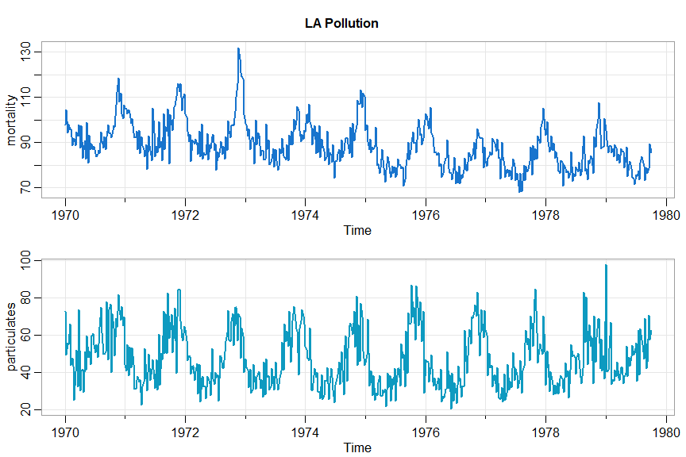

# astsa vignette

##### we'll demonstrate some of the capabilities of `astsa` ... if you haven't installed it yet, [head over to the News page for installation instructions](https://github.com/nickpoison/astsa/blob/master/NEWS.md).

Remember to load `astsa` at the start of a session.

> **`library(astsa)`**

-----
------

##### Table of Contents  
[Data Sets](#data)  
[Graphics and Plotting](#graphics)
[Correlation Functions](#correlation)

-----
-----

<a name="data"/>
## 1. Data

There are lots of fun data sets included in `astsa`. Here's a list obtained by issuing the command

> **`data(package = "astsa")`**

And you can get more information on any individual set using the `help()` command, e.g.
`help(cardox)` or `?cardox`

-----
|Data sets in package ‘astsa’|                         |
|----------|-------------|
|EQ5                         | Seismic Trace of Earthquake number 5                        |
|EQcount                     | EQ Counts                                                   |
|EXP6                        | Seismic Trace of Explosion number 6                         |
|HCT                         | Hematocrit Levels                                           |
|Hare                        | Snowshoe Hare                                               |
|Lynx                        | Canadian Lynx                                               |
|PLT                         | Platelet Levels                                             |
|UnempRate                   | U.S. Unemployment Rate                                      |
|WBC                         | White Blood Cell Levels                                     |
|ar1miss                     | AR with Missing Values                                      |
|arf                         | Simulated ARFIMA                                            |
|beamd                       | Infrasonic Signal from a Nuclear Explosion                  |
|birth                       | U.S. Monthly Live Births                                    |
|blood                       | Daily Blood Work                                            |
|bnrf1ebv                    | Nucleotide sequence - BNRF1 Epstein-Barr                    |
|bnrf1hvs                    | Nucleotide sequence - BNRF1 of Herpesvirus saimiri          |
|cardox                      | Monthly Carbon Dioxide Levels at Mauna Loa                  |
|chicken                     | Monthly price of a pound of chicken                         |
|climhyd                     | Lake Shasta inflow data                                     |
|cmort                       | Cardiovascular Mortality from the LA Pollution study        |
|cpg                         | Hard Drive Cost per GB                                      |
|djia                        | Dow Jones Industrial Average                                |
|econ5                       | Five Quarterly Economic Series                              |
|eqexp                       | Earthquake and Explosion Seismic Series                     |
|flu                         | Monthly pneumonia and influenza deaths in the U.S., 1968 to 1978. |
|fmri                        | fMRI - complete data set                                    |
|fmri1                       | fMRI Data Used in Chapter 1                                 |
|gas                         | Gas Prices                                                  |
|gdp                         | Quarterly U.S. GDP                                          |
|globtemp                    | Global mean land-ocean temperature deviations to 2015       |
|globtempl                   | Global mean land (only) temperature deviations to 2015      |
|gnp                         | Quarterly U.S. GNP                                          |
|gtemp                       | Global mean land-ocean temperature deviations               |
|gtemp2                      | Global Mean Surface Air Temperature Deviations              |
|gtemp_land                  | Global mean land temperature deviations - updated to 2017   |
|gtemp_ocean                 | Global mean ocean temperature deviations - updated to 2017  |
|hor                         | Hawaiian occupancy rates                                    |
|jj                          | Johnson and Johnson Quarterly Earnings Per Share            |
|lap                         | LA Pollution-Mortality Study                                |
|lead                        | Leading Indicator                                           |
|nyse                        | Returns of the New York Stock Exchange                      |
|oil                         | Crude oil, WTI spot price FOB                               |
|part                        | Particulate levels from the LA pollution study              |
|polio                       | Poliomyelitis cases in US                                   |
|prodn                       | Monthly Federal Reserve Board Production Index              |
|qinfl                       | Quarterly Inflation                                         |
|qintr                       | Quarterly Interest Rate                                     |
|rec                         | Recruitment (number of new fish index)                      |
|sales                       | Sales                                                       |
|salmon                      | Monthly export price of salmon                              |
|salt                        | Salt Profiles                                               |
|saltemp                     | Temperature Profiles                                        |
|so2                         | SO2 levels from the LA pollution study                      |
|soi                         | Southern Oscillation Index                                  |
|soiltemp                    | Spatial Grid of Surface Soil Temperatures                   |
|sp500w                      | Weekly Growth Rate of the Standard and Poor's 500           |
|speech                      | Speech Recording                                            |
|star                        | Variable Star                                               |
|sunspotz                    | Biannual Sunspot Numbers                                    |
|tempr                       | Temperatures from the LA pollution study                    |
|unemp                       | U.S. Unemployment                                           |
|varve                       | Annual Varve Series                                         |

-----

<a name="graphics"/>
## 2. Plotting

 - When `astsa` is loaded, the astsa palette is attached.  The palette is  especially  suited for plotting  time series and it is a bit darker than the new default R4 palette. You can revert back using  `palette("default")`.  Also,  

> **`astsa.col()`** 

is included to easily adjust opacity of the palette.  For example,
<pre><code>
par(mfrow=c(3,1))
barplot(rep(1,8), col=1:8, main='astsa palette', names=1:8)
barplot(rep(1,8), col=astsa.col(1:8, .7), main='transparency', names=1:8)
barplot(rep(1,8), col=astsa.col(3:6, .5), main='pastelity', names=rep(3:6, 2))
</code></pre> 

- For plotting time series and just about anything else, you can use

> **`tsplot()`**

Notice there are minor ticks and a grid by default. Here are some examples.
<pre><code>
par(mfrow=c(2,1))
tsplot(soi, col=4, lwd=2)
tsplot(soi, col=4, lwd=2, gg=TRUE)
</code></pre>

Two at a time:
<pre><code>
tsplot(cbind(mortality=cmort, particulates=part), col=4:5, lwd=2, main='LA Pollution')
</code></pre>

Do you like spaghetti?
<pre><code>
tsplot(cbind(Hare,Lynx), col=astsa.col(c(2,4),.5), lwd=2, type="o", pch=c(0,2), ylab=expression(Number~~~(""%*% 1000)), spaghetti=TRUE)
legend("topright", legend=c("Hare","Lynx"), col=c(2,4), lty=1, pch=c(0,2), bty="n")
</code></pre>

<pre><code>
x <- replicate(100, cumsum(rcauchy(1000))/1:1000)
tsplot(x, col=1:8, main='not happening', spaghetti=TRUE, gg=TRUE, ylab="sample mean", xlab="sample size")
</code></pre>

-----

<a name="correlation"/>
## 3. Correlations

There are three basic correlation scripts in `astsa`.  They are

> **`acf1()`**, **`acf2()`,** and **`ccf2()`** 

The first one will give the sample ACF or PACF of a series.  The second one gives both the
sample ACF and PACF in a multifigure plot and both on the same scale.  The graphics do not display the lag 0 value because it is always 1.  The third one plots the sample CCF.
The first two also print the values; the third one returns the values invisibly.

+ The individual sample ACF or PACF
<pre><code>
acf1(soi)

  [1]  0.60  0.37  0.21  0.05 -0.11 -0.19 -0.18 -0.10  ...
</code></pre>

<pre><code>
acf1(rec, pacf=TRUE, gg=TRUE, col=2:7, lwd=4)
  
[1]  0.92 -0.44 -0.05 -0.02  0.07 -0.03 -0.03  0.04 ...
</code></pre>

+ Sample ACF and PACF at the same time
<pre><code>
acf2(diff(log(varve)))

        [,1]  [,2]  [,3]  [,4]  [,5]  [,6]  [,7]  [,8]  [,9] ...
   ACF  -0.4 -0.04 -0.06  0.01  0.00  0.04 -0.04  0.04  0.01 ...
   PACF -0.4 -0.24 -0.23 -0.18 -0.15 -0.08 -0.11 -0.05 -0.01 ... 
</code></pre>

+ and the sample CCF
<pre><code>
ccf2(cmort, part)
</code></pre>

-----

## 4.  ARIMA Simulation

You can simulate data from seasonal ARIMA or non-seasonal ARIMA models via 

> **`sarima.sim`**

The syntax are simple and we'll demonstrate with a couple of examples. There are more examples in the help file (`?sarima.sim`).  For example, you can input your own innovations or generate non-normal innovations (the default is normal).

+ First an AR(2) with a mean of 50 (n=500 is the default sample size)
<pre><code>
y = sarima.sim(ar=c(1.5,-.75)) + 50
tsplot(y, main=expression(AR(2)~~~phi[1]==1.5~~phi[2]==-.75), col=4)
</code></pre>

+ Now we'll simulate from a seasonal model, `SARIMA(0,1,1)x(0,1,1)``12`  --- B&J's favorite
<pre><code>
set.seed(101010)
tsplot(sarima.sim(d=1, ma=-.4, D=1, sma=-.6, S=12, n=120), col=4, ylab='')  
</code></pre>

