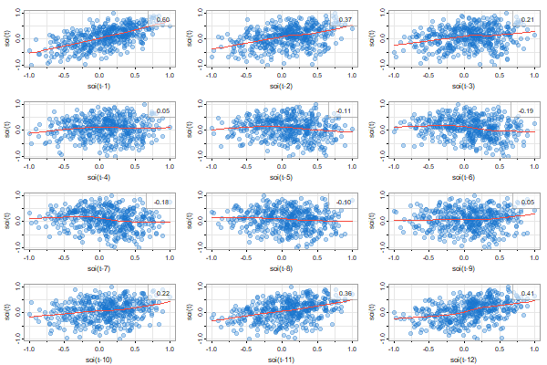
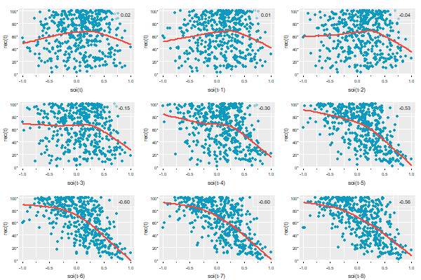
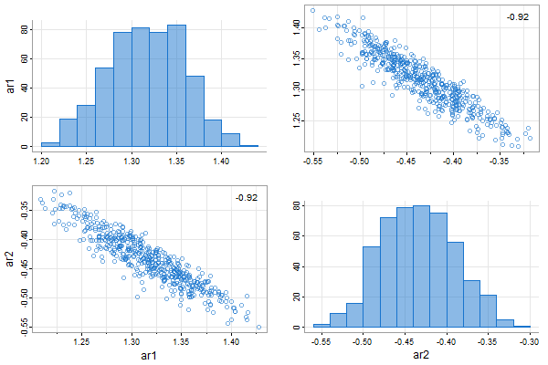
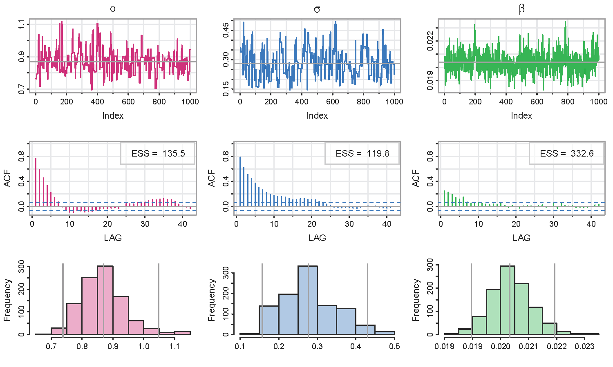

# fun with &#x1D538;&#x1D54A;&#x1D54B;&#x1D54A;&#x1D538; &#x1F388;&#x1F388;&#x1F388;

<!-- fun with astsa -->

[](https://cran.r-project.org/package=astsa) &nbsp;&nbsp; [](https://www.r-pkg.org/badges/version/astsa) <sup>&#9664; current CRAN version</sup>&nbsp;&nbsp;  <sup>&#9664; current GitHub version</sup>

#### We'll demonstrate some of the capabilities of `astsa` ... the [NEWS](https://github.com/nickpoison/astsa/blob/master/NEWS.md) page  has additional installation information.


Remember to load `astsa` at the start of a session...  

> **`library(astsa)`**

it's more than just data ... it's a palindrome

⭐⭐⭐⭐⭐⭐⭐⭐⭐

-----
-----
&#128226; __Note:__  When you are in a code block below, you can copy the contents of the block by moving your mouse to the upper right corner and clicking on the copy icon ( __&#10697;__ ).

------
-----

 

### Table of Contents

  * [1. Data](#1-data)
  * [2. Plotting](#2-plotting)
     * [astsa Color Palette](#colors)
     * [Color Wheels](#color-wheel)
     * [Time Series Plots](#tsplot)
     * [Lag Plots](#lag-plots)
     * [Time Series Scatterplots](#scatterplots)
     * [Trends](#trends)
     * [QQ Normal Plots](#qqnorm)
     * [Regression t-table with VIFs](#regression-t-table-with-vifs)
  * [3. Correlations](#3-correlations)
  * [4. ARIMA](#4-arima)
     * [Check Model Validity](#arma-model-evaluation)
     * [Simulation](#arima-simulation)
     * [Estimation](#arima-estimation)
     * [Forecasting](#forecasting)
     * [Missing Data](#missing-data)
  * [5. Spectral Analysis](#5-spectral-analysis)
     * [ARMA Spectrum](#arma-spectral-density)
     * [Nonparametric](#nonparametric-spectral-analysis)
     * [Parametric](#parametric-spectral-analysis)
     * [Spectral Matrices](#more-multivariate-spectra)
  * [6. Detecting Structural Breaks](#6-detecting-structural-breaks)
    * [autoSpec - changepoint detection - nonparametric](#autospec) 
    * [autoParm - changepoint detection - parametric](#autoparm) 
  * [7. Testing for Linearity](#7-linearity-test)
  * [8. State Space Models and Kalman Filtering](#8-state-space-models)
     * [Quick Kalman Filter and Smoother](#quick-kalman-filter-and-smoother)
     * [SSM - for beginners](#beginners-paradise)
  * [9. EM Algorithm and Missing Data](#9-em-algorithm-and-missing-data)
     * [Parameter Constraints](#parameter-constraints)
  * [10. Bayesian Techniques](#10-bayesian-techniques)
      * [AR Models](#ar-models)
      * [Gibbs Sampling for State Space Models - the FFBS Algorithm](#gibbs-sampling-for-linear-state-space-models)
      * [Effective Sample Size (ESS)](#ess)
  * [11. Stochastic Volatility Models](#11-stochastic-volatility-models)  
      * [Bayesian](#bayesian)
      * [Classical](#classical) 
  * [12. Arithmetic](#12-arithmetic)
     * [ARMAtoAR](#armatoar)
     * [Matrix Powers](#matrix-powers)
     * [Polynomial Multiplication](#polynomial-multiplication)
  * [13. The Spectral Envelope](#13-the-spectral-envelope)
     * [DNA and the Spectral Envelope](#dna-and-the-spectral-envelope)
     * [Real-Valued Series, Optimal Transformations, and the Spectral Envelope](#optimal-transformations-and-the-spectral-envelope)

-----
-----


## 1. Data

&#x1F4A1; There are lots of fun data sets included in `astsa`. Here's a list obtained by issuing the command

> **`data(package = "astsa")`**

And you can get more information on any individual set using the `help()` command, e.g.
`help(cardox)` or `?cardox`


|Name|     Title                     |
|----------|-------------|
|BCJ                              |  Daily Returns of Three Banks                                                 |
|EBV                              |  Entire Epstein-Barr Virus (EBV) Nucleotide Sequence                          |
|ENSO                             |  El Ni&ntilde;o - Southern Oscillation Index                                  |
|EQ5                              |  Seismic Trace of Earthquake number 5                                         |
|EQcount                          |  Earthquake Counts                                                            |
|EXP6                             |  Seismic Trace of Explosion number 6                                          |
|GDP (GDP23)                      |  Quarterly U.S. GDP - updated to 2023                                         |
|GNP (GNP23)                      |  Quarterly U.S. GNP - updated to 2023                                         |
|HCT                              |  Hematocrit Levels                                                            |
|Hare                             |  Snowshoe Hare                                                                |
|Lynx                             |  Canadian Lynx (not the same as R dataset `lynx` )                            |
|MEI                              |  Multivariate ENSO Index (version 1)  1950 - 2019                             |
|MEI2                             |  Multivariate ENSO Index (version 2)  1979 - 2025                             |
|PLT                              |  Platelet Levels                                                              |
|USpop / USpop20                  |  U.S. Population - 1900 to 2010 / 2020   (2 different files)                  |
|UnempRate                        |  U.S. Unemployment Rate                                                       |
|WBC                              |  White Blood Cell Levels                                                      |
|ar1miss                          |  AR with Missing Values                                                       |
|arf                              |  Simulated ARFIMA                                                             |
|beamd                            |  Infrasonic Signal from a Nuclear Explosion                                   |
|birth                            |  U.S. Monthly Live Births                                                     |
|blood                            |  Daily Blood Work with Missing Values                                         |
|bnrf1ebv                         |  Nucleotide sequence - BNRF1 Epstein-Barr                                     |
|bnrf1hvs                         |  Nucleotide sequence - BNRF1 of Herpesvirus saimiri                           |
|cardox                           |  Monthly Carbon Dioxide Levels at Mauna Loa                                   |
|chicken                          |  Monthly price of a pound of chicken                                          |
|climhyd                          |  Lake Shasta inflow data                                                      |
|cmort                            |  Cardiovascular Mortality from the LA Pollution study                         |
|cpg                              |  Hard Drive Cost per GB                                                       |
|djia                             |  Dow Jones Industrial Average                                                 |
|econ5                            |  Five Quarterly Economic Series                                               |
|eqexp                            |  Earthquake and Explosion Series &mdash; <a href="figs/eqexp.png">the map</a> |
|flu                              |  Monthly pneumonia and influenza deaths in the U.S., 1968 to 1978.            |
|fmri                             |  fMRI - complete data set                                                     |
|fmri1                            |  fMRI Data Used in Chapter 1                                                  |
|gas                              |  Gas Prices                                                                   |
|gdp                              |  Quarterly U.S. GDP                                                           |
|gnp                              |  Quarterly U.S. GNP                                                           |
|gtemp.month                      |  Monthly global average surface temperatures by year                          |
|gtemp_both                       |  Global mean land and open ocean temperature deviations, 1850-2023            |
|gtemp_land                       |  Global mean land temperature deviations, 1850-2023                           |
|gtemp_ocean                      |  Global mean ocean temperature deviations, 1850-2023                          |
|hor                              |  Hawaiian occupancy rates                                                     |
|jj                               |  Johnson and Johnson Quarterly Earnings Per Share                             |
|lap                              |  LA Pollution-Mortality Study                                                 |
|lap.xts                          |  LA Pollution-Mortality Study Daily Observations                              |
|lead                             |  Leading Indicator                                                            |
|nyse                             |  Returns of the New York Stock Exchange                                       |
|oil                              |  Crude oil, WTI spot price FOB                                                |
|part                             |  Particulate levels from the LA pollution study                               |
|polio                            |  Poliomyelitis cases in US                                                    |
|prodn                            |  Monthly Federal Reserve Board Production Index                               |
|qinfl                            |  Quarterly Inflation                                                          |
|qintr                            |  Quarterly Interest Rate                                                      |
|rec                              |  Recruitment (number of new fish index)                                       |
|sales                            |  Sales                                                                        |
|salmon                           |  Monthly export price of salmon                                               |
|salt                             |  Salt Profiles                                                                |
|saltemp                          |  Temperature Profiles                                                         |
|sleep1                           |  Sleep State and Movement Data - Group 1                                      |
|sleep2                           |  Sleep State and Movement Data - Group 2                                      |
|so2                              |  SO2 levels from the LA pollution study                                       |
|soi                              |  Southern Oscillation Index                                                   |
|soiltemp                         |  Spatial Grid of Surface Soil Temperatures                                    |
|sp500.gr                         |  Returns of the S&P 500                                                       |
|sp500w                           |  Weekly Growth Rate of the Standard and Poor's 500                            |
|speech                           |  Speech Recording                                                             |
|star                             |  Variable Star                                                                |
|sunspotz                         |  Biannual Sunspot Numbers                                                     |
|tempr                            |  Temperatures from the LA pollution study                                     |
|unemp                            |  U.S. Unemployment                                                            |
|varve                            |  Annual Varve Series                                                          |


[<sub>top</sub>](#table-of-contents)

-----


## 2. Plotting


### Colors 


&#x1F4A1; When `astsa` is loaded, the astsa palette is attached.  The palette is  especially  suited for plotting  time series and it is a bit darker than the new default R4 palette. You can revert back using  `palette("default")`.  Also,

> **`astsa.col()`**

is included to easily adjust the opacity of the colors.

```r
par(mfrow=c(3,1))

barplot(rep(1,8), density=10, angle=c(45, -45), main='astsa palette')
barplot(rep(1,8), col=1:8, names=1:8, add=TRUE)

barplot(rep(1,8), density=10, angle=c(45, -45), main='transparency')
barplot(rep(1,8), col=astsa.col(1:8, .7), names=1:8, add=TRUE)

barplot(rep(1,8), density=10, angle=c(45, -45), main='pastelity')
barplot(rep(1,8), col=astsa.col(3:6, .5), names=rep(3:6, 2), add=TRUE)
```
**Notice each color display has diagonal lines behind it to demonstrate opacity.**


<br/><br/>

###  Color Wheel

&#127752; NEW &#127752;: `astsa.col` now can create a _color wheel_ with a user specified number of colors based on a chosen color.  Also included is the option to show a pie chart of the colors for inspection before use.  Here's some examples (with bells and whistles):

```r
par(mfrow=2:1, mar=rep(0,4))
astsa.col(4, wheel=TRUE, pie=TRUE, num=10) -> u
 legend('topright', legend=u, fill=u, title='Hex Color Code')
x = replicate(6, 15+sarima.sim(ar=c(1.5,-.75), n=100))
tsplot(x, ylab='Xs', main='six slick sick series', spag=TRUE, col=astsa.col(4, alpha=.7, wheel=TRUE, num=6), lwd=3)
```
 <br/>


<br/><br/>

### tsplot

&#x1F535; For plotting time series and just about anything else, you can use

> **`tsplot()`**


&#128064; Notice there are minor ticks and a grid by default. Here are some examples.

```r
par(mfrow=c(2,1))
tsplot(soi, col=4, lwd=2)            
tsplot(soi, col=4, lwd=2, gg=TRUE)   # gg => gris-gris plot - the grammar of astsa is voodoo
```


<br/>

&#x1F535; Many in one swell foop:

```r
tsplot(climhyd, ncol=2)   # a quick simple plot (3 rows - 2 columns)

# but with some bells and whistles and  gris-gris:
climhyd[,5:6] = sqrt(climhyd[,5:6])
tsplot(climhyd, ncol=2, gg=TRUE, col=2:7, lwd=2, scale=.9) 
```
 

In version 2.2 and beyond, you can use `scale` to control the character expansion (`cex`) of the plot so the axis values don't get too small if there are many series being plotted. 

<br/>

&#x1F535; Do you like `spaghetti` (you can shorten it to `spag`):


&#10004; In version 2.2 and beyond, you can use `addLegend` in `tsplot` with spaghetti plots (more than 1 series on the same plate).

```r
tsplot(cbind(Hare,Lynx), col=astsa.col(c(2,4),.5), lwd=2, type="o", pch=c(0,2),ylab='Number', spaghetti=TRUE, addLegend=TRUE)
mtext('\u00D7 1000', side=2, adj=1, line=1.5, cex=.8)
```


<br/>

If you need more control, you can still use `legend`:

```r
tsplot(cbind(Hare,Lynx), col=astsa.col(c(2,4),.5), lwd=2, type="o", pch=c(0,2), ylab='Number',  spaghetti=TRUE)
mtext('\u00D7 1000', side=2, adj=1, line=1.5, cex=.8)
legend("topright", legend=c("Hare","Lynx"), col=c(2,4), lty=1, pch=c(0,2), bty="n")
```

<br/>

&#127378; And another easy-add legend for spaghetti plots:

```r
# quick and easy legend
tsplot(cbind(Mortality=cmort, Pollution=part), col=5:6, gg=TRUE, spaghetti=TRUE, addLegend=TRUE, llwd=2)
```


<br/>


&#128148; And you can still have spaghetti in the land where the LLN ceases to exist:

```r
x <- replicate(100, cumsum(rcauchy(1000))/1:1000)
tsplot(x, col=1:8, main='not happening', spaghetti=TRUE, gg=TRUE, ylab="sample mean", xlab="sample size")
```


<br/>
<br/>


 &#127381; `timex` ... keeps on ticking

 There are a few `xts` data files in `astsa` and we recommend installing the package (and consequently `zoo`) if you are analyzing time series.  But, in case `xts` is not available, you can still plot the series using the actual times as of `astsa` version 2.4.

Here's an example using `djia`.  

```r
par(mfrow=2:1)
tsplot(djia[,'Close'], col=4, ylab='DJIA Close')               # no dates
tsplot(timex(djia), djia[,'Close'], col=4, ylab='DJIA Close')  # yes dates
```


In the top plot, the dates on the time axis are missing. The script `timex` takes the 'unix time stamp' dates from the `xts` data file and converts them to decimal time; e.g., September 1, 2010 is approximately 2010.666 because it is day 243 of that 365-day year (Jan 1 being day zero).

<br/><br/>


### Lag Plots

&#129412; There are also lag plots for one series and for two series using

> **`lag1.plot()`** or **`lag2.plot()`**

By default, the graphic displays the sample ACF or CCF and a `lowess` fit. They can be turned off individually (`?lag1.plot` or `?lag2.plot` for more info).

First,  for one series

```r
# minimal call 
lag1.plot(soi, 12)
# but prettified
lag1.plot(soi, 12, col=astsa.col(4, .3), pch=20, cex=2)
```


<br/>

and for two series (the first one gets lagged)

```r
# minimal call - the first series gets lagged
lag2.plot(soi, rec, 8)
# but prettified
lag2.plot(soi, rec, 8, pch=19, col=5, lwl=2, gg=TRUE)
```


<br/>

As of version 2.3, you can change the location of the ACF values:

```r
lag2.plot(soi, rec, 8, pch=19, col=astsa.col(4,.3), gg=TRUE, location='bottomleft')
```


<br/>


&#128045; As previously mentioned, you can turn off the correlation or smooth displays by setting those things to `FALSE` (in either script); e.g.,

```r
lag1.plot(diff(log(GDP)), 4, corr=FALSE, smooth=FALSE)  # not shown
```


### Scatterplots
Aside from lag plots, we have some additional scripts for doing scatterplot matrices.

&#128057; There is now `tspairs`, which is an `astsa` version of `stats::pairs` for time series.  It's used in `ar.boot` and `ar.mcmc` now. Here are two examples: 

```r
tspairs(diff(log(econ5[,1:3])), col.diag=6, pt.size=1.5, lwl=2, gg=TRUE, las=0)
```

 <br/>

<br/>

```r
tspairs(ts.intersect(cmort,tempr,partL4=lag(part,-4)), hist=FALSE, pch=9, scale=1.1)
```

 <br/>

<br/>


&#128027; Sometimes it's nice to have a scatterplot with marginal histograms...

```r
scatter.hist(tempr, cmort, hist.col=astsa.col(5,.4), pt.col=5, pt.size=1.5, reset=FALSE)
lines(lowess(tempr, cmort), col=6, lwd=2)  # with reset=FALSE, can add to the scatterplot
```

 

<br/>

### Trends

&#128178; There are two scripts to help with analyzing trends. They are

> **`detrend()`** and **`trend()`**


 &#x1F535;  `detrend` returns a detrended series using a polynomial regression (default is linear) or lowess (with the default span).  For example,

 ```r
tsplot(cbind(salmon, detrend(salmon)), main='Norwegian Salmon (USD/KG)', lwd=2, col=5:6)
 ```


<br/>


&#128061; `trend`  fits a trend (same options as detrend) and produces a graphic of the series with the trend and error bounds superimposed.  The trend and error bounds are returned invisibly.

 ```r
 trend(soi, lowess=TRUE)
 ```

 


<br/>

### QQnorm

&#129412; The texts have a few QQ plots and we needed them to look good because the importance of appearance extends well beyond the pleasant experiences we have when we look at attractive plots.  And the code was sitting there in `sarima` as part of the diagnostics, so we just pulled it out.

```R
par(mfrow=1:2)
QQnorm(varve, main='varve', gg=TRUE)
QQnorm(log(varve), main='log(varve)')
```


<br/>


### Regression t-table with VIFs

&#128045; It's not a graphic thing, but there was no other place to put this with ease.  This is used in the 2nd edition of the Chapman Hall text. It is available in `astsa` version 2.3 and beyond.  It's based on `summary.lm` but it prints AIC, AICc, and BIC and it can include VIFs if appropriate and it goes like this: 

```r
fit = lm( mpg~ cyl + disp + hp + drat + wt + qsec, data=mtcars) 
ttable(fit, vif=TRUE)

## output

  Coefficients:
              Estimate      SE  t.value  p.value       VIF
  (Intercept)  26.3074 14.6299   1.7982   0.0842          
  cyl          -0.8186  0.8116  -1.0086   0.3228    9.9590
  disp          0.0132  0.0120   1.0971   0.2831   10.5506  <- engine size
  hp           -0.0179  0.0155  -1.1564   0.2585    5.3578
  drat          1.3204  1.4795   0.8925   0.3806    2.9665
  wt           -4.1908  1.2579  -3.3316   0.0027    7.1817
  qsec          0.4015  0.5166   0.7771   0.4444    4.0397

 Residual standard error: 2.557 on 25 degrees of freedom
 Multiple R-squared:  0.8548,    Adjusted R-squared:   0.82 
 F-statistic: 24.53 on 6 and 25 DF,  p-value: 2.45e-09
 AIC =  3.1309    AICc =  3.2768    BIC =  3.4974 
```
`mtcars` is an R data set on gas consumption (`mpg`) and various car design aspects (the 'mt' refers to 'motor trend' magazine). The design aspects are related [bigger engines have more horse power and weight more ...], thus the high VIFs.  Also notice that the engine size (`disp`) coefficient has the wrong sign because bigger engines don't get better gas mileage.  Also, nothing but weight (`wt`) is significant because the SEs are inflated.  How's that for a picture?

<br/>

[<sub>top</sub>](#table-of-contents)

-----


## 3. Correlations

&#128125; There are four basic correlation scripts and one not so basic script in `astsa`. They are


> **`acf1()`**, **`acf2()`,**  **`ccf2()`**,  **`acfm()`**, and **`pre.white()`**

- `acf1` gives the sample ACF or PACF of a series.  

- `acf2` gives both the sample ACF and PACF in a multifigure plot and both on the same scale.  The graphics do not display the lag 0 ACF value because it is always 1.  

- `ccf2` plots the sample CCF 

  >  `acf1` and `acf2` also print the values, but rounded - `ccf2` returns the values invisibly  

- `acfm` is for multiple time series and it produces a grid of plots of the sample ACFs and CCFs.  

- `pre.white` (in version 2.2) will prewhiten the first series automatically, filter the second accordingly, and perform a cross-correlation analysis.

<br/>


&#x1F535; The individual sample ACF or PACF

```r
acf1(soi)

  [1]  0.60  0.37  0.21  0.05 -0.11 -0.19 -0.18 -0.10  ...
```


<br/>

&#x1F4A1; Note the LAG axis label indicates the frequency of the data unless it is 1.  This way, you can see that the tick at LAG 1 corresponds to 12 (months) and so on.

```r
acf1(rec, pacf=TRUE, gg=TRUE, col=2:7, lwd=4)

   [1]  0.92 -0.44 -0.05 -0.02  0.07 -0.03 -0.03  0.04 ...
```


<br/>

&#x1F535; Sample ACF and PACF at the same time

```r
acf2(diff(log(varve)))

        [,1]  [,2]  [,3]  [,4]  [,5]  [,6]  [,7]  [,8]  [,9] ...
   ACF  -0.4 -0.04 -0.06  0.01  0.00  0.04 -0.04  0.04  0.01 ...
   PACF -0.4 -0.24 -0.23 -0.18 -0.15 -0.08 -0.11 -0.05 -0.01 ...
```


<br/>

&#x1F535; If you just want the values (not rounded by the script), use `plot=FALSE` (works for `acf1` too)
```r
acf2(diff(log(varve)), plot=FALSE)

                ACF         PACF
 [1,] -0.3974306333 -0.397430633
 [2,] -0.0444811551 -0.240404406
 [3,] -0.0637310878 -0.228393075
 [4,]  0.0092043800 -0.175778181
 [5,] -0.0029272130 -0.148565114
 [6,]  0.0353209520 -0.080800502
  .         .             .
[33,] -0.0516758878 -0.017946464
[34,] -0.0308370865 -0.021854959
[35,]  0.0431050489  0.010867281
[36,] -0.0503025493 -0.068574763
```


&#x1F535; and the sample CCF

```r
ccf2(cmort, part)
```


<br/>

&#x1F6AB; **Don't be fooled because neither series is white noise - far from it.**  Prewhiten before a real cross-correlation analysis (but you know that already because you've read it in one of the books).  

&#129297; Here's a way to do it using `pre.white` from `astsa` version 2.2  (it's semiautomatic- the user has to decide if differencing is necessary):

```r
pre.white(cmort, part, diff=TRUE, col=4)    # in version 2.2 

# with output
   cmort prewhitened using an AR p = 3 
   after differencing d = 1
# and ...
```

**…**  you get a graphic. The transformed series are returned invisibly (the .w is for whitened and the .f is for filtered):


<br/>

&#x1F535; For multiple series, you can look at all sample ACFs (highlighted a bit on the diagonal) and CCFs (off-diagonal) simultaneously:

```r
acfm(diff(log(econ5)))
```


<br/>

What you see are estimates of _corr( x<sub>t+LAG</sub> , y<sub>t</sub> )_ where _x<sub>t</sub>_ is a column series and _y<sub>t</sub>_ is a row series. _x<sub>t</sub>_  leads when LAG is positive and _x<sub>t</sub>_ lags when LAG is negative. In the figure, the top (columns) series leads and the side series (rows) lags.

All of these scripts use `tsplot` so there are various options for plotting. For example, you can suppress the minor ticks if it's too much, or you can do a "gris-gris" plot (the grammar of `astsa` is voodoo):

```r
acfm(diff(log(econ5)), nxm=0)    #  no minor ticks on LAG axis

acfm(diff(log(econ5)), gg=TRUE, acf.highlight=FALSE)  # Gris-Gris Gumbo Ya Ya

```


[<sub>top</sub>](#table-of-contents)

-----

## 4. ARIMA

<br/>

### ARMA Model Evaluation

&#129322; Checking the validity of an ARMA model (seasonal ok) just got easier with `arma.check`. Let's look at some examples with output.

```r
arma.check(ar=.9, ma=-.88)

#   WARNING: (Possible) Parameter Redundancy 
#   
#   It looks like that ARMA model has (approximate) common factors.
#   This means that the model is (possibly) over-parameterized.
#   You might want to try again.
```
```r
arma.check(ar=c(1,-.9), sar=-.6, sma=-.4, S=4)

#   The model is causal.
#   The model is invertible.
#   That's a very nice ARMA model!
```
```r
arma.check(ma=1, sar=1, S=12)

#   WARNING: Model Not Invertible 
#   WARNING: Seasonal Part Not Causal 
#   NOTE: Redundancy checked only for causal and invertible models 
```

<br/>

You want a picture? Ok, but any seasonal stuff is ignored to avoid a messy graphic. It's the complex plane with the inverse roots and the little circles have the radius of the `redundancy tolerance`, which may be set by the user (`?arma.check` has details).  Also, the graphic is displayed ONLY for causal and invertible models (so all inverted roots are within the unit circle).

```r
arma.check(ar=c(1.5,-.75), ma=c(-.6,-.3,.45), plot=TRUE, gg=TRUE)

#   WARNING: (Possible) Parameter Redundancy ...

##- this is not output... but just a little note that you can't
##- always tell if a model is overparameterized just by looking
##- at the parameters (unless you have extraordinary skills) 
```


<br/>
<br/>

### ARIMA Simulation

&#128171; You can simulate from ARIMA models - seasonal  or non-seasonal  - via

> **`sarima.sim()`**

The syntax are simple and we'll demonstrate with a couple of examples. There are more examples in the help file (`?sarima.sim`).  For example, you can input your own innovations or generate non-normal innovations (the default is normal).

&#x1F535; First an AR(2) with a mean of 50 (n=500 is the default sample size)

```r
y = sarima.sim(ar=c(1.5,-.75)) + 50
tsplot(y, main=bquote(AR(2)~~~phi[1]==1.5~~phi[2]==-.75), col=4)
```


<br/>

&#x1F535; Now we'll simulate from a seasonal model, `SARIMA(0,1,1)x(0,1,1)`<sub>`12`</sub>  --- B&J's favorite

```r
set.seed(101010)
x = sarima.sim(d=1, ma=-.4, D=1, sma=-.6, S=12, n=120) + 100
tsplot(x, col=4, lwd=2, gg=TRUE, ylab='Number of Widgets')
```


<br/>

<br/>

### ARIMA Estimation

&#127817; Fitting ARIMA models to data is a breeze with the  script

> **`sarima()`**

It can do everything for you but you have to choose the model ... speaking of which ...


---

&#x274C; Don't use black boxes like `auto.arima` from the `forecast` package because IT DOESN'T WORK well. If you know what you are doing, fitting an ARIMA model to linear time series data is easy.

---

<br/>


Originally, `astsa` had a version of automatic fitting of models but IT DIDN'T WORK and was scrapped.  The bottom line is, if you don't know what you're doing (aka _ZERO KNOWLEDGE_), why are you doing it? Maybe a better idea is to [take a short course on fitting ARIMA models to data](https://www.datacamp.com/courses/arima-models-in-r).

> DON'T BELIEVE IT?? OK... HERE YOU GO:

```r
set.seed(666)
x = rnorm(1000)          # WHITE NOISE
forecast::auto.arima(x)  # BLACK BOX

   # partial output
     Series: x
     ARIMA(2,0,1) with zero mean

     Coefficients:
               ar1      ar2     ma1
           -0.9744  -0.0477  0.9509
     s.e.   0.0429   0.0321  0.0294

     sigma^2 estimated as 0.9657:  log likelihood=-1400
     AIC=2808.01   AICc=2808.05   BIC=2827.64
````

&#129315;&#129315;&#129315;  ... an ARMA(2,1) ??  BUT, if you KNOW what you are doing, you realize the model is basically overparametrized white noise ... CHECK IT OUT:

```r
arma.check(ar=c(-.9744, -.0477), ma=.9509)

  WARNING: (Possible) Parameter Redundancy 

  It looks like that ARMA model has (approximate) common factors.
  This means that the model is (possibly) over-parameterized.
  You might want to try again.
```

Here's another humorous example. Using the data `cmort` (cardiovascular mortality)

```r
forecast::auto.arima(cmort)

   Series: cmort 
   ARIMA(2,0,2)(0,1,0)[52] with drift 
   
   Coefficients:
            ar1     ar2      ma1     ma2    drift
         0.5826  0.0246  -0.3857  0.2479  -0.0203
   s.e.  0.3623  0.3116   0.3606  0.2179   0.0148  
   
   sigma^2 = 56.94:  log likelihood = -1566.28
   AIC=3144.57   AICc=3144.76   BIC=3169.3
```

HA!  __Five parameters and none significant__ in a rather complex seasonal model. AND, it took forever to run during which my CPU fan speed ran on high.  By overfitting, the standard errors are inflated. 

 But, if you know what you're doing, difference to remove the trend, then it's obviously an AR(1):

```r
sarima(cmort, 1,1,0, no.constant=TRUE)

  Coefficients: 
      Estimate     SE  t.value p.value
  ar1  -0.5064 0.0383 -13.2224       0

  sigma^2 estimated as 33.81057 on 506 degrees of freedom 
  AIC = 6.367124  AICc = 6.36714  BIC = 6.383805 
```

Yep!! 1 parameter with a decent standard error and the residuals are perfect (white and normal).

---

&#128125;  Ok - back to our regularly scheduled program, `sarima()`.  As with everything else, there are many examples on the help page (`?sarima`) and we'll do a couple here.

<br/> 


&#x1F535; Everyone else does it, so why don't we.  Here's a seasonal ARIMA fit to the AirPassenger data set (for the millionth time).

```r
sarima(log(AirPassengers),0,1,1,0,1,1,12, gg=TRUE, col=4)
```
and the partial output including the residual diagnostic plot is (`AIC` is basically `aic` divided by the sample size):

```r
Coefficients: 
     Estimate     SE t.value p.value
ma1   -0.4018 0.0896 -4.4825       0
sma1  -0.5569 0.0731 -7.6190       0

sigma^2 estimated as 0.001348035 on 129 degrees of freedom 
 
AIC = -3.690069  AICc = -3.689354  BIC = -3.624225 
```


<br/>

&#x1F535; You can shut off the diagnostics using `details=FALSE`

```r
 sarima(log(AirPassengers),0,1,1,0,1,1,12, details=FALSE)
```


&#x1F535; You can fix parameters too, for example

```r
x = sarima.sim( ar=c(0,-.9), n=200 ) + 50
sarima(x, 2,0,0, fixed=c(0,NA,NA))  # ar1 (fixed at 0), ar2 (NA -> free), mean (NA -> free)
```
with output

```r
Coefficients: 
      Estimate     SE   t.value p.value
ar2    -0.9319 0.0246  -37.9526       0
xmean  49.9527 0.0367 1361.7834       0

sigma^2 estimated as 0.9946776 on 198 degrees of freedom 
 
AIC = 2.882823  AICc = 2.883128  BIC = 2.932298 
```

<br/>

&#x1F535; And one more with exogenous variables - this is the regression of `Lynx` on `Hare` lagged one year with AR(2) errors.

```r
pp = ts.intersect(Lynx, HareL1 = lag(Hare,-1), dframe=TRUE)
sarima(pp$Lynx, 2,0,0, xreg=pp$HareL1)
```
with partial output

```r
Coefficients: 
          Estimate     SE t.value p.value
ar1         1.3258 0.0732 18.1184  0.0000
ar2        -0.7143 0.0731 -9.7689  0.0000
intercept  25.1319 2.5469  9.8676  0.0000
xreg        0.0692 0.0318  2.1727  0.0326

sigma^2 estimated as 59.57091 on 86 degrees of freedom 
 
AIC = 7.062148  AICc = 7.067377  BIC = 7.201026 
```


<br/>

&#128126; And you can fit AR models using the bootstrap. Let's fit an AR(2) to the Recruitment series.

```r
ar.boot(rec, 2)
 
## output: ## 
   Quantiles: 
         ar1     ar2
   1%    1.205 -0.5338
   2.5%  1.234 -0.5186
   5%    1.249 -0.5021
   10%   1.266 -0.4912
   25%   1.294 -0.4656
   50%   1.326 -0.4429
   75%   1.354 -0.4121
   90%   1.376 -0.3874
   95%   1.393 -0.3682
   97.5% 1.406 -0.3589
   99%   1.413 -0.3443  

  Mean: 
      ar1     ar2 
   1.3229 -0.4404   

  Bias: 
             ar1      ar2
  [1,] -0.008703 0.004168  

  rMSE: 
           ar1     ar2
  [1,] 0.04479 0.04192
```

and a picture (uses `tspairs` for output):



<br/>


### Forecasting

&#127801;  Forecasting your fitted ARIMA model is as simple as using

> **`sarima.for()`**

You get a graphic showing  ± 1 and 2 root mean square prediction errors and the predictions and standard errors are printed.   The syntax are similar to `sarima` but the number of periods to forecast, `n.ahead`, has to be specified.


&#x1F535; Here's a simple example.  We'll generate some data from an ARIMA(1,1,0), forecast some of it and then compare the forecasts to the actual values.

```r
set.seed(12345)
x <- sarima.sim(ar=.9, d=1, n=150)   # 150 observations
y <- window(x, start=1, end=100)     # use first 100 to forecast
sarima.for(y, n.ahead=50, p=1, d=1, q=0, plot.all=TRUE)
text(85, 375, "PAST"); text(115, 375, "FUTURE")
abline(v=100, lty=2, col=4)
lines(x)
```
with partial output

```r
$pred
Time Series:
Start = 101
End = 150
Frequency = 1
 [1] 242.3821 241.3023 240.5037 239.9545 239.6264 239.4945 239.5364 ...

$se
Time Series:
Start = 101
End = 150
Frequency = 1
 [1]  1.136849  2.427539  3.889295  5.459392  7.096606  8.772528 10.466926 ...
```


<br/>

&#x1F535; Notice the `plot.all=TRUE` in the `sarima.for` call. The default is `FALSE` in which case the graphic shows only the final 100 observations and the forecasts to make it easier to see what's going on (like in the next example).

```r
sarima.for(cardox, 60, 1,1,1, 0,1,1,12)
```
<br/>

<br/>

### Missing Data

Because ARIMA models are put into state space form for estimation, missing data can be handled easily.  There is a data file in `astsa` called `ar1miss` that has missing data (it's used in Chapter 6 Problems &ndash; you'll see the data in the forecast plot):

```r
sarima(ar1miss, p=1, col=4, pch=19, gg=TRUE)
```

<br/>

```r
sarima.for(ar1miss, n.ahead=5, p=1, col=3, pcol=6, pch=19, gg=TRUE)
```

<br/>


[<sub>top</sub>](#table-of-contents)

-----

## 5. Spectral Analysis

&#127774;  There are a few scripts that help with spectral analysis.

The spectral density of an ARMA model can be obtained using

> **`arma.spec()`**

Nonparametric spectral analysis is done with

> **`mvspec()`**

and parametric spectral analysis with

> **`spec.ic()`**

<br/>

### ARMA Spectral Density


&#x1F4A1;  `arma.spec` tests for causality, invertibility, and common zeros. If the model is not causal or invertible an error message is given. If there are approximate common zeros, a spectrum will be displayed and a warning will be given.  The frequency and spectral ordinates are returned invisibly.

```r
arma.spec(ar = c(1.5, -.75), ma = c(-.8,.4), col=4, lwd=2)
```

<br/>

and if you want to do a seasonal model, you have to be a little creative; e.g., _x<sub>t</sub>= .4 x<sub>t-12</sub> + w<sub>t</sub> + .5 w<sub>t-1</sub>_

```r
arma.spec(ar=c(rep(0,11),.4), ma=.5, col=5, lwd=3, frequency=12)
```


<br/>


Some goofs
```r
arma.spec(ar=10, ma=20)

   WARNING: Model Not Causal
   WARNING: Model Not Invertible
   Error in arma.spec(ar = 10, ma = 20) : Try Again
```
```r
arma.spec(ar= .9, ma= -.9, main="It's White Noise, Dingus")

   WARNING: Parameter Redundancy
```

<br/>

<br/>

### nonparametric spectral analysis

&#127929; `mvspec` was originally just a way to  get the multivariate spectral density estimate out of `spec.pgram` directly (without additional calculations), but then it turned into its own pretty little monster with lots of bells and whistles.

&#x1F535; If you want the periodogram, you got it (tapering is not done automatically because you're old enough to do it by yourself):

```r
x1 = 2*cos(2*pi*1:100*5/100)  + 3*sin(2*pi*1:100*5/100)
x2 = 4*cos(2*pi*1:100*10/100) + 5*sin(2*pi*1:100*10/100)
x3 = 6*cos(2*pi*1:100*40/100) + 7*sin(2*pi*1:100*40/100)
x  = x1 + x2 + x3
tsplot(x, col=5, lwd=2, gg=TRUE)
mvspec(x, col=4, lwd=2, type='o', pch=20)
```

<br/>
<br/>

&#x1F535; You can smooth in the usual way and get the CIs on the log-plot:

```r
par(mfrow=c(2,1))
sois  = mvspec(soi, spans=c(7,7), taper=.1, col=4, lwd=2)
##-- these get printed unless plot=FALSE--##
# Bandwidth: 0.231 | Degrees of Freedom: 8.96 | split taper: 10%
soisl = mvspec(soi, spans=c(7,7), taper=.5, col=4, lwd=2, log='y')
# ditto
```


<br/>

&#x1F535; and you can easily locate the peaks

```r
 sois$details[1:45,]

      frequency  period spectrum

 [8,]     0.200  5.0000   0.0461
 [9,]     0.225  4.4444   0.0489
[10,]     0.250  4.0000   0.0502  <- here
[11,]     0.275  3.6364   0.0490
[12,]     0.300  3.3333   0.0451
[13,]     0.325  3.0769   0.0403
[14,]     0.350  2.8571   0.0361

[38,]     0.950  1.0526   0.1253
[39,]     0.975  1.0256   0.1537
[40,]     1.000  1.0000   0.1675  <- here
[41,]     1.025  0.9756   0.1538
[42,]     1.050  0.9524   0.1259
[43,]     1.075  0.9302   0.0972

```
&#x1F535; and cross-spectra

```r
mvspec(cbind(soi,rec), spans=20, plot.type="coh", taper=.1, ci.lty=2, gg=TRUE, main="SOI & Recruitment")

#  Bandwidth: 0.513 | Degrees of Freedom: 34.68 | split taper: 10% 
```

<br/>

<br/>

### parametric spectral analysis


&#x1F4A1; `spec.ic` (in astsa) is similar to `spec.ar` (in stats) but the option to use BIC instead of AIC is available.  Also, you can use the script to compare  AIC and BIC for AR fits to the data.

&#x1F535; Based on BIC after detrending (default is using AIC with `BIC=FALSE`)

```r
u <- spec.ic(soi, BIC=TRUE, detrend=TRUE, col=4, lwd=2)
```

<br/>

&#x1F535; Print and plot AIC and BIC (both pick order 15):

```r
u[[1]]   # notice the values are adjusted by the min

      ORDER         AIC        BIC
 [1,]     0 272.6937023 210.955320
 [2,]     1  82.1484043  24.525915
 [3,]     2  84.1441892  30.637592
 [4,]     3  85.5926277  36.201922
 [5,]     4  80.4715619  35.196749
 [6,]     5  70.7822012  29.623280
 [7,]     6  69.5898661  32.546837
 [8,]     7  71.5718647  38.644728
 [9,]     8  71.4320021  42.620757
[10,]     9  63.2815353  38.586183
[11,]    10  49.9872355  29.407775
[12,]    11  40.7220194  24.258451
[13,]    12  41.0928139  28.745138
[14,]    13  37.0833413  28.851557
[15,]    14   8.7779160   4.662024
[16,]    15   0.0000000   0.000000
[17,]    16   0.4321663   4.548058
[18,]    17   0.8834736   9.115258
[19,]    18   0.9605224  13.308199
[20,]    19   2.9348253  19.398394
[21,]    20   4.7475516  25.327012
[22,]    21   6.7012637  31.396616
[23,]    22   7.1553956  35.966641
[24,]    23   4.6428297  37.569967
[25,]    24   5.8610042  42.904033
[26,]    25   6.5000325  47.658954
[27,]    26   2.8918549  48.166668
[28,]    27   4.2581518  53.648857
[29,]    28   5.5960927  59.102690
[30,]    29   6.3765400  63.999030
[31,]    30   2.6978096  64.436191
```

```r
tsplot(0:30, u[[1]][,2:3], type='o', col=2:3, xlab='ORDER', nxm=5, lwd=2, gg=TRUE)
```
<br/>

<br/>

### more multivariate spectra

&#x1F535; The data frame `econ5` was used to consider the effect of quarterly GNP, consumption, and government and private investment on  U.S. unemployment. In this case, `mvspec` will plot the individual spectra by default and you can extract the spectral matrices as `fxx`, an array of dimensions `dim = c(p,p,nfreq)` as well as plot coherencies and phases. Here, <i>p = 5</i>:

```r
gr = diff(log(econ5))
gr = scale(gr)  # for comparable spectra
tsplot(gr, ncol=2, col=2:6, lwd=2, byrow=FALSE, reset=FALSE)
gr.spec = mvspec(gr, spans=c(7,7), detrend=FALSE, taper=.25, col=2:6, lwd=2, main='spectra')
round(gr.spec$fxx, 2)
```
<br/>

And a sample of the output of the last line giving the matrix estimate. The numbers at top refer to frequency ordinate:

```r
, , 49

              [,1]          [,2]          [,3]          [,4]          [,5]
[1,]  0.097+0.000i -0.048+0.042i -0.053+0.080i  0.032-0.037i -0.027+0.033i
[2,] -0.048-0.042i  0.129+0.000i  0.100-0.039i -0.052+0.012i  0.111+0.000i
[3,] -0.053-0.080i  0.100+0.039i  0.232+0.000i -0.041+0.001i  0.023+0.079i
[4,]  0.032+0.037i -0.052-0.012i -0.041-0.001i  0.051+0.000i -0.049+0.008i
[5,] -0.027-0.033i  0.111+0.000i  0.023-0.079i -0.049-0.008i  0.157+0.000i

, , 50

              [,1]          [,2]          [,3]          [,4]          [,5]
[1,]  0.093+0.000i -0.054+0.045i -0.053+0.081i  0.030-0.034i -0.033+0.035i
[2,] -0.054-0.045i  0.124+0.000i  0.112-0.041i -0.048+0.010i  0.100+0.008i
[3,] -0.053-0.081i  0.112+0.041i  0.240+0.000i -0.034+0.009i  0.027+0.085i
[4,]  0.030+0.034i -0.048-0.010i -0.034-0.009i  0.050+0.000i -0.043+0.015i
[5,] -0.033-0.035i  0.100-0.008i  0.027-0.085i -0.043-0.015i  0.146+0.000i

```

[<sub>top</sub>](#table-of-contents)

-----

## 6. Detecting Structural Breaks

### autoSpec

#### &emsp; Detection of Narrowband Frequency Changes in Time Series -  [the paper is here](https://dx.doi.org/10.4310/21-SII703) 

<br/>

&#x1F4A1;  The basic idea is to fit local spectra by detecting slight changes in frequency.  Section 2 of the paper on _Resolution_ provides the motivation for the technique.  If you haven't guessed it already, the script is called  

> **`autoSpec()`**

and most of the inputs have default settings.  

&#128526; Here's an example where other techniques tend to fail (try it with `autoParm` below). A narrowband signal is modulated until halfway through. 

Part of the input are `min.freq` and `max.freq` that specify the frequency range (`min`, `max`) over which to calculate the Whittle likelihood; the default is (0, &half;), which is the entire frequency range.

```r
# simulate data
set.seed(90210)
num = 500
t   = 1:num
w   = 2*pi/25
d   = 2*pi/150
x1  = 2*cos(w*t)*cos(d*t) + rnorm(num)
x2  = cos(w*t) + rnorm(num)
x   = c(x1, x2)

# periodogram  (not shown) - all action below .1
mvspec(x)

autoSpec(x, max.freq=.1)

  # returned breakpoints include the endpoints 
  # $breakpoints
  # [1]    1  483 1000
  # 
  # $number_of_segments
  # [1] 2
  # 
  # $segment_kernel_orders_m
  # [1] 2 1

# plot everything
par(mfrow=c(3,1))
tsplot(x, col=4)
 abline(v=483, col=6, lty=2, lwd=2)
mvspec(x[1:482],    kernel=bart(2), taper=.5, main='segment 1', col=4, lwd=2, xlim=c(0,.25))
mvspec(x[483:1000], kernel=bart(1), taper=.5, main='segment 2', col=4, lwd=2, xlim=c(0,.25))   
```

<br/>

<br/><br/>

### autoParm

#### &emsp; Structural Break Estimation for Nonstationary Time Series Models. -  [the paper is here](https://doi.org/10.1198/016214505000000745) 


&#x1F4A1;  This is similar to `autoSpec` but fits local AR models.  If you haven't guessed it already, the script is called  

> **`autoParm()`**

and most of the inputs have default settings.  Here's an example.

```r
##-- simulation - two AR(2)s that may look similar
x1 = sarima.sim(ar=c(1.69, -.81), n=500)
x2 = sarima.sim(ar=c(1.32, -.81), n=500) 
x = c(x1, x2)

##-- but if you look at the data they're very different
##-- in fact, x2 is twice as fast as x1
tsplot(x)

##-- run procedure
autoParm(x)

# output
#  returned breakpoints include the endpoints 
#  $breakpoints
#  [1]    1  507 1000
#  
#  $number_of_segments
#  [1] 2
#  
#  $segment_AR_orders
#  [1] 2 2

##-- now fit AR(2)s to each piece
ar(x[1:506], order=2, aic=FALSE)

#  Coefficients:
#        1        2  
#   1.6786  -0.8085  
#  Order selected 2  sigma^2 estimated as 1.053
#  

ar(x[507:1000], order=2, aic=FALSE) 

#  Coefficients:
#        1        2  
#   1.2883  -0.7635  
# Order selected 2  sigma^2 estimate as 1.144
```


<br/>

[<sub>top</sub>](#table-of-contents)

-----

## 7. Linearity Test

&#x1F4A1;  Linear time series models are built on the linear process, where it is assumed that a univariate series <i>X<sub>t</sub></i> can be generated as

&emsp;&emsp; <i>X<sub>t</sub> = &mu; + &sum; &psi;<sub>j</sub> Z<sub>t - j</sub></i> where  &sum; | &psi;<sub>j</sub> | < &infin;


where <i>Z<sub>t</sub></i> is a sequence of i.i.d. random variables with at least finite third moments.  This assumption can be tested using the bispectrum, which  is constant under the null hypothesis  that the data are from a linear process with i.i.d. innovations.  The workhorse here is

> **`test.linear()`**

and more details can be found in its help file (`?test.linear`).    Chi-squared test statistics are formed in blocks to measure departures from the null hypothesis and the corresponding p-values are displayed in a graphic and returned invisibly -
[details in this paper](https://www.la.utexas.edu/hinich/files/Statistics/Normbispec.pdf).

&#x1F535; First an example of a linear process where the graphic suggests a constant bispectrum.

```r
test.linear(soi)
```
<br/>

&#x1F535; Notoriously nonlinear processes are financial series, for example the returns of the New York Stock Exchange (NYSE) from February 2, 1984 to December 31, 1991

```r
# other packages have an 'nyse' data so to be safe we're setting
nyse = astsa::nyse   # just to be sure 
test.linear(nyse)
tsplot(nyse, col=4)
```
<br/>
<br/>

[<sub>top</sub>](#table-of-contents)

-----

## 8. State Space Models


<br/>

For Kalman filtering and smoothing the scripts are

> `Kfilter` and `Ksmooth`


The default model (for both) is

&diams; **Version 1:** 

 &emsp; &emsp;  x<sub>t</sub> = &Phi; x<sub>t-1</sub> +  &Upsilon; u<sub>t</sub> + sQ w<sub>t</sub>  &nbsp; and &nbsp;  y<sub>t</sub> = A<sub>t</sub> x<sub>t</sub> +  &Gamma; u<sub>t</sub> + sR v<sub>t</sub>,

where w<sub>t</sub> ~ iid N<sub>p</sub>(0, <span style="font-family: serif;">I</span>) &perp; v<sub>t</sub> ~ iid N<sub>q</sub>(0, <span style="font-family: serif;">I</span>) &perp; x<sub>0</sub> ~ N<sub>p</sub>(&mu;<sub>0</sub>, &Sigma;<sub>0</sub>).  In this case Q = sQ sQ' and R = sR sR'.  If it's easier to model by specifying Q and/or R, you can use `sQ = t(chol(Q))` or `sQ = Q %^% .5` and so on.  

<br/>

There is an option to select the correlated errors version:  

&diams; **Version 2:** 

&emsp; &emsp; x<sub>t+1</sub> = &Phi; x<sub>t</sub> +  &Upsilon; u<sub>t+1</sub> + sQ w<sub>t</sub>, &nbsp; and   &nbsp;   y<sub>t</sub> = A<sub>t</sub> x<sub>t</sub> +  &Gamma; u<sub>t</sub> + sR v<sub>t</sub>, 

where cov(w<sub>s</sub>, v<sub>t</sub>) = S &delta;<sub>s</sub><span style="position:relative; left: -.9ex; bottom: 2pt"><sup>t</sup></span> and so on.

<br/>

&#10067;  See the help files `?Kfilter` and `?Ksmooth` to see how the models are specified, but the calls look like

&emsp; `Kfilter(y, A, mu0, Sigma0, Phi, sQ, sR, Ups = NULL, Gam = NULL, input = NULL, S = NULL, version = 1)`.

The "always needed" stuff comes first, and the "sometimes needed" comes last.  And again, if you want to model via  `Q` and `R`, just use `sQ = Q %^%.5` and  `sR = R %^%.5` [which works in the psd case] or `sQ = t(chol(Q))` and `sR = t(chol(R))` [which needs pd].

<br/>

&#x1F535; We'll do the bootstrap example from the text, which used to take a long time... but now is fast.

```r
# Example 6.13  
tol = .0001       # determines convergence of optimizer     
nboot = 500       # number of bootstrap replicates     
 
# set up 
y     = window(qinfl, c(1953,1), c(1965,2))  # quarterly inflation   
z     = window(qintr, c(1953,1), c(1965,2))  # interest   
num   = length(y) 
A     = array(z, dim=c(1,1,num))
input = matrix(1,num,1)  

# Function to Calculate Likelihood   
Linn  = function(para, y.data){  # pass parameters and data 
   phi = para[1];  alpha = para[2]
   b   = para[3];  Ups   = (1-phi)*b
   sQ  = para[4];  sR    = para[5]  
   kf  = Kfilter(y.data, A, mu0, Sigma0, phi, sQ, sR, Ups, Gam=alpha, input)   # version 1 by default
   return(kf$like)    
}

# Parameter ML Estimation   
mu0      = 1
Sigma0   = .01  
init.par = c(phi=.84, alpha=-.77, b=.85, sQ=.12, sR=1.1) # initial values   

est = optim(init.par,  Linn, NULL, y.data=y, method="BFGS", hessian=TRUE, 
             control=list(trace=1, REPORT=1, reltol=tol))  
SE  = sqrt(diag(solve(est$hessian)))   

## results
phi   = est$par[1];  alpha = est$par[2]
b     = est$par[3];  Ups   = (1-phi)*b         
sQ    = est$par[4];  sR    = est$par[5] 
round(cbind(estimate=est$par, SE), 3)  

   # output
   ###        estimate      SE
   ###  phi      0.866   0.223
   ###  alpha   -0.686   0.486
   ###  b        0.788   0.226
   ###  sQ       0.115   0.107
   ###  sR       1.135   0.147

# BEGIN BOOTSTRAP   
# Run the filter at the estimates 
kf  = Kfilter(y, A, mu0, Sigma0, phi, sQ, sR, Ups, Gam=alpha, input) 

# Pull out necessary values from the filter and initialize  
xp      = kf$Xp
Pp      = kf$Pp
innov   = kf$innov 
sig     = kf$sig 
e       = innov/sqrt(sig)
e.star  = e                      # initialize values
y.star  = y  
xp.star = xp  
k       = 4:50                   # hold first 3 observations fixed 
para.star = matrix(0, nboot, 5)  # to store estimates
init.par  =  c(.84, -.77, .85, .12, 1.1)    


pb = txtProgressBar(min = 0, max = nboot, initial = 0, style=3)  # progress bar

for (i in 1:nboot){
 setTxtProgressBar(pb,i)                       
 e.star[k] = sample(e[k], replace=TRUE)   
 for (j in k){ 
   K = (phi*Pp[j]*z[j])/sig[j]  
   xp.star[j] = phi*xp.star[j-1] + Ups + K*sqrt(sig[j])*e.star[j]
  } 
   y.star[k] = z[k]*xp.star[k] + alpha + sqrt(sig[k])*e.star[k]  
   est.star  = optim(init.par, Linn, NULL, y.data=y.star, method='BFGS', control=list(reltol=tol))     
  para.star[i,] = cbind(est.star$par[1], est.star$par[2], est.star$par[3], 
                       abs(est.star$par[4]), abs(est.star$par[5]))   
}
close(pb) 

# Some summary statistics
# SEs from the bootstrap
rmse = rep(NA,5)
for(i in 1:5){rmse[i]=sqrt(sum((para.star[,i]-est$par[i])^2)/nboot)
              cat(i, rmse[i],"\n") 
             }    
# output (compare these to the SEs above)        
# 1 0.401331 
# 2 0.5590043 
# 3 0.3346493 
# 4 0.1793103 
# 5 0.2836505 
             
# Plot phi and sigw  (scatter.hist in astsa)
phi  = para.star[,1] 
sigw = abs(para.star[,4]) 
phi  = ifelse(phi<0, NA, phi)    # any phi < 0 not plotted
scatter.hist(sigw, phi, ylab=expression(phi), xlab=expression(sigma[~w]), 
             hist.col=astsa.col(5,.4), pt.col=5, pt.size=1.5)
```
<br/>

&#x1F535; The smoother is similar. Here's a simple example with no output shown.
```r
# generate some data
 set.seed(1)
 sQ  = 1; sR = 3; n = 100  
 mu0 = 0; Sigma0 = 10; x0 = rnorm(1,mu0,Sigma0)
 w = rnorm(n); v = rnorm(n)
 x = c(x0 + sQ*w[1]);  y = c(x[1] + sR*v[1])   # initialize
for (t in 2:n){
  x[t] = x[t-1] + sQ*w[t]
  y[t] = x[t] + sR*v[t]   
  }
# let's make y a time series starting in the year 3000 just to mess with its mind
y = ts(y, start=3000)  

# run and plot the filter  
run = Ksmooth(y, A=1, mu0, Sigma0, Phi=1, sQ, sR)

# the smoother comes back as an array, so you have to un-array (drop) it
tsplot(cbind(y, drop(run$Xs)), spaghetti=TRUE, type='o', col=c(4,6), pch=c(1,NA))
legend('topleft', legend=c("y(t)","Xs(t)"), lty=1, col=c(4,6), bty="n", pch=c(1,NA))
```

<br/> 

### Beginners Paradise

 &#x1F4A1;  There is a basic linear state space model script in `astsa` :

> **`ssm()`**


&#x1F535; For a univariate model (both $p=q=1$), write the **states** as _x<sub>t</sub>_ and the **observations** as _y<sub>t</sub>_.

&emsp;&emsp;_x<sub>t</sub> = &alpha; + &phi; x<sub>t-1</sub> + w<sub>t</sub>_    &nbsp;&nbsp; and &nbsp;&nbsp; _y<sub>t</sub> = A x<sub>t</sub> + v<sub>t</sub>_  <br/>where  _w<sub>t</sub> ~ iid N(0, &sigma;<sub>w</sub>)_ &perp;   _v<sub>t</sub> ~ iid N(0, &sigma;<sub>v</sub>)_ &perp; _x<sub>0</sub> ~ N(&mu;<sub>0</sub>, &sigma;<sub>0</sub>)_

&#x1F535; We'll fit the model to one of the global temperature series. To use the script, you have to give initial estimates and then the script fits the model via MLE. The initial values of &mu;<sub>0</sub> and &sigma;<sub>0</sub> are chosen automatically. In this example, we hold &phi; fixed at 1.

```r
u = ssm(gtemp_land, A=1, phi=1, alpha=.01, sigw=.01, sigv=.1, fixphi=TRUE)
```
(remove the `fixphi=TRUE` to estimate &phi;) with output:

```r
          estimate          SE
  alpha 0.01428210 0.005138887
  sigw  0.06643393 0.013368981
  sigv  0.29494720 0.017370440
```

and a nice picture - the data [_y<sub>t</sub>_], the smoothers [ E(_x<sub>t</sub>_ | _y<sub>1</sub> ,..., y<sub>n</sub>_) ] and  &#177;2 root MSPEs.  The smoothers are
in `Xs` and the MSPEs are in `Ps`:

```r
tsplot(gtemp_land, col=4, type="o", pch=20, ylab="Temperature Deviations")
lines(u$Xs, col=6, lwd=2)
 xx = c(time(u$Xs), rev(time(u$Xs)))
 yy = c(u$Xs-2*sqrt(u$Ps), rev(u$Xs+2*sqrt(u$Ps)))
polygon(xx, yy, border=8, col=gray(.6, alpha=.25) )
```
<br/>


<br/>

&#x1F535; The output of `ssm()` gives the predictors  [`Xp`] and MSPE [`Pp`], the
filtered values [`Xf` and `Pf`]  and the smoothers [`Xs` and `Ps`]:

```r
str(u)

List of 6
 $ Xp: Time-Series [1:174] from 1850 to 2023: -0.446 -0.445 -0.467 -0.46 -0.454 ...
 $ Pp: Time-Series [1:174] from 1850 to 2023: 0.0292 0.0263 0.0246 0.0236 0.023 ...
 $ Xf: Time-Series [1:174] from 1850 to 2023: -0.459 -0.481 -0.474 -0.468 -0.401 ...
 $ Pf: Time-Series [1:174] from 1850 to 2023: 0.0218 0.0202 0.0192 0.0186 0.0182 ...
 $ Xs: Time-Series [1:174] from 1850 to 2023: -0.503 -0.497 -0.487 -0.475 -0.463 ...
 $ Ps: Time-Series [1:174] from 1850 to 2023: 0.01094 0.01051 0.01023 0.01005 0.00994 ...
```

<br/>


[<sub>top</sub>](#table-of-contents)

---

## 9. EM Algorithm and Missing Data

&#x1F4A1;  To use the EM algorithm presented in [Shumway & Stoffer (1982)](https://www.stat.pitt.edu/stoffer/dss_files/em.pdf) and discussed in detail in Chapter 6 of the
text [Time Series Analysis and Its Applications: With R Examples](https://link.springer.com/book/9783031705830), use the script 


> **`EM()`**

The call looks like 

&emsp; `EM(y, A, mu0, Sigma0, Phi, Q, R, Ups=NULL, Gam=NULL, input=NULL, max.iter=100, tol=1e-04)`

and sort of mimics the `Kfilter` and `Ksmooth` calls but accepts `Q` and `R` directly. However, the code only works with the uncorrelated noise script (version 1). 

&#x1F535;  Here's a simple univariate example. With `y = gtemp_land`, the model we'll fit is

&emsp;&emsp;_x<sub>t</sub> = &alpha; + &phi; x<sub>t-1</sub> + w<sub>t</sub>_    &nbsp;&nbsp; and  &nbsp;&nbsp; _y<sub>t</sub> = A x<sub>t</sub> + v<sub>t</sub>_

where  _w<sub>t</sub> ~ iid N(0, &sigma;<sub>w</sub>)_ &perp;   _v<sub>t</sub> ~ iid N(0, &sigma;<sub>v</sub>)_ &perp; _x<sub>0</sub> ~ N(&mu;<sub>0</sub>, &sigma;<sub>0</sub>)_

```r
y   = gtemp_land
A   = 1        # if A is constant, enter it that way 
Ups = 0.01     # alpha
Phi = 1 
Q   = 0.001    # notice you input Q 
R   = 0.01     #  and R now
mu0 = mean(y[1:5])           # this is how ssm() chooses
Sigma0 = var(jitter(y[1:5])) #  initial state values
input  = rep(1, length(y))
( em = EM(y, A, mu0, Sigma0, Phi, Q, R, Ups, Gam=NULL, input) ) 

```

with partial output

```r
$Phi
[1] 1.024571

$Q
            [,1]
[1,] 0.001541975

$R
          [,1]
[1,] 0.0941836

$Ups
[1] 0.01301747

$Gam
NULL

$mu0
           [,1]
[1,]  -0.5036954

$Sigma0
            [,1]
[1,]  0.001961116


$like
[1]  328.3526 -110.5628 -112.3838 -112.3874

$niter
[1]  4

$cvg
[1]  3.194832e-05
```

<br/>

&#x1F535; Missing data can be entered as NA or zero (0) in the data (y) and measurement matrices (A<sub>t</sub>).  Next, we'll do a missing data   example, `blood`, which contains the daily blood work of a patient for 91 days and where there are many missing observations after the first month.


```r
tsplot(blood, type='o', col=c(6,4,2), lwd=2, pch=19, cex=1)
```

<br/>

+ First the set up.

&emsp;&emsp;_x<sub>t</sub> =   &Phi; x<sub>t-1</sub> + w<sub>t</sub>_    &nbsp;&nbsp; and &nbsp;&nbsp; _y<sub>t</sub> = A<sub>t</sub> x<sub>t</sub> + v<sub>t</sub>_

where _A<sub>t</sub>_ is 3x3 identity when observed, and 0 matrix when missing. The errors are  _w<sub>t</sub> ~ iid N<sub>3</sub>(0, Q)_ &perp;   _v<sub>t</sub> ~ iid N<sub>3</sub>(0, V)_ &perp; _x<sub>0</sub> ~ N<sub>3</sub>(&mu;<sub>0</sub>, &Sigma;<sub>0</sub>)_.


```r
y    = blood  # missing values are NA
num  = nrow(y)
A    = array(0, dim=c(3,3,num))  # creates num 3x3 zero matrices
for(k in 1:num) if (!is.na(y[k,1])) A[,,k]= diag(1,3) # measurement matrices for observed

```

+ Next, run the EM Algorithm by specifying model parameters. You can specify the max number of iterations and relative tolerance, too.

```r
# Initial values
mu0    = matrix(0,3,1)
Sigma0 = diag(c(.1,.1,1) ,3)
Phi    = diag(1, 3)
Q     = diag(c(.01,.01,1), 3) 
R     = diag(c(.01,.01,1), 3) 
# Run  EM
(em = EM(y, A, mu0, Sigma0, Phi, Q, R))
```
The (partial) output is

```r
iteration    -loglikelihood 
    1            68.28328 
    2           -183.9361 
    3           -194.2051 
    4           -197.5444 
    5           -199.7442 
 
    60          -233.2111 
    61          -233.2501 
    62          -233.2837 
    63          -233.3121 
    64          -233.3357 
    65          -233.3545 

# estimates below

$Phi
            [,1]        [,2]        [,3]
[1,]  0.98395673 -0.03975976 0.008688178
[2,]  0.05726606  0.92656284 0.006023044
[3,] -1.26586175  1.96500888 0.820475630

$Q
             [,1]         [,2]       [,3]
[1,]  0.013786286 -0.001974193 0.01147321
[2,] -0.001974193  0.002796296 0.02685780
[3,]  0.011473214  0.026857800 3.33355946

$R
           [,1]       [,2]      [,3]
[1,] 0.00694027 0.00000000 0.0000000
[2,] 0.00000000 0.01707764 0.0000000
[3,] 0.00000000 0.00000000 0.9389751

$mu0
          [,1]
[1,]  2.137368
[2,]  4.417385
[3,] 25.815731

$Sigma0
              [,1]          [,2]          [,3]
[1,]  2.910997e-04 -4.161189e-05  0.0002346656
[2,] -4.161189e-05  1.923713e-04 -0.0002854434
[3,]  2.346656e-04 -2.854434e-04  0.1052641500

$like
 [1]   68.28328 -183.93608 -194.20508 -197.54440 -199.74425 -201.64313 -203.42258 -205.12530
 [9] -206.75951 -208.32511 -209.82091 -211.24639 -212.60202 -213.88906 -215.10935 -216.26514
[17] -217.35887 -218.39311 -219.37048 -220.29354 -221.16485 -221.98686 -222.76196 -223.49243
[25] -224.18049 -224.82824 -225.43771 -226.01085 -226.54953 -227.05552 -227.53054 -227.97621
[33] -228.39410 -228.78569 -229.15242 -229.49563 -229.81661 -230.11659 -230.39674 -230.65816
[41] -230.90189 -231.12893 -231.34021 -231.53662 -231.71899 -231.88811 -232.04473 -232.18954
[49] -232.32321 -232.44634 -232.55954 -232.66333 -232.75824 -232.84475 -232.92332 -232.99437
[57] -233.05831 -233.11551 -233.16633 -233.21110 -233.25013 -233.28372 -233.31215 -233.33567
[65] -233.35454

$niter
[1] 65

$cvg
[1] 8.086056e-05   # relative tolerance of -loglikelihood at convergence
```

+ Now  plot the results.

```r
# Run smoother at the estimates (using the new Ksmooth script)
sQ = em$Q %^% .5
sR = sqrt(em$R)
ks  = Ksmooth(y, A, em$mu0, em$Sigma0, em$Phi, sQ, sR)

# Pull out the values
y1s = ks$Xs[1,,]
y2s = ks$Xs[2,,]
y3s = ks$Xs[3,,]
p1  = 2*sqrt(ks$Ps[1,1,])
p2  = 2*sqrt(ks$Ps[2,2,])
p3  = 2*sqrt(ks$Ps[3,3,])

# plots
par(mfrow=c(3,1))
tsplot(WBC, type='p', pch=19, ylim=c(1,5), col=6, lwd=2, cex=1)
lines(y1s)
  xx = c(time(WBC), rev(time(WBC)))  # same for all
  yy = c(y1s-p1, rev(y1s+p1))
polygon(xx, yy, border=8, col=astsa.col(8, alpha = .1))

tsplot(PLT, type='p', ylim=c(3,6), pch=19, col=4, lwd=2, cex=1)
lines(y2s)
  yy = c(y2s-p2, rev(y2s+p2))
polygon(xx, yy, border=8, col=astsa.col(8, alpha = .1))

tsplot(HCT, type='p', pch=19, ylim=c(20,40), col=2, lwd=2, cex=1)
lines(y3s)
  yy = c(y3s-p3, rev(y3s+p3))
polygon(xx, yy, border=8, col=astsa.col(8, alpha = .1))
```

<br/>

<br/><br/>

### &#129299; EM with Parameter Constraints

&#x1F4A1; The script doesn't allow constraints on the parameters, but constrained parameter estimation can be accomplished by being a little clever.  We demonstrate by fitting an AR(2) with noise.  

The model is 

&emsp;&emsp;_x<sub>t</sub> =  &phi;<sub>1</sub> x<sub>t-1</sub> + &phi;<sub>2</sub> x<sub>t-2</sub> + w<sub>t</sub>_  &nbsp;&nbsp; and  &nbsp; &nbsp; y<sub>t</sub> = x<sub>t</sub> + v<sub>t</sub>.

or in state-space form

$$\begin{pmatrix}x_t\cr x_{t-1}\end{pmatrix} = \begin{bmatrix}\phi_1 & \phi_2\cr 1 & 0\end{bmatrix}\begin{pmatrix}x_{t-1}\cr x_{t-2}\end{pmatrix} + \begin{pmatrix}w_{t}\cr 0\end{pmatrix}$$

$$y_t =  \begin{bmatrix}1 & 0\end{bmatrix} \begin{pmatrix}x_t\cr x_{t-1}\end{pmatrix} + v_t$$

Here we go
```r
# generate some data
set.seed(1)
num = 100
phi1 = 1.5; phi2 =-.75   # the ar parameters
Phi= diag(0,2)
Phi[1,1] = phi1; Phi[1,2] = phi2
Phi[2,1] = 1
Q = diag(0, 2)
Q[1,1] = 1               # var(w[t])
# simulate the AR(2) states (var w[t] is 1 by default)
x = sarima.sim(ar = c(phi1, phi2), n=num)
# the observations
A = cbind(1, 0)
R = .01                  # var(v[t])
y = x + rnorm(num, 0, sqrt(R))


# fix the initial values throughout
mux = rbind(0, 0)
Sigmax = matrix(c(8.6,7.4,7.4,8.6), 2,2)

# for estimation, use these not so great starting values
Phi[1,1]=.1 ; Phi[1,2]=.1
Q[1,1] = .1
R = .1

###########################################################
#### run EM one at a time, then re-constrain the parms ####
###########################################################
###-- with some extra coding, the loop can be stopped when a given
###-- tolerance is reached  by monitoring em$like at each iteration ... 
for (i in 1:75){
em = EM(y, A, mu0=mux, Sigma0=Sigmax, Phi, Q, R, max.iter = 1)
Phi= diag(0,2)
Phi[2,1] = 1
Phi[1,1] = em$Phi[1,1]; Phi[1,2] = em$Phi[1,2]
Q = diag(0, 2)
Q[1,1] = em$Q[1,1]
R = em$R
}

# ### some output ###
#iteration    -loglikelihood 
#    1          1485.486 
#iteration    -loglikelihood 
#    1          95.26131 
#iteration    -loglikelihood 
#    1          73.45769 
#iteration    -loglikelihood 
#    1          63.83681 
#iteration    -loglikelihood 
#    1          58.44693 
#    .            .
#    .            .
#iteration    -loglikelihood 
#    1          48.69579 
#iteration    -loglikelihood 
#    1          48.69518 
#iteration    -loglikelihood 
#    1          48.6946 
#iteration    -loglikelihood 
#    1          48.69405 
############################

## Results
Phi # (actual 1.5 and -.75)
##          [,1]      [,2]
## [1,] 1.513079 -0.737669
## [2,] 1.000000  0.000000

Q  # (actual 1)
##           [,1] [,2]
## [1,] 0.7973415    0
## [2,] 0.0000000    0
 
R  # (actual .01)
##            [,1]
## [1,] 0.04462222
```

&#128526; And that's how it's done.


[<sub>top</sub>](#table-of-contents)

---

## 10. Bayesian Techniques

&#x1F4A1; We've added some scripts to handle Bayesian analysis. So far we have

> `ar.mcmc` to fit AR models 

> `SV.mcmc` to fit stochastic volatility models 

> `ffbs` the forward filter backward sampling (FFBS) algorithm - part of Gibbs for LINEAR SS models

<br/>

### AR Models

&#x1F535; For a minimal example, we'll fit an AR(2) to the Recruitment (`rec`) data. 

&emsp;&emsp;_x<sub>t</sub> = &phi;<sub>0</sub> +  &phi;<sub>1</sub> x<sub>t-1</sub> + &phi;<sub>2</sub> x<sub>t-2</sub> + &sigma; w<sub>t</sub>_  

where _w<sub>t</sub>_ is standard Gaussian white noise.

You just need to input the data and the order because the priors, the number of MCMC iterations (including burnin) have defaults. The method is fast and efficient. The output includes a graphic (unless `plot = FALSE`) and some quantiles of the sampled parameters.  For further details and references, see the help file (`?ar.mcmc`).

```r
u = ar.mcmc(rec, 2)
```

with screen output
```r
 Quantiles: 
            phi0     phi1       phi2     sigma
  1%    3.991699 1.268724 -0.5604687  8.799926
  2.5%  4.504180 1.276576 -0.5460294  8.903435
  5%    4.897493 1.289001 -0.5306669  9.001894
  10%   5.312776 1.302280 -0.5163514  9.109764
  25%   5.976938 1.325613 -0.4907099  9.291095
  50%   6.780525 1.353442 -0.4614311  9.498246
  75%   7.571304 1.380684 -0.4361400  9.703718
  90%   8.235147 1.406633 -0.4130296  9.913079
  95%   8.643331 1.424673 -0.3985069 10.018678
  97.5% 8.928998 1.435397 -0.3874075 10.130158
  99%   9.482394 1.458155 -0.3751349 10.335975  
```

and graphics (now uses `tspairs`)

<br/>

<br/>

The draws are returned invisibly:

```r
head(u)
  #          phi0     phi1       phi2     sigma
  # [1,] 6.414775 1.353891 -0.4498024  9.055021
  # [2,] 8.140380 1.417450 -0.5423222  9.631700
  # [3,] 6.251149 1.381373 -0.4903105  9.012220
  # [4,] 5.635571 1.324994 -0.4188650 10.144267
  # [5,] 8.116873 1.344782 -0.4676563  8.994929
  # [6,] 6.118467 1.312165 -0.4166178  9.362385
```

<br/><br/>

### Gibbs Sampling for Linear State Space Models

&#x1F535; The package has an `ffbs` script (**Forward Filtering Backward Sampling - FFBS**)
 to facilitate Gibbs sampling for linear state space models:  

&emsp;&emsp;  x<sub>t</sub> = &Phi; x<sub>t-1</sub> +  &Upsilon; u<sub>t</sub> + sQ w<sub>t</sub>,  &nbsp; &nbsp;  y<sub>t</sub> = A<sub>t</sub> x<sub>t</sub> +  &Gamma; u<sub>t</sub> + sR v<sub>t</sub>, 

w<sub>t</sub> ~ iid N<sub>p</sub>(0, I) &perp;   v<sub>t</sub> ~ iid N<sub>q</sub>(0, I) &perp; x<sub>0</sub> ~ N<sub>p</sub>(&mu;<sub>0</sub>, &Sigma;<sub>0</sub>)
and  u<sub>t</sub> is an r-dimensional input sequence.

If $\Theta$ represents the parameters, $x_{0:n}$ the states, $y_{1:n}$ the data, then the generic Gibbs sampler is (rinse and repeat)

&emsp;&emsp; (1) sample $\Theta' \sim p(\Theta \mid x_{0:n}, y_{1:n})$ <br/>
&emsp;&emsp; (2) sample $x_{0:n}' \sim p(x_{0:n} \mid \Theta', y_{1:n})$

`ffbs` accomplishes (2). There is NOT a script to do (1) because the model is too general to build a decent script to cover the possibilities.  The script uses version 1 of `Kfilter` and `Ksmooth`.


&#x1F6C2;  **Example: Local Level Model** 

&emsp;&emsp;_x<sub>t</sub> =  x<sub>t-1</sub>  +  w<sub>t</sub>_  &nbsp; &nbsp; and &nbsp;  &nbsp; _y<sub>t</sub> = x<sub>t</sub> + 3 v<sub>t</sub>_

where  _w<sub>t</sub>_ and _v<sub>t</sub>_ are independent standard Gaussian noise.

```r
# generate some data from the model 
set.seed(1)
sQ = 1;  sR = 3        # 2 parameters
mu0 = 0; Sigma0 = 10; x0 = rnorm(1,mu0,Sigma0)  # initial state
n  = 100; w = rnorm(n); v = rnorm(n)
x = c(x0   + sQ*w[1])  # initialize states
y = c(x[1] + sR*v[1])  # initialize obs
for (t in 2:n){ 
  x[t] = x[t-1] + sQ*w[t]
  y[t] = x[t] + sR*v[t]
  }
# we'll plot these below

# set up the Gibbs sampler
burn   = 50;  n.iter = 1000
niter  = burn + n.iter
draws  = c()

# priors for R (a,b) and Q (c,d) IG distributions
a = 2; b = 2; c = 2; d = 1  

###-- (1) initialize - sample sQ and sR --###
sR = sqrt(1/rgamma(1,a,b)) 
sQ = sqrt(1/rgamma(1,c,d))

# progress bar
pb = txtProgressBar(min = 0, max = niter, initial = 0, style=3)  

# run it
for (iter in 1:niter){
###-- (2)  sample the states --###  
 run   = ffbs(y,A=1,mu0=0,Sigma0=10,Phi=1,sQ,sR) 
###-- (1)  sample the parameters --###   
  xs   = as.matrix(run$Xs)
  R    = 1/rgamma(1, a+n/2, b+sum((y-xs)^2)/2)
 sR    = sqrt(R)
  Q    = 1/rgamma(1, c+(n-1)/2, d+sum(diff(xs)^2)/2)
 sQ    = sqrt(Q)
## store everything 
 draws = rbind(draws,c(sQ,sR,xs))
 setTxtProgressBar(pb, iter)  
}
close(pb)

# pull out the results for easy plotting
draws  = draws[(burn+1):(niter),]
 q025  = function(x){quantile(x,0.025)}
 q975  = function(x){quantile(x,0.975)}
xs     = draws[,3:(n+2)]
lx     = apply(xs,2,q025)
mx     = apply(xs,2,mean)
ux     = apply(xs,2,q975)

# some graphics 
tsplot(cbind(x,y,mx), spag=TRUE,  ylab='', col=c(6,8,4), lwd=c(1,1,1.5), type='o', pch=c(NA,1,NA))
legend('topleft', legend=c("x(t)","y(t)","xs(t)"), lty=1, col=c(6,8,4), lwd=1.5, bty="n", pch=c(NA,1,NA))
points(y)
 xx=c(1:100, 100:1)
 yy=c(lx, rev(ux))
polygon(xx, yy, border=NA, col=astsa.col(4,.1))
```
<br/>

```r
# and the parameters
scatter.hist(draws[,1],draws[,2], xlab=expression(sigma[w]), ylab=expression(sigma[v]), 
              reset.par = FALSE, pt.col=5, hist.col=5)
abline(v=mean(draws[,1]), col=3, lwd=2)
abline(h=mean(draws[,2]), col=3, lwd=2)
```
<br/>

<br/>

&#x1F6C2;  **Example: Structural Model** 

Here's the model and some discussion. $y_t = \text{jj}$ (Johnson & Johnson data), $T_t$ is trend and $S_t$ is quarterly season and

&emsp;&emsp; $y_t  = T_t + S_t + v_t$ &emsp; where &emsp; $T_t = \phi T_{t-1} + w_{t1}$   &emsp; and &emsp; $S_t+S_{t-1}+S_{t-2}+S_{t-3} = w_{t2}$.

 The set  up (Example 6.26 in edition 5 of the text for more details):


```r
y = jj    # the data

### setup - model and initial parameters
set.seed(90210)
n   = length(y)
A   = matrix(c(1,1,0,0), 1, 4)
Phi = diag(0,4)
  Phi[1,1] = 1.03 
  Phi[2,]  = c(0,-1,-1,-1); Phi[3,]=c(0,1,0,0); Phi[4,]=c(0,0,1,0)
mu0 = rbind(.7,0,0,0)
Sigma0 = diag(.04, 4)
sR = 1                    # observation noise standard deviation
sQ = diag(c(.1,.1,0,0))   # state noise standard deviations on the diagonal

### initializing and hyperparameters
burn   = 50
n.iter = 1000
niter  = burn + n.iter
draws  = NULL
a = 2; b = 2; c = 2; d = 1   # hypers (c and d for both Qs)
pb = txtProgressBar(min = 0, max = niter, initial = 0, style=3)  # progress bar

### start Gibbs
for (iter in 1:niter){
# draw states 
  run  = ffbs(y,A,mu0,Sigma0,Phi,sQ,sR)   # initial values are given above
  xs   = run$Xs
# obs variance
  R    = 1/rgamma(1,a+n/2,b+sum((as.vector(y)-as.vector(A%*%xs[,,]))^2))
 sR    = sqrt(R)
# beta where phi = 1+beta  
 Y     = diff(xs[1,,])
 D     = as.vector(lag(xs[1,,],-1))[-1]
 regu  = lm(Y~0+D)  # est beta = phi-1
 phies = as.vector(coef(summary(regu)))[1:2] + c(1,0) # phi estimate and SE
 dft   = df.residual(regu)
 Phi[1,1]  = phies[1] + rt(1,dft)*phies[2]  # use a t to sample phi
# state variances
  u   = xs[,,2:n] - Phi%*%xs[,,1:(n-1)]
  uu  = u%*%t(u)/(n-2)
  Q1  = 1/rgamma(1,c+(n-1)/2,d+uu[1,1]/2)
  sQ1 = sqrt(Q1)
  Q2  = 1/rgamma(1,c+(n-1)/2,d+uu[2,2]/2)
  sQ2 = sqrt(Q2) 
  sQ  = diag(c(sQ1, sQ2, 0,0))
# store results
 trend = xs[1,,]
 season= xs[2,,] 
 draws = rbind(draws,c(Phi[1,1],sQ1,sQ2,sR,trend,season))
 setTxtProgressBar(pb,iter)  
}
close(pb)

##- display results -##

# set up
u     = draws[(burn+1):(niter),]
parms = u[,1:4]
q025  = function(x){quantile(x,0.025)}
q975  = function(x){quantile(x,0.975)}

##  plot parameters (display at end)
names= c(expression(phi), expression(sigma[w1]), expression(sigma[w2]), expression(sigma[v]))
par(mfrow=c(4,1), mar=c(2,1,2,1)+1)
for (i in 1:4){
hist(parms[,i], col=astsa.col(5,.4), main=names[i], xlab='', cex.main=2)
 u1 = apply(parms,2,q025); u2 = apply(parms,2,mean); u3 = apply(parms,2,q975);
abline(v=c(u1[i],u2[i],u3[i]), lwd=2, col=c(3,6,3))
}

###  plot states  (display at end)
# trend
dev.new()
par(mfrow=2:1)
tr    = ts(u[,5:(n+4)], start=1960, frequency=4)
ltr   = ts(apply(tr,2,q025), start=1960, frequency=4)
mtr   = ts(apply(tr,2,mean), start=1960, frequency=4)
utr   = ts(apply(tr,2,q975), start=1960, frequency=4)

tsplot(mtr, ylab='', col=4, main='trend')
 xx=c(time(mtr), rev(time(mtr)))
 yy=c(ltr, rev(utr))
polygon(xx, yy, border=NA, col=astsa.col(4,.1)) 

# trend + season
sea    = ts(u[,(n+5):(2*n)], start=1960, frequency=4)
lsea   = ts(apply(sea,2,q025), start=1960, frequency=4)
msea   = ts(apply(sea,2,mean), start=1960, frequency=4)
usea   = ts(apply(sea,2,q975), start=1960, frequency=4)
tsplot(msea+mtr, ylab='', col=4, main='trend + season')
 xx=c(time(msea), rev(time(msea)))
 yy=c(lsea+ltr, rev(usea+utr))
polygon(xx, yy, border=NA, col=astsa.col(4,.1)) 
```

<br/>

<br/>

<br/>

&#x1F3B5; And let's check the efficiency of the sampler ( see [ESS](#ess) ); recall `niter = 1000`.

```r
colnames(parms)=c('Phi11','sQ1','sQ2','sR')
apply(parms,2,ESS)
    Phi11       sQ1       sQ2        sR 
 571.0002 1000.0000 1000.0000  270.7789 

# and maybe look at some other things (not displayed)
tsplot(parms, col=4, ncolm=2)   # plot the traces
acfm(parms)                     # view the ACFs
```

<br/>

### ESS

&#x1F437; The effective sample size (ESS) is a measure of efficiency of an MCMC procedure based on estimating a posterior mean.  The package now includes a script to estimate ESS given a sequence of samples. It was used in the display for the  [Stochastic Volatility](#stochastic-volatility) example and just above in the structural equation model.

Here's another example.

```r
# Fit an AR(2) to the Recruitment series
u = ar.mcmc(rec, 2, n.iter = 1000, plot = FALSE)  
#  Quantiles: 
#         phi0  phi1    phi2  sigma
#  1%    4.198 1.256 -0.5601  8.875
#  2.5%  4.640 1.274 -0.5459  8.937
#             . . .
# then calculate the ESSs 
apply(u, 2, ESS)
 phi0  phi1  phi2 sigma 
 1000  1000  1000  1000
# nice
```


[<sub>top</sub>](#table-of-contents)

---


## 11. Stochastic Volatility Models 

####  &nbsp;&nbsp; &#128111;`astsa` has classical and Bayesian versions ... 

### Bayesian:

&#x1F535; For an example, we'll fit a stochastic volatility model to the S&P500 weekly returns(`sp500w`).  We've also added some new financial data sets, `sp500.gr` (daily S&P 500 returns) and `BCJ` (daily returns for 3 banks, Bank of America, Citi, and JP Morgan Chase).  The model is

&emsp;&emsp;_x<sub>t</sub> =  &phi; x<sub>t-1</sub>  + &sigma; w<sub>t</sub>_ , &nbsp; &nbsp; and &nbsp;  &nbsp; _y<sub>t</sub> =&beta;_ exp _(&half; x<sub>t</sub>) &epsilon;<sub>t</sub>_

where _w<sub>t</sub>_ and  _&epsilon;<sub>t</sub>_  are independent standard Gaussian white noise,  _x<sub>t</sub>_ is the hidden log-volatility process and _y<sub>t</sub>_ are the returns.  Most of the inputs have defaults, so a minimal run just needs the data specified.

 ```r
 u = SV.mcmc(sp500w)   # put the results in an object - it's important
 ```

 The immediate output shows the status, then the time to run and the acceptance rate of the Metropolis MCMC (which should be close to 28%):
 ```
  |= = = = = = = = = = = = = = = = = = = = = = = = =| 100%
   Time to run (secs): 
     user  system elapsed 
    42.02    0.71   44.73 
   The acceptance rate is: 29.7%
 ```
and graphics (traces, effective sample sizes, ACFs, histograms with 2.5%-50%-97.5% quantiles followed by the posterior mean log-volatility with 95% credible intervals).

<br/>

&#x1F429;  The **Effective Sample Size (ESS)** in the graphic above were calculated using the script `ESS`.

<br/>

An easy way to see the defaults (a list of options) is to look at the structure of the object:
```r
str(u)

   List of 5
    $ phi    : num [1:1000] 0.764 0.764 0.764 0.764 0.764 ...
    $ sigma  : num [1:1000] 0.36 0.36 0.36 0.36 0.36 ...
    $ beta   : num [1:1000] 0.0199 0.0206 0.0208 0.0202 0.0208 ...
    $ log.vol: num [1:1000, 1:509] 0.0146 0.0266 -0.0694 -0.1368 -0.0442 ...
    $ options:List of 8
     ..$ nmcmc   : num 1000
     ..$ burnin  : num 100
     ..$ init    : num [1:3] 0.9 0.5 0.1
     ..$ hyper   : num [1:5] 0.9 0.5 0.075 0.3 -0.25
     ..$ tuning  : num 0.03
     ..$ sigma_MH: num [1:2, 1:2] 1 -0.25 -0.25 1
     ..$ npart   : num 10
     ..$ mcmseed : num 90210
```

&#x1F4A1; And as always, references and details are in the help file (`?SV.mcmc`). The techniques are not covered in tsa4.

---

### Classical: 

&#129412; We'll fit an SV model with _feedback_ (aka leverage) to the daily returns of Bank of America (in `astsa`). The returns are $r_t$ and the log volatility is $x_t = \log \sigma_t^2$ with $$x_{t+1} = \gamma r_t + \phi x_t + \sigma w_t.$$  The prior return feeds back directly into the volatility. The observations are $y_t = \log r_t^2$, and $$y_t = \alpha + x_t + \eta_t$$  where $\eta_t$ is a mixture of two normals, one centered at zero. 
More details are in the text (obviously).  You can have $\text{corr}(w_t, \eta_t) = \rho$, but it's not needed if you include feedback.

```r
SV.mle(BCJ[,'boa'], feedback=TRUE, rho=0)  # rho not included if no start value given
  Coefficients: 
              gamma    phi     sQ   alpha  sigv0     mu1  sigv1    rho
  estimates -1.9464 0.9967 0.1260 -8.5394 1.1997 -2.1895 3.6221 0.1982
  SE         0.5063 0.0023 0.0266  0.7049 0.0509  0.1778 0.1085 0.3970
```

Notice that $\rho$ is not significant and its SE is huge! And you get a graphic of the predicted $x_t$ superimpose on $r_t$ (times 10), and a comparison of the distribution of $\eta_t$ vs $\log \chi_1^2$, 


<br/>

To do the same run but without $\rho$, just don't give it an initial value:

```r
SV.mle(BCJ[,'boa'], feedback=TRUE)

# and output (the graphics are nearly the same so it's a no show)
 
  Coefficients: 
              gamma    phi     sQ   alpha  sigv0     mu1  sigv1
  estimates -1.9514 0.9968 0.1287 -8.5241 1.1925 -2.1916 3.6965
  SE         0.5029 0.0023 0.0267  0.7215 0.0455  0.1806 0.1083
```

and to ignore the feedback term, just leave it out of the call (but why would you?): `SV.mle(BCJ[,'boa'])`

[<sub>top</sub>](#table-of-contents)
<br/>


## 12. Arithmetic

&#x1F4A1; The package has a few scripts to help with items related to time series and stochastic processes.

<br/>

### ARMAtoAR

&#x1F535;  R `stats` has an `ARMAtoMA` script to help visualize the causal form of a model.  To help visualize the _invertible_ form of a model, `astsa` includes an `ARMAtoAR` script.  For example,
```r
# ARMA(2, 2) in causal form [rounded for your pleasure]
ARMAtoMA(ar = c(1.5, -.75), ma = c(-.8,.4), 50)

  [1]  0.7000  0.7000  0.5250  0.2625  0.0000 -0.1969 -0.2953 -0.2953 -0.2215 -0.1107
 [11]  0.0000  0.0831  0.1246  0.1246  0.0934  0.0467  0.0000 -0.0350 -0.0526 -0.0526 ...
```
giving some of the &psi;-weights in the _x<sub>t</sub> = &sum;&psi;<sub>j</sub> w<sub>t-j</sub>_ representation of the model (_w<sub>t</sub>_ is white noise). If you want to go the other way, use
```r
# ARMA(2, 2) in invertible form [rounded for your pleasure]
ARMAtoAR(ar = c(1.5, -.75), ma = c(-.8,.4), 50)

  [1] -0.7000 -0.2100  0.1120  0.1736  0.0941  0.0058 -0.0330 -0.0287 -0.0098  0.0037
 [11]  0.0068  0.0040  0.0005 -0.0012 -0.0012 -0.0004  0.0001  0.0003  0.0002  0.0000 ...
```
giving some of the &pi;-weights in the _w<sub>t</sub> = &sum;&pi;<sub>j</sub> x<sub>t-j</sub>_ representation of the model.

&#x1F4A1; As a side note, you can check if a model is causal and invertible using `arma.spec()` from `astsa`, and if you're not careful
```r
arma.spec(ar = c(1.5, -.75), ma = c(-.8,-.4))

  WARNING: Model Not Invertible
  Error in arma.spec(ar = c(1.5, -0.75), ma = c(-0.8, -0.4)) : Try Again
```

<br/>

### Matrix Powers

&#x1F535;   We  compute _&Sigma;<sup>&nbsp;-&frac12;</sup>_ where _&Sigma;_ is a variance-covariance matrix  when calculating the [_spectral envelope_](https://projecteuclid.org/journals/statistical-science/volume-15/issue-3/The-spectral-envelope-and-its-applications/10.1214/ss/1009212816.full). Also, the square root of a  covariance matrix can be useful for state space modeling via `Kfilter`, `Ksmooth`, and `EM`.
So, we built in a script called `matrixpwr` that computes powers of a square matrix, including negative powers for nonsingular matrices.
Also, `%^%` is available as a more intuitive operator. For example,

```r
var(econ5)%^%-.5  # rounded here (not by the script) for you pleasure

          [,1]   [,2]   [,3]   [,4]   [,5]
   [1,]  1.073  0.005 -0.017  0.006  0.021
   [2,]  0.005  0.017 -0.019 -0.009 -0.010
   [3,] -0.017 -0.019  0.026  0.006  0.004
   [4,]  0.006 -0.009  0.006  0.025  0.006
   [5,]  0.021 -0.010  0.004  0.006  0.033
```
where

```r
round(var(econ5), 1)

        unemp      gnp   consum   govinv    prinv
 unemp    2.9    782.4    565.4    117.4    114.2
 gnp    782.4 661297.3 449876.0 111333.5 117830.4
 consum 565.4 449876.0 307483.0  74977.9  79860.3
 govinv 117.4 111333.5  74977.9  20780.9  19381.8
 prinv  114.2 117830.4  79860.3  19381.8  22126.5
```

&#x1F535; But also, if you're playing with Markov Chains, you can learn about long run distributions by raising the transition matrix to a large power.  Here's a demonstration of convergence in a 2 state MC:

```r
( P = matrix(c(.7,.5,.3,.5), 2) )  # 1 step transitions

       [,1] [,2]
  [1,]  0.7  0.3
  [2,]  0.5  0.5

( P %^% 5 )  # 5 step transitions

          [,1]    [,2]
  [1,] 0.62512 0.37488
  [2,] 0.62480 0.37520

( P %^% 50 )  # 50 step transitions

        [,1]  [,2]
  [1,] 0.625 0.375
  [2,] 0.625 0.375
```
_&pi;(1)_ = 5/(3+5) = .625 and _&pi;(2)_ = 3/(3+5)=.375 and almost there in 5 steps.

A note - if you use it in an expression, surround the operation with parentheses:
```r
c(.5,.5) %*% ( P %^% 50 )  # toss a coin for initial state

        [,1]  [,2]
  [1,] 0.625 0.375

# but this draws an error because %*% is first
c(.5,.5) %*% P %^% 50
```

<br/>

### Polynomial Multiplication

&#x1F535;  The script `sarima.sim` uses `polyMul` when simulating data from seasonal ARIMA models.
For example,<br/>
_&emsp; &emsp; (1 - 1.5B<sup>1</sup> + .75B<sup>2</sup>)&times;(1 - .9B<sup>12</sup>) x<sub>t</sub>   =w<sub>t</sub>_<br/>
which is an ARIMA(2,0,0)&times;(1,0,0)<sub>12</sub> model.  You can add MA and SMA parts to your liking in the same manner.  Here's the AR polynomial on the left (`ARpoly`) and then the AR coefficients when on the right (`ARparm`):

```r
ar = c(1, -1.5, .75)
sar = c(1, rep(0,11), -.9)
AR = polyMul(ar,sar)
( ARpoly = cbind(order=0:14, ARpoly=AR) )

        order ARpoly
   [1,]     0  1.000
   [2,]     1 -1.500
   [3,]     2  0.750
   [4,]     3  0.000
   [5,]     4  0.000
   [6,]     5  0.000
   [7,]     6  0.000
   [8,]     7  0.000
   [9,]     8  0.000
  [10,]     9  0.000
  [11,]    10  0.000
  [12,]    11  0.000
  [13,]    12 -0.900
  [14,]    13  1.350
  [15,]    14 -0.675

```
which is
&emsp; x<sub>t</sub> -1.5  x<sub>t-1</sub> +.75  x<sub>t-2</sub> - .9  x<sub>t-12</sub>
           + 1.35  x<sub>t-13</sub> - .675  x<sub>t-14</sub> =  w<sub>t</sub> , &emsp; or
```r
( ARparm = cbind(order=1:14, ARparm=-AR[-1]) )

       order ARparm
  [1,]     1  1.500
  [2,]     2 -0.750
  [3,]     3  0.000
  [4,]     4  0.000
  [5,]     5  0.000
  [6,]     6  0.000
  [7,]     7  0.000
  [8,]     8  0.000
  [9,]     9  0.000
 [10,]    10  0.000
 [11,]    11  0.000
 [12,]    12  0.900
 [13,]    13 -1.350
 [14,]    14  0.675
```
which is
&emsp; x<sub>t</sub> = 1.5  x<sub>t-1</sub> -.75  x<sub>t-2</sub> + .9  x<sub>t-12</sub>
           -1.35  x<sub>t-13</sub> + .675  x<sub>t-14</sub> +  w<sub>t</sub> .

&#129313;  That **was** fun!


[<sub>top</sub>](#table-of-contents)

---
## 13. The Spectral Envelope

<br/>

### DNA and the Spectral Envelope

&#x1F4A1;  There are 2 scripts to accomplish spectral analysis of DNA sequences,

> **`specenv`** and **`dna2vector`**

and then there are a few data files,

> **`bnrf1ebv`**, **`bnrf1hvs`**, and **`EBV`**.

&#x1F535;  The first and second files are the nucleotide sequence of the BNRF1  gene (3741 bp) of the Epstein-Barr virus (EBV) and of the herpesvirus saimiri (HVS) using the coding 1=A, 2=C, 3=G, 4=T.   EBV is the FASTA file of the entire Epstein-Barr virus sequence taken from [NCBI]( https://www.ncbi.nlm.nih.gov/nuccore/V01555.2),  172281 bp.  It's not useful on its own, but using  `dna2vector`, different regions can be explored. For example,

```r
# EBV looks like "AGAATTCGTCTTG ...", one very long string
ebv = dna2vector(EBV)
head(ebv)

       [,1] [,2] [,3] [,4]
  [1,]    1    0    0    0
  [2,]    0    0    1    0
  [3,]    1    0    0    0
  [4,]    1    0    0    0
  [5,]    0    0    0    1
  [6,]    0    0    0    1
```

&#x1F535;  To use `specenv`, the input sequence has to be a matrix of indicators like the output above.  That's where `dna2vector` comes in.  There are many examples in the help file (`?dna2vector`), but here's a few to whet the appetite.


&#129002; Let's say you download a DNA sequence as a FASTA file called `sequence.fasta`.
It will look something like this:
```r
>HSBGPG Human gene for bone gla protein (BGP)
GGCAGATTCCCCCTAGACCCGCCCGCACCATGGTCAGGCATGCCCCTCCTCATCGCTGGGCACAGCCCAGAGGGT
ATAAACAGTGCTGGAGGCTGGCGGGGCAGGCCAGCTGAGTCCTGAGCAGCAGCCCAGCGCAGCCACCGAGACACC
ATGAGAGCCCTCACACTCCTCGCCCTATTGGCCCTGGCCGCACTTTGCATCGCTGGCCAGGCAGGTGAGTGCCCC
```

If the file is in the working directory, the following code can be used to read the data into the session, create the indicator sequence and save it as a compressed R data file:

```r
  fileName <- 'sequence.fasta'      # name of FASTA file
  data     <- readChar(fileName, file.info(fileName)$size)  # input the sequence
  bone    <- dna2vector(data)       # convert it to indicators
  save(bone, file='bone.rda')       # save the file as a compressed file
  load('bone.rda')                  # and load 'bone' when you need it
```

&#129002; Here are some other examples using `dna2vector`, which takes two arguments,
`data` and `alphabet`.  Of course `data` is the object that contains the sequence data, and `alphabet` is the particular alphabet used in the file, which defaults to ` alphabet = c("A", "C", "G", "T")` for strings and `alphabet = 1:4` for numeric data such as `bnrf1ebv`.

```r
####################################################################
## gene BNRF1 of EBV with  1, 2, 3, 4 for "A", "C", "G", "T"      ##
## remember 'bnrf1ebv' is a data set in astsa and it is a numeric ##
####################################################################
xdata = dna2vector(bnrf1ebv)
# note:
head(bnrf1ebv)
   [1] 1 4 3 3 1
# and
head(xdata)
        [,1] [,2] [,3] [,4]
   [1,]    1    0    0    0
   [2,]    0    0    0    1
   [3,]    0    0    1    0
   [4,]    0    0    1    0
   [5,]    1    0    0    0


##########################
## raw GenBank sequence ##
##########################
data <-
c("1 agaattcgtc ttgctctatt cacccttact tttcttcttg cccgttctct ttcttagtat
  61 gaatccagta tgcctgcctg taattgttgc gccctacctc ttttggctgg cggctattgc")
xdata = dna2vector(data, alphabet=c('a', 'c', 'g', 't'))
head(xdata)

        [,1] [,2] [,3] [,4]
   [1,]    1    0    0    0
   [2,]    0    0    1    0
   [3,]    1    0    0    0
   [4,]    1    0    0    0
   [5,]    0    0    0    1

##########################
##  raw FASTA sequence  ##
##########################
data <-
 c("AGAATTCGTCTTGCTCTATTCACCCTTACTTTTCTTCTTGCCCGTTCTCTTTCTTAGTATGAATCCAGTA
    TGCCTGCCTGTAATTGTTGCGCCCTACCTCTTTTGGCTGGCGGCTATTGCCGCCTCGTGTTTCACGGCCT")
xdata = dna2vector(data)
head(xdata)

       [,1] [,2] [,3] [,4]
  [1,]    1    0    0    0
  [2,]    0    0    1    0
  [3,]    1    0    0    0
  [4,]    1    0    0    0
  [5,]    0    0    0    1
```

&#x1F4A1;  `specenv` calculates the spectral envelope defined in [the original paper](https://www.stat.pitt.edu/stoffer/dss_files/spenv.pdf), summarized in  [Statistical Science](https://projecteuclid.org/journals/statistical-science/volume-15/issue-3/The-spectral-envelope-and-its-applications/10.1214/ss/1009212816.full) and discussed in Chapter 7 of the text.

By default, it produces a graph of the spectral envelope and an approximate significance threshold and invisibly return a matrix containing: _frequency, spectral envelope ordinates, and scaling of the categories_ in the order of the categories in the alphabet.

&#129002; A very simple run is something like this
```r
xdata = dna2vector(bnrf1ebv)
u = specenv(xdata, spans=c(7,7))  # graphic below
head(u)  # output - coefs are scalings in order of 'alphabet' (A C G T here)

          freq     specenv    coef[1]    coef[2]    coef[3] coef[4]
  [1,] 0.00025 0.002034738 -0.5014652 -0.5595067 -0.6599128       0
  [2,] 0.00050 0.001929567 -0.5162806 -0.5557567 -0.6516047       0
  [3,] 0.00075 0.001747429 -0.5402356 -0.5498484 -0.6370339       0
  [4,] 0.00100 0.001587832 -0.5716387 -0.5398917 -0.6178560       0
  [5,] 0.00125 0.001511232 -0.6025964 -0.5307763 -0.5959481       0
```

<br/>

&#129002; One more example... you can specify a section (`section = start:end`) to work on and the significance threshold (or turn it off `significance = NA`), plus other options.
Here's one for a section of the EBV.

```r
xdata = dna2vector(EBV)
u = specenv(xdata, spans=c(7,7), section=50000:52000)  # repeat section
round(head(u), 3)  # output

         freq specenv coef[1] coef[2] coef[3] coef[4]
   [1,] 0.000   0.055   0.520  -0.529  -0.671       0
   [2,] 0.001   0.047   0.519  -0.531  -0.671       0
   [3,] 0.001   0.037   0.514  -0.536  -0.669       0
   [4,] 0.002   0.026   0.507  -0.547  -0.667       0
   [5,] 0.002   0.017   0.493  -0.564  -0.662       0
```

<br/>

<br/>

### Optimal Transformations and the Spectral Envelope

The script

> **`specenv()`**

can also be used to find optimal transformations of real-valued time series.
For example, we've seen the NYSE returns are nonlinear.

```r
x = astsa::nyse
# possible transformations include absolute value and squared value
xdata = cbind(x, abs(x), x^2)
par(mfrow=2:1)
u = specenv(xdata, real=TRUE,  spans=c(3,3))
# peak at freq = .001 so let's
# plot the optimal transform
beta = u[2, 3:5]  # scalings
b = beta/beta[2]  # makes abs(x) coef=1
gopt = function(x) { b[1]*x+b[2]*abs(x)+b[3]*x^2 }
 curve(gopt, -.2, .2, col=4, lwd=2, panel.first=Grid(nym=0))
gabs = function(x) { b[2]*abs(x) } # corresponding to |x|
 curve(gabs, -.2, .2, add=TRUE, col=6)
legend('bottomright', lty=1, col=c(4,6), legend=c('optimal', 'absolute value'), bg='white')
```

<br/>

[<sub>top</sub>](#table-of-contents)


----
&#128584; &#128585; &#128586;  &emsp; THAT'S A WRAP  &emsp;  &#128586; &#128585;  &#128584;

----


