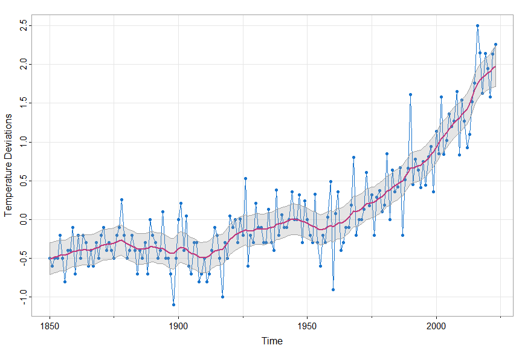

# fun with astsa

[](https://cran.r-project.org/package=astsa)


##### we'll demonstrate some of the capabilities of `astsa` ... the [NEWS page  has additional installation information](https://github.com/nickpoison/astsa/blob/master/NEWS.md).

Remember to load `astsa` at the start of a session.

> **`library(astsa)`**

it's more than just data ...


&#x1F4CC;  If it helps, an updated [pdf version of the `astsa` manual](https://github.com/nickpoison/astsa/blob/master/astsa.pdf) is available.

-----
-----
> &#128262; Note: when you are in a code block below, you can copy the contents of the block by moving your mouse to the upper right corner and clicking on the copy icon ( &#128203; ).
------
-----

### Table of Contents

  * [1. Data](#1-data)
  * [2. Plotting](#2-plotting)
     * [astsa Color Palette](#colors)
     * [Time Series Plots](#tsplot)
     * [Lag Plots](#lag-plots)
     * [Scatterplots](#scatterplots)
     * [Trends](#trends)
  * [3. Correlations](#3-correlations)
  * [4. ARIMA](#4-arima)
     * [Simulation](#arima-simulation)
     * [Estimation](#arima-estimation)
     * [Forecasting](#forecasting)
  * [5. Spectral Analysis](#5-spectral-analysis)
     * [ARMA Spectrum](#arma-spectral-density)
     * [Nonparametric](#nonparametric-spectral-analysis)
     * [Parametric](#parametric-spectral-analysis)
     * [Spectral Matrices](#more-multivariate-spectra)
  * [6. Testing for Linearity](#6-linearity-test)
  * [7. State Space Models and Kalman Filtering](#7-state-space-models)
     * [Quick Kalman Filter and Smoother - NEW](#quick-kalman-filter-and-smoother)
     * [Beginners Paradise - SSM](#beginners-paradise)
    * [The Old Stuff](#now-back-to-the-old-stuff)
  * [8. EM Algorithm and Missing Data](#8-em-algorithm-and-missing-data)
  * [9. Bayesian Techniques](#9-bayesian-techniques)
      * [AR Models](#ar-models)
      * [Stochastic Volatility Models](#stochastic-volatility)
      * [Gibbs Sampling for State Space Models - the FFBS Algorithm](#gibbs-sampling-for-linear-state-space-models)
      * [Effective Sample Size (ESS)](#ess)
  * [10. Arithmetic](#10-arithmetic)
     * [ARMAtoAR](#armatoar)
     * [Matrix Powers](#matrix-powers)
     * [Polynomial Multiplication](#polynomial-multiplication)
  * [11. The Spectral Envelope](#11-the-spectral-envelope)
     * [DNA and the Spectral Envelope](#dna-and-the-spectral-envelope)
     * [Real-Valued Series, Optimal Transformations, and the Spectral Envelope](#optimal-transformations-and-the-spectral-envelope)

-----
-----


## 1. Data

&#x1F4A1; There are lots of fun data sets included in `astsa`. Here's a list obtained by issuing the command

> **`data(package = "astsa")`**

And you can get more information on any individual set using the `help()` command, e.g.
`help(cardox)` or `?cardox`


|Name|     Title                     |
|----------|-------------|
|BCJ                         | Daily Returns of Three Banks                                |
|EBV                         | Entire Epstein-Barr Virus (EBV) Nucleotide Sequence         |
|EQ5                         | Seismic Trace of Earthquake number 5                        |
|EQcount                     | EQ Counts                                                   |
|EXP6                        | Seismic Trace of Explosion number 6                         |
|HCT                         | Hematocrit Levels                                           |
|Hare                        | Snowshoe Hare                                               |
|Lynx                        | Canadian Lynx                                               |
|PLT                         | Platelet Levels                                             |
|UnempRate                   | U.S. Unemployment Rate                                      |
|WBC                         | White Blood Cell Levels                                     |
|ar1miss                     | AR with Missing Values                                      |
|arf                         | Simulated ARFIMA                                            |
|beamd                       | Infrasonic Signal from a Nuclear Explosion                  |
|birth                       | U.S. Monthly Live Births                                    |
|blood                       | Daily Blood Work                                            |
|bnrf1ebv                    | Nucleotide sequence - BNRF1 Epstein-Barr                    |
|bnrf1hvs                    | Nucleotide sequence - BNRF1 of Herpesvirus saimiri          |
|cardox                      | Monthly Carbon Dioxide Levels at Mauna Loa                  |
|chicken                     | Monthly price of a pound of chicken                         |
|climhyd                     | Lake Shasta inflow data                                     |
|cmort                       | Cardiovascular Mortality from the LA Pollution study        |
|cpg                         | Hard Drive Cost per GB                                      |
|djia                        | Dow Jones Industrial Average                                |
|econ5                       | Five Quarterly Economic Series                              |
|eqexp                       | Earthquake and Explosion Seismic Series                     |
|flu                         | Monthly pneumonia and influenza deaths in the U.S., 1968 to 1978. |
|fmri                        | fMRI - complete data set                                    |
|fmri1                       | fMRI Data Used in Chapter 1                                 |
|gas                         | Gas Prices                                                  |
|gdp                         | Quarterly U.S. GDP                                          |
|globtemp                    | Global mean land-ocean temperature deviations to 2015       |
|globtempl                   | Global mean land (only) temperature deviations to 2015      |
|gnp                         | Quarterly U.S. GNP                                          |
|gtemp                       | Global mean land-ocean temperature deviations               |
|gtemp2                      | Global Mean Surface Air Temperature Deviations              |
|gtemp_land                  | Global mean land temperature deviations - updated to 2017   |
|gtemp_ocean                 | Global mean ocean temperature deviations - updated to 2017  |
|hor                         | Hawaiian occupancy rates                                    |
|jj                          | Johnson and Johnson Quarterly Earnings Per Share            |
|lap                         | LA Pollution-Mortality Study                                |
|lead                        | Leading Indicator                                           |
|nyse                        | Returns of the New York Stock Exchange                      |
|oil                         | Crude oil, WTI spot price FOB                               |
|part                        | Particulate levels from the LA pollution study              |
|polio                       | Poliomyelitis cases in US                                   |
|prodn                       | Monthly Federal Reserve Board Production Index              |
|qinfl                       | Quarterly Inflation                                         |
|qintr                       | Quarterly Interest Rate                                     |
|rec                         | Recruitment (number of new fish index)                      |
|sales                       | Sales                                                       |
|salmon                      | Monthly export price of salmon                              |
|salt                        | Salt Profiles                                               |
|saltemp                     | Temperature Profiles                                        |
|sleep1                      | Sleep State and Movement Data - Group 1                     |
|sleep2                      | Sleep State and Movement Data - Group 2                     |
|so2                         | SO2 levels from the LA pollution study                      |
|soi                         | Southern Oscillation Index                                  |
|soiltemp                    | Spatial Grid of Surface Soil Temperatures                   |
|sp500.gr                    | Returns of the S&P 500                                      |
|sp500w                      | Weekly Growth Rate of the Standard and Poor's 500           |
|speech                      | Speech Recording                                            |
|star                        | Variable Star                                               |
|sunspotz                    | Biannual Sunspot Numbers                                    |
|tempr                       | Temperatures from the LA pollution study                    |
|unemp                       | U.S. Unemployment                                           |
|varve                       | Annual Varve Series                                         |


[<sub>top</sub>](#table-of-contents)

-----


## 2. Plotting

### Colors

&#x1F4A1; When `astsa` is loaded, the astsa palette is attached.  The palette is  especially  suited for plotting  time series and it is a bit darker than the new default R4 palette. You can revert back using  `palette("default")`.  Also,

> **`astsa.col()`**

is included to easily adjust the opacity of the colors.

```r
par(mfrow=c(3,1))

barplot(rep(1,8), density=10, angle=c(45, -45), main='astsa palette')
barplot(rep(1,8), col=1:8, names=1:8, add=TRUE)

barplot(rep(1,8), density=10, angle=c(45, -45), main='transparency')
barplot(rep(1,8), col=astsa.col(1:8, .7), names=1:8, add=TRUE)

barplot(rep(1,8), density=10, angle=c(45, -45), main='pastelity')
barplot(rep(1,8), col=astsa.col(3:6, .5), names=rep(3:6, 2), add=TRUE)
```
**Notice each color display has diagonal lines behind it to demonstrate opacity.**


### tsplot

&#x1F535; For plotting time series and just about anything else, you can use

> **`tsplot()`**


&#x1F535; Notice there are minor ticks and a grid by default. Here are some examples.

```r
par(mfrow=c(2,1))
tsplot(soi, col=4, lwd=2)            
tsplot(soi, col=4, lwd=2, gg=TRUE)   # gg => gris-gris plot - the grammar of astsa is voodoo
```


&#x1F535; Many in one swell foop:

```r
tsplot(climhyd, ncol=2, gg=TRUE, col=2:7, lwd=2)  # another gris-gris plot
```


&#x1F535; Do you like `spaghetti` (you can shorten it to `spag` or even `spaghet`):

```r
tsplot(cbind(Hare,Lynx), col=astsa.col(c(2,4),.5), lwd=2, type="o", pch=c(0,2),
          ylab=expression(Number~~~(""%*% 1000)),  spaghetti=TRUE)
legend("topright", legend=c("Hare","Lynx"), col=c(2,4), lty=1, pch=c(0,2), bty="n")
```


&#x1F535; And the land where the LLN ceases to exist:

```r
x <- replicate(100, cumsum(rcauchy(1000))/1:1000)
tsplot(x, col=1:8, main='not happening', spaghetti=TRUE, gg=TRUE, ylab="sample mean", xlab="sample size")
```


### Lag Plots

&#x1F4A1; There are also lag plots for one series and for two series using

> **`lag1.plot()`** or **`lag2.plot()`**

By default, the graphic displays the sample ACF or CCF and a `lowess` fit.
They can be turned off individually (`?lag1.plot` or `?lag2.plot` for more info).

First,  for one series

```r
# minimal call 
lag1.plot(soi, 12)
# but prettified
lag1.plot(soi, 12, col=astsa.col(4, .3), pch=20, cex=2)
```


and for two series (the first one gets lagged)

```r
# minimal call - the first series gets lagged
lag2.plot(soi, rec, 8)
# but prettified
lag2.plot(soi, rec, 8, cex=1.1, pch=19, col=5, bgl='transparent', lwl=2, gg=T, box.col=gray(1))
```


### Scatterplots

&#x1F4A1; Sometimes it's nice to have a scatterplot with marginal histograms...

```r
scatter.hist(tempr, cmort, hist.col=astsa.col(5,.4), pt.col=5, pt.size=1.5, reset=FALSE)
lines(lowess(tempr, cmort), col=6, lwd=2)
```


### Trends

&#x1F4A1; As of version 1.15, there are two new scripts to help with analyzing trends. They are

> **`detrend()`** and **`trend()`**


 &#x1F535;  `detrend` returns a detrended series using a polynomial regression (default is linear) or lowess (with the default span).  For example,

 ```r
tsplot(cbind(salmon, detrend(salmon)), main='Norwegian Salmon - USD per KG')
 ```


&#x1F535; `trend`  fits a trend (same options as detrend) and produces a graphic of the series with the trend and error bounds superimposed.  The trend and error bounds are returned invisibly.

 ```r
 trend(soi, lowess=TRUE)
 ``` 

 


[<sub>top</sub>](#table-of-contents)

-----


## 3. Correlations

&#x1F4A1; There are four basic correlation scripts in `astsa`.  They are


> **`acf1()`**, **`acf2()`,**  **`ccf2()`**, and **`acfm()`**

The first one will give the sample ACF or PACF of a series.  The second one gives both the sample ACF and PACF in a multifigure plot and both on the same scale.  The graphics do not display the lag 0 value because it is always 1.  The third one plots the sample CCF. The first two also print the values; the third one returns the values invisibly.  The last one is for multiple time series and it produces a grid of plots of the sample ACFs and CCFs.


&#x1F535; The individual sample ACF or PACF

```r
acf1(soi)

  [1]  0.60  0.37  0.21  0.05 -0.11 -0.19 -0.18 -0.10  ...
```


&#x1F4A1; Since version 1.13.2, the LAG axis label indicates the frequency of
the data unless it is 1.  This way, you can see that the tick at LAG 1
corresponds to 12 (months) and so on.

```r
acf1(rec, pacf=TRUE, gg=TRUE, col=2:7, lwd=4)

   [1]  0.92 -0.44 -0.05 -0.02  0.07 -0.03 -0.03  0.04 ...
```


&#x1F535; Sample ACF and PACF at the same time

```r
acf2(diff(log(varve)))

        [,1]  [,2]  [,3]  [,4]  [,5]  [,6]  [,7]  [,8]  [,9] ...
   ACF  -0.4 -0.04 -0.06  0.01  0.00  0.04 -0.04  0.04  0.01 ...
   PACF -0.4 -0.24 -0.23 -0.18 -0.15 -0.08 -0.11 -0.05 -0.01 ...
```


&#x1F535; If you just want the values, use `plot=FALSE` (works for `acf1` too)
```r
acf2(diff(log(varve)), plot=FALSE)

                ACF         PACF
 [1,] -0.3974306333 -0.397430633
 [2,] -0.0444811551 -0.240404406
 [3,] -0.0637310878 -0.228393075
 [4,]  0.0092043800 -0.175778181
 [5,] -0.0029272130 -0.148565114
 [6,]  0.0353209520 -0.080800502

[33,] -0.0516758878 -0.017946464
[34,] -0.0308370865 -0.021854959
[35,]  0.0431050489  0.010867281
[36,] -0.0503025493 -0.068574763
```


&#x1F535; and the sample CCF

```r
ccf2(cmort, part)
```


&#x1F6AB; **Don't be fooled because neither series is white noise - far from it.**  Prewhiten before a real cross-correlation analysis (but you know that already because you've read it in one of the books).


&#x1F535; For multiple series, you can look at all sample ACFs (diagonal)
and CCFs (off-diagonal) simultaneously:

```r
acfm(diff(log(econ5)))
```


What you see are estimates of
_corr( x<sub>t+LAG</sub> , y<sub>t</sub> )_ where
_x<sub>t</sub>_ is a column series and _y<sub>t</sub>_ is a row
series. _x<sub>t</sub>_  leads when LAG is positive and
_x<sub>t</sub>_ lags when LAG is negative -
column-wise, the top series leads and row-wise, the side series lags.

The script uses `tsplot` so there are various options for the output.
For example, you can suppress the minor ticks if it's too much, or
you can do a "gris-gris" plot (the grammar of `astsa` is voodoo):

```r
acfm(diff(log(econ5)), nxm=0)    #  no minor ticks on LAG axis

acfm(diff(log(econ5)), gg=TRUE, acf.highlight=FALSE)  # Gris-Gris Gumbo Ya Ya
```


[<sub>top</sub>](#table-of-contents)

-----

## 4. ARIMA

### ARIMA Simulation

&#x1F4A1; You can simulate data from seasonal ARIMA or non-seasonal ARIMA models via

> **`sarima.sim()`**

The syntax are simple and we'll demonstrate with a couple of examples. There are more examples in the help file (`?sarima.sim`).  For example, you can input your own innovations or generate non-normal innovations (the default is normal).

&#x1F535; First an AR(2) with a mean of 50 (n=500 is the default sample size)

```r
y = sarima.sim(ar=c(1.5,-.75)) + 50
tsplot(y, main=expression(AR(2)~~~phi[1]==1.5~~phi[2]==-.75), col=4)
```


&#x1F535; Now we'll simulate from a seasonal model, `SARIMA(0,1,1)x(0,1,1)`<sub>`12`</sub>  --- B&J's favorite

```r
set.seed(101010)
x = sarima.sim(d=1, ma=-.4, D=1, sma=-.6, S=12, n=120) + 100
tsplot(x, col=4, lwd=2, gg=TRUE, ylab='Number of Widgets')
```


### ARIMA Estimation

&#x1F4A1; Fitting ARIMA models to data is a breeze with the modern script

> **`sarima()`**

It can do everything for you but you have to choose the model.

&#x274C; Don't use black boxes like `auto.arima` from the `forecast` package because IT DOESN'T WORK; see [Using an automated process to select the order of an ARMA time series model returns the true data generating process less than half the time even with simple data generating processes; and with more complex models the chance of success comes down nearly to zero even with long sample sizes.](http://freerangestats.info/blog/2015/09/30/autoarima-success-rates)


Originally, `astsa` had a version of automatic fitting of models but IT DIDN'T WORK and was scrapped.
 The bottom line is, if you don't know what you're doing (aka _ZERO KNOWLEDGE_), why are you doing it? Maybe a better idea is to [take a short course on fitting ARIMA models to data](https://www.datacamp.com/courses/arima-models-in-r).

> DON'T BELIEVE IT?? OK... HERE YOU GO:

```r
set.seed(666)
x = rnorm(1000)          # WHITE NOISE
forecast::auto.arima(x)  # BLACK BOX

   # partial output
     Series: x
     ARIMA(2,0,1) with zero mean

     Coefficients:
               ar1      ar2     ma1
           -0.9744  -0.0477  0.9509
     s.e.   0.0429   0.0321  0.0294

     sigma^2 estimated as 0.9657:  log likelihood=-1400
     AIC=2808.01   AICc=2808.05   BIC=2827.64
````
> HA! ... an ARMA(2,1) ??  BUT, if you KNOW what you are doing, you realize the model
is basically overparametrized white noise.

&nbsp;

Ok - back to our regularly scheduled program, `sarima()`.
As with everything else, there are many examples on the help page (`?sarima`) and we'll do a couple here.

&nbsp;


&#x1F535; Everyone else does it, so why don't we.  Here's a seasonal ARIMA fit to the AirPassenger data set (for the millionth time).

```r
sarima(log(AirPassengers),0,1,1,0,1,1,12, gg=TRUE, col=4)
```
and the partial output including the residual diagnostic plot is (`AIC` is basically `aic` divided by the sample size):

```r
Coefficients:
          ma1     sma1
      -0.4018  -0.5569
s.e.   0.0896   0.0731

sigma^2 estimated as 0.001348:  log likelihood = 244.7,  aic = -483.4

$degrees_of_freedom
[1] 129

$ttable
     Estimate     SE t.value p.value
ma1   -0.4018 0.0896 -4.4825       0
sma1  -0.5569 0.0731 -7.6190       0

$AIC
[1] -3.690069

$AICc
[1] -3.689354

$BIC
[1] -3.624225
```


&#x1F535; You can shut off the diagnostics using `details=FALSE`

```r
 sarima(log(AirPassengers),0,1,1,0,1,1,12, details=FALSE)
```


&#x1F535; You can fix parameters too, for example

```r
x = sarima.sim( ar=c(0,-.9), n=200 ) + 50
sarima(x, 2,0,0, fixed=c(0,NA,NA))  # ar1 (fixed at 0), ar2 (free), mean (free)
```
with output

```r
Coefficients:
      ar1      ar2    xmean
        0  -0.8829  49.9881
s.e.    0   0.0317   0.0381

sigma^2 estimated as 1.02:  log likelihood = -287.3,  aic = 580.59

$degrees_of_freedom
[1] 198

$ttable
      Estimate     SE   t.value p.value
ar2    -0.8829 0.0317  -27.8093       0
xmean  49.9881 0.0381 1311.6366       0

$AIC
[1] 2.954332

$AICc
[1] 2.954637

$BIC
[1] 3.003807
```

&#x1F535; And one more with exogenous variables - this is the regression
of `Lynx` on `Hare` lagged one year with AR(2) errors.

```r
pp = ts.intersect(Lynx, HareL1 = lag(Hare,-1), dframe=TRUE)
sarima(pp$Lynx, 2,0,0, xreg=pp$HareL1)
```
with partial output

```r
sigma^2 estimated as 59.57:  log likelihood = -312.8,  aic = 635.59

$degrees_of_freedom
[1] 86

$ttable
          Estimate     SE t.value p.value
ar1         1.3258 0.0732 18.1184  0.0000
ar2        -0.7143 0.0731 -9.7689  0.0000
intercept  25.1319 2.5469  9.8676  0.0000
xreg        0.0692 0.0318  2.1727  0.0326

$AIC
[1] 7.062148

$AICc
[1] 7.067377

$BIC
[1] 7.201026
```


### Forecasting

&#x1F4A1;  Forecasting your fitted ARIMA model is as simple as using

> **`sarima.for()`**

You get a graphic showing  ± 1 and 2 root mean square prediction errors and the predictions and standard errors are printed.   The syntax are similar to `sarima` but the
number of periods to forecast, `n.ahead`, has to be specified.


&#x1F535; Here's a simple example.  We'll generate some data from an ARIMA(1,1,0), forecast some of it and then compare the forecasts to the actual values.

```r
set.seed(12345)
x <- sarima.sim(ar=.9, d=1, n=150)
y <- window(x, start=1, end=100)
sarima.for(y, n.ahead=50, p=1, d=1, q=0, plot.all=TRUE)
text(85, 375, "PAST"); text(115, 375, "FUTURE")
abline(v=100, lty=2, col=4)
lines(x)
```
with partial output

```r
$pred
Time Series:
Start = 101
End = 150
Frequency = 1
 [1] 242.3821 241.3023 240.5037 239.9545 239.6264 239.4945 239.5364 ...

$se
Time Series:
Start = 101
End = 150
Frequency = 1
 [1]  1.136849  2.427539  3.889295  5.459392  7.096606  8.772528 10.466926 ...
```


&#x1F535; Notice the `plot.all=TRUE` in the `sarima.for` call. The default is `FALSE` in which case the graphic shows only the final 100 observations and the forecasts to make it easier to see what's going on (like in the next example).

```r
sarima.for(cardox, 60, 1,1,1, 0,1,1,12)
```


[<sub>top</sub>](#table-of-contents)

-----

## 5. Spectral Analysis

&#x1F4A1;  There are a few scripts that help with spectral analysis.

The spectral density of an ARMA model can be obtained using

> **`arma.spec()`**

Nonparametric spectral analysis is done with

> **`mvspec()`**

and parametric spectral analysis with

> **`spec.ic()`**

### ARMA Spectral Density


&#x1F4A1;  `arma.spec` tests for causality, invertibility, and common zeros. If the model is not causal or invertible an error message is given. If there are approximate common zeros, a spectrum will be displayed and a warning will be given.  The frequency and spectral ordinates are returned invisibly.

```r
arma.spec(ar = c(1.5, -.75), ma = c(-.8,.4), col=4, lwd=2)
```


and if you want to do a seasonal model, you have to be a little creative; e.g., _x<sub>t</sub>= .4 x<sub>t-12</sub> + w<sub>t</sub> + .5 w<sub>t-1</sub>_

```r
arma.spec(ar=c(rep(0,11),.4), ma=.5, col=5, lwd=3, frequency=12)
```


Some goofs
```r
arma.spec(ar=10, ma=20)

   WARNING: Model Not Causal
   WARNING: Model Not Invertible
   Error in arma.spec(ar = 10, ma = 20) : Try Again
```
```r
arma.spec(ar= .9, ma= -.9, main="It's White Noise, Dingus")

   WARNING: Parameter Redundancy
```


### nonparametric spectral analysis

&#x1F4A1; `mvspec` was originally just a way to  get the multivariate spectral density estimate out of `spec.pgram` directly (without additional calculations), but then it turned into its own little monster with different defaults and bandwidth calculations.

&#x1F535; If you want the periodogram, you got it (tapering is not done automatically because you're old enough to do it by yourself):

```r
x1 = 2*cos(2*pi*1:100*5/100)  + 3*sin(2*pi*1:100*5/100)
x2 = 4*cos(2*pi*1:100*10/100) + 5*sin(2*pi*1:100*10/100)
x3 = 6*cos(2*pi*1:100*40/100) + 7*sin(2*pi*1:100*40/100)
x  = x1 + x2 + x3
tsplot(x, col=5, lwd=2, gg=TRUE)
mvspec(x, col=4, lwd=2, type='o', pch=20)
```


&#x1F535; You can smooth in the usual way and get the CIs on the log-plot:

```r
par(mfrow=c(2,1))
sois  = mvspec(soi, spans=c(7,7), taper=.1, col=4, lwd=2)
soisl = mvspec(soi, spans=c(7,7), taper=.5, col=4, lwd=2, log='y')
```


&#x1F535; and you can get the usual information

```r
c(sois$df, sois$bandwidth)

  [1] 17.4261799  0.2308103
```

and easily locate the peaks

```r
 sois$details[1:45,]

      frequency  period spectrum

 [8,]     0.200  5.0000   0.0461
 [9,]     0.225  4.4444   0.0489
[10,]     0.250  4.0000   0.0502  <- here
[11,]     0.275  3.6364   0.0490
[12,]     0.300  3.3333   0.0451
[13,]     0.325  3.0769   0.0403
[14,]     0.350  2.8571   0.0361

[38,]     0.950  1.0526   0.1253
[39,]     0.975  1.0256   0.1537
[40,]     1.000  1.0000   0.1675  <- here
[41,]     1.025  0.9756   0.1538
[42,]     1.050  0.9524   0.1259
[43,]     1.075  0.9302   0.0972

```
&#x1F535; and cross-spectra

```r
mvspec(cbind(soi,rec), spans=20, plot.type="coh", ci.lty=2, main="SOI & Recruitment")
```


### parametric spectral analysis


&#x1F4A1; `spec.ic` is similar to `spec.ar` but the option to use BIC instead of AIC is available.  Also, you can use the script to compare  AIC and BIC for AR fits to the data.

&#x1F535; Based on BIC after detrending (default is using AIC with `BIC=FALSE`)

```r
u <- spec.ic(soi, BIC=TRUE, detrend=TRUE, col=4, lwd=2)
```


&#x1F535; Print and plot AIC and BIC (both pick order 15):

```r
u[[1]]   # notice the values are adjusted by the min

      ORDER         AIC        BIC
 [1,]     0 272.6937023 210.955320
 [2,]     1  82.1484043  24.525915
 [3,]     2  84.1441892  30.637592
 [4,]     3  85.5926277  36.201922
 [5,]     4  80.4715619  35.196749
 [6,]     5  70.7822012  29.623280
 [7,]     6  69.5898661  32.546837
 [8,]     7  71.5718647  38.644728
 [9,]     8  71.4320021  42.620757
[10,]     9  63.2815353  38.586183
[11,]    10  49.9872355  29.407775
[12,]    11  40.7220194  24.258451
[13,]    12  41.0928139  28.745138
[14,]    13  37.0833413  28.851557
[15,]    14   8.7779160   4.662024
[16,]    15   0.0000000   0.000000
[17,]    16   0.4321663   4.548058
[18,]    17   0.8834736   9.115258
[19,]    18   0.9605224  13.308199
[20,]    19   2.9348253  19.398394
[21,]    20   4.7475516  25.327012
[22,]    21   6.7012637  31.396616
[23,]    22   7.1553956  35.966641
[24,]    23   4.6428297  37.569967
[25,]    24   5.8610042  42.904033
[26,]    25   6.5000325  47.658954
[27,]    26   2.8918549  48.166668
[28,]    27   4.2581518  53.648857
[29,]    28   5.5960927  59.102690
[30,]    29   6.3765400  63.999030
[31,]    30   2.6978096  64.436191
```

```r
tsplot(0:30, u[[1]][,2:3], type='o', col=2:3, xlab='ORDER', nxm=5, lwd=2, gg=TRUE)
```


### more multivariate spectra

&#x1F535; The data frame `econ5` was used to consider the effect of quarterly GNP, consumption, and government and private investment on  U.S. unemployment. In this case, `mvspec` will plot the individual spectra by default and you can extract the spectral matrices as `fxx`, an array of dimensions `dim = c(p,p,nfreq)` as well as plot coherencies and phases. Here, <i>p = 5</i>:

```r
gr = diff(log(econ5))
gr = scale(gr)  # for comparable spectra
tsplot(gr, ncol=2, col=2:6, lwd=2, byrow=FALSE)
gr.spec = mvspec(gr, spans=c(7,7), detrend=FALSE, taper=.25, col=2:6, lwd=2, main='spectra')
round(gr.spec$fxx, 2)
```


And a sample of the output of the last line giving the matrix estimate. The numbers at top
refer to frequency ordinate:

```r
, , 49

              [,1]          [,2]          [,3]          [,4]          [,5]
[1,]  0.097+0.000i -0.048+0.042i -0.053+0.080i  0.032-0.037i -0.027+0.033i
[2,] -0.048-0.042i  0.129+0.000i  0.100-0.039i -0.052+0.012i  0.111+0.000i
[3,] -0.053-0.080i  0.100+0.039i  0.232+0.000i -0.041+0.001i  0.023+0.079i
[4,]  0.032+0.037i -0.052-0.012i -0.041-0.001i  0.051+0.000i -0.049+0.008i
[5,] -0.027-0.033i  0.111+0.000i  0.023-0.079i -0.049-0.008i  0.157+0.000i

, , 50

              [,1]          [,2]          [,3]          [,4]          [,5]
[1,]  0.093+0.000i -0.054+0.045i -0.053+0.081i  0.030-0.034i -0.033+0.035i
[2,] -0.054-0.045i  0.124+0.000i  0.112-0.041i -0.048+0.010i  0.100+0.008i
[3,] -0.053-0.081i  0.112+0.041i  0.240+0.000i -0.034+0.009i  0.027+0.085i
[4,]  0.030+0.034i -0.048-0.010i -0.034-0.009i  0.050+0.000i -0.043+0.015i
[5,] -0.033-0.035i  0.100-0.008i  0.027-0.085i -0.043-0.015i  0.146+0.000i

```

[<sub>top</sub>](#table-of-contents)

-----

## 6. Linearity Test

&#x1F4A1;  Linear time series models are built on the linear process, where it is assumed that a univariate series <i>X<sub>t</sub></i> can be generated as

&emsp;&emsp; <i>X<sub>t</sub> = &mu; + &sum; &psi;<sub>j</sub> Z<sub>t - j</sub></i> where  &sum; | &psi;<sub>j</sub> | < &infin;


where <i>Z<sub>t</sub></i> is a sequence of i.i.d. random variables with at least finite third moments.  This assumption can be tested using the bispectrum, which  is constant under the null hypothesis  that the data are from a linear process with i.i.d. innovations.  The workhorse here is

> **`test.linear()`**

and more details can be found in its help file (`?test.linear`).    Chi-squared test statistics are formed in blocks to measure departures from the null hypothesis and the corresponding p-values are displayed in a graphic and returned invisibly -
[details in this paper](https://www.la.utexas.edu/hinich/files/Statistics/Normbispec.pdf).

&#x1F535; First an example of a linear process where the graphic suggests a constant bispectrum.

```r
test.linear(soi)
```


&#x1F535; Notoriously nonlinear processes are financial series, for example the returns of the New York Stock Exchange (NYSE) from February 2, 1984 to December 31, 1991

```r
# other packages have an 'nyse' data set
# nyse = astsa::nyse  # if you have one of those other packages loaded
test.linear(nyse)
tsplot(nyse, col=4)
```


[<sub>top</sub>](#table-of-contents)

-----

## 7. State Space Models

 First, the new and improved
 ### Quick Kalman Filter and Smoother 

&#128293; We've added two new scripts to simplify Kalman filtering and smoothing for linear state space models. The scripts are
> `Kfilter` and `Ksmooth`

and are meant to replace  `Kfilter0/Ksmooth0`,  `Kfilter1/Ksmooth1`, `Kfilter2/Ksmooth2` with simplified arguments and faster running times. 

&#x1F535; We'll do the bootstrap example from the text, which used to take a long time... but now is very fast.

```r
# Example 6.13  
tol = .0001       # determines convergence of optimizer     
nboot = 500       # number of bootstrap replicates     
 
# set up 
y     = window(qinfl, c(1953,1), c(1965,2))  # quarterly inflation   
z     = window(qintr, c(1953,1), c(1965,2))  # interest   
num   = length(y) 
A     = array(z, dim=c(1,1,num))
input = matrix(1,num,1)  

# Function to Calculate Likelihood   
Linn  = function(para, y.data){  # pass data also
   phi = para[1];  alpha = para[2]
   b   = para[3];  Ups   = (1-phi)*b
   sQ  = para[4];  sR    = para[5]  
   kf  = Kfilter(y.data, A, mu0, Sigma0, phi, sQ, sR, Ups, Gam=alpha, input)
   return(kf$like)    
}

# Parameter ML Estimation   
mu0      = 1
Sigma0   = .01  
init.par = c(phi=.84, alpha=-.77, b=.85, sQ=.12, sR=1.1) # initial values   

est = optim(init.par,  Linn, NULL, y.data=y, method="BFGS", hessian=TRUE, 
             control=list(trace=1, REPORT=1, reltol=tol))  
SE  = sqrt(diag(solve(est$hessian)))   

## results
phi   = est$par[1];  alpha = est$par[2]
b     = est$par[3];  Ups   = (1-phi)*b         
sQ    = est$par[4];  sR    = est$par[5] 
round(cbind(estimate=est$par, SE), 3)  

   # output
   ###        estimate      SE
   ###  phi      0.866   0.223
   ###  alpha   -0.686   0.486
   ###  b        0.788   0.226
   ###  sQ       0.115   0.107
   ###  sR       1.135   0.147

# BEGIN BOOTSTRAP   
# Run the filter at the estimates 
kf  = Kfilter(y, A, mu0, Sigma0, phi, sQ, sR, Ups, Gam=alpha, input) 

# Pull out necessary values from the filter and initialize  
xp      = kf$Xp
Pp      = kf$Pp
innov   = kf$innov 
sig     = kf$sig 
e       = innov/sqrt(sig)
e.star  = e                      # initialize values
y.star  = y  
xp.star = xp  
k       = 4:50                   # hold first 3 observations fixed 
para.star = matrix(0, nboot, 5)  # to store estimates
init.par  =  c(.84, -.77, .85, .12, 1.1)    


pb = txtProgressBar(min = 0, max = nboot, initial = 0, style=3)  # progress bar

for (i in 1:nboot){
 setTxtProgressBar(pb,i)                       
 e.star[k] = sample(e[k], replace=TRUE)   
 for (j in k){ 
   K = (phi*Pp[j]*z[j])/sig[j]  
  xp.star[j] = phi*xp.star[j-1] + Ups + K*sqrt(sig[j])*e.star[j]
  } 
   y.star[k] = z[k]*xp.star[k] + alpha + sqrt(sig[k])*e.star[k]  
 est.star  = optim(init.par, Linn, NULL, y.data=y.star, method='BFGS', control=list(reltol=tol))     
 para.star[i,] = cbind(est.star$par[1], est.star$par[2], est.star$par[3], 
                       abs(est.star$par[4]), abs(est.star$par[5]))   
}
close(pb) 

# Some summary statistics
# SEs from the bootstrap
rmse = rep(NA,5)
for(i in 1:5){rmse[i]=sqrt(sum((para.star[,i]-est$par[i])^2)/nboot)
              cat(i, rmse[i],"\n") 
             }    
# output (compare to SEs above)        
### 1 0.4341447 
### 2 0.5653623 
### 3 0.3201879 
### 4 0.1945398 
### 5 0.3183883 
             
# Plot phi and sigw  (scatter.hist in astsa)
phi  = para.star[,1] 
sigw = abs(para.star[,4]) 
phi  = ifelse(phi<0, NA, phi)    # any phi < 0 not plotted
scatter.hist(sigw, phi, ylab=expression(phi), xlab=expression(sigma[~w]), 
             hist.col=astsa.col(5,.4), pt.col=5, pt.size=1.5)
```


&#x1F535; The smoother is similar. Here's a simple example with no output shown.
```r
# generate some data
 set.seed(1)
 sQ  = 1; sR = 3; n = 100  
 mu0 = 0; Sigma0 = 10; x0 = rnorm(1,mu0,Sigma0)
 w = rnorm(n); v = rnorm(n)
 x = c(x0 + sQ*w[1]);  y = c(x[1] + sR*v[1])   # initialize
for (t in 2:n){
  x[t] = x[t-1] + sQ*w[t]
  y[t] = x[t] + sR*v[t]   
  }
# let's make y a time series starting in the year 3000 just to mess with its mind
y = ts(y, start=3000)  

# run and plot the filter  
run = Ksmooth(y, A=1, mu0, Sigma0, Phi=1, sQ, sR)

# the smoother comes back as an array, so you have to un-array it
tsplot(cbind(y, drop(run$Xs)), spaghetti=TRUE, type='o', col=c(4,6), pch=c(1,NA))
legend('topleft', legend=c("y(t)","Xs(t)"), lty=1, col=c(4,6), bty="n", pch=c(1,NA))
```

<br/> 

### Beginners Paradise
 
 &#x1F4A1;  There is a basic state space model script in `astsa` for beginners:

> **`ssm()`**


&#x1F535; First, consider a simple univariate model.
We write the **states** as _x<sub>t</sub>_ and the **observations** as _y<sub>t</sub>_.


&emsp;&emsp;_x<sub>t</sub> = &alpha; + &phi; x<sub>t-1</sub> + w<sub>t</sub>_    &nbsp;&nbsp; and &nbsp;&nbsp; _y<sub>t</sub> = A x<sub>t</sub> + v<sub>t</sub>_<br/>

where  _w<sub>t</sub> ~ iid N(0, &sigma;<sub>w</sub>)_ &perp;   _v<sub>t</sub> ~ iid N(0, &sigma;<sub>v</sub>)_ &perp; _x<sub>0</sub> ~ N(&mu;<sub>0</sub>, &sigma;<sub>0</sub>)_

&#x1F535; We'll fit the model to one of the global temperature series.
To use the script, you have to give initial estimates and then the script fits the model via MLE. The initial values of &mu;<sub>0</sub> and &sigma;<sub>0</sub> are chosen automatically.

```r
u = ssm(gtemp_land, A=1, phi=1, alpha=.01, sigw=.01, sigv=.1)
```
with output (estimates and standard errors)

```r
        estimate          SE
phi   1.01350314 0.009171042
alpha 0.01270687 0.003749046
sigw  0.04252969 0.010688521
sigv  0.14902612 0.010685375
```

and a nice picture - the data [_y<sub>t</sub>_], the smoothers [ E(_x<sub>t</sub>_ | _y<sub>1</sub> ,..., y<sub>n</sub>_) ] and  &#177;2 root MSPEs.  The smoothers are
in `Xs` and the MSPEs are in `Ps`:

```r
tsplot(gtemp_land, col=4, type="o", pch=20, ylab="Temperature Deviations")
lines(u$Xs, col=6, lwd=2)
 xx = c(time(u$Xs), rev(time(u$Xs)))
 yy = c(u$Xs-2*sqrt(u$Ps), rev(u$Xs+2*sqrt(u$Ps)))
polygon(xx, yy, border=8, col=gray(.6, alpha=.25) )
```



&#x1F535; You can fix &phi;=1 in this case if you believe the series is taking a random walk with drift:

```r
ssm(gtemp_land, A=1, alpha=.01, phi=1, sigw=.01, sigv=.1, fixphi=TRUE)

##-- output --##
initial  value -79.270104
iter   2 value -158.182337
iter   3 value -160.835289

iter  17 value -172.310970
iter  18 value -172.312005
iter  19 value -172.326951
iter  20 value -172.326965
iter  20 value -172.326965
iter  20 value -172.326965
final  value -172.326965
converged

        estimate          SE
alpha 0.01356630 0.004279108
sigw  0.04930987 0.011151130
sigv  0.14727510 0.010881612
```
<br/>

&#x1F535; The output of `ssm()` gives the predictors  [`Xp`] and MSPE [`Pp`], the
filtered values [`Xf` and `Pf`]  and the smoothers [`Xs` and `Ps`]:

```r
str(u)

List of 6
 $ Xp: Time-Series [1:138] from 1880 to 2017: -0.591 -0.602 -0.538 -0.511 -0.537 ...
 $ Pp: Time-Series [1:138] from 1880 to 2017: 0.02441 0.01375 0.01053 0.00915 0.00846 ...
 $ Xf: Time-Series [1:138] from 1880 to 2017: -0.606 -0.544 -0.516 -0.543 -0.615 ...
 $ Pf: Time-Series [1:138] from 1880 to 2017: 0.01163 0.00849 0.00714 0.00648 0.00613 ...
 $ Xs: Time-Series [1:138] from 1880 to 2017: -0.595 -0.588 -0.593 -0.607 -0.621 ...
 $ Ps: Time-Series [1:138] from 1880 to 2017: 0.00432 0.0038 0.0035 0.00333 0.00324 ...
 ```

<br/>

###  now back to the old stuff
&#9888; THE FOLLOWING HAS BEEN SUPERSCEDED BY `Kfilter` and `Ksmooth` DESCRIBED ABOVE

For general models, there are three levels of filtering and smoothing,

> **`Kfilter0()/Ksmooth0()`**, **`Kfilter1()/Ksmooth1()`**, **`Kfilter2()/Ksmooth2()`**

Further explanations are also given on a [special page on Kalman filtering and
smoothing](https://github.com/nickpoison/tsa4/blob/master/chap6.md) for the text.

MLE is accomplished via  the `Kfilter_()`s, each of  which returns the value
of -log.likelihood of the innovations.


&#x1F535; We'll give an example of using `Kfiler0()` on some generated data.
The model is a simple AR(1) plus noise:

&emsp;&emsp;_x<sub>t</sub> =  &phi; x<sub>t-1</sub> + w<sub>t</sub>_    &nbsp;&nbsp; and &nbsp;&nbsp; _y<sub>t</sub> = x<sub>t</sub> + v<sub>t</sub>_<br/>


```r
# Generate Data
set.seed(999)
num  = 100
N    = num+1
x    = sarima.sim(n=N, ar=.8)      # state x[0], x[1], ..., x[100]
y    = ts(x[-1] + rnorm(num,0,1))  # obs         y[1], ..., y[100]


# Function to evaluate the likelihood
Linn  = function(para){
  phi = para[1]; sigw = para[2]; sigv = para[3]
  kf  = Kfilter0(num, y, A=1, mu0=0, Sigma0=10, phi, sigw, sigv)
  return(kf$like)
  }

# Estimation
init.par = c(.1, 1, 1)   # initial parameter values
(est = optim(init.par, Linn, gr=NULL, method="BFGS", hessian=TRUE, control=list(trace=1,REPORT=1)))

   # output from numerical optimization
   initial  value 115.748358
   iter   2 value 98.291352
   iter   3 value 94.054737
   iter   4 value 93.454266
   iter   5 value 92.192204
   iter   6 value 91.398541
   iter   7 value 91.368801
   iter   8 value 91.365538
   iter   9 value 91.365527
   iter   9 value 91.365526
   iter   9 value 91.365525
   final  value 91.365525
   converged
   $par
   [1] 0.7653691 1.0408250 0.9348492

   $value
   [1] 91.36552

   $counts
   function gradient
         28        9

   $convergence
   [1] 0

   $message
   NULL

   $hessian
             [,1]     [,2]     [,3]
   [1,] 178.81837 46.95386 -8.64152
   [2,]  46.95386 60.71263 38.88109
   [3,]  -8.64152 38.88109 65.62742

# nice display of the results
SE = sqrt(diag(solve(est$hessian)))
cbind(estimate=c(phi=est$par[1],sigw=est$par[2],sigv=est$par[3]), SE)

         estimate         SE
   phi  0.7653691 0.09726158   # actual phi = .8
  sigw  1.0408250 0.21121288   # actual sigw = 1
  sigv  0.9348492 0.18193356   # actual sigv = 1

# and maybe plot the data with the smoother
ks =  Ksmooth0(num, y, A=1,mu0=0, Sigma0=10, est$par[1], est$par[2], est$par[3])
tsplot(y, type='o', col=4, pch=20)
lines(ks$xs, col=6, lwd=2)
```


[<sub>top</sub>](#table-of-contents)

---

## 8. EM Algorithm and Missing Data

&#x1F4A1;  To use the EM algorithm presented in [Shumway & Stoffer (1982)](https://www.stat.pitt.edu/stoffer/dss_files/em.pdf) and discussed in detail in Chapter 6 of the
text [Time Series Analysis and Its Applications: With R Examples](http://www.springer.com/us/book/9783319524511), there are two scripts

> **`EM0()`** and **`EM1()`**

that follow the Kalman filtering scripts, `EM0` does the EM Algorithm for Time Invariant State Space Models, and `EM1` does the EM Algorithm for General State Space Models.

&#x1F535; We'll do an example for the general set up using the data in `blood` containing the daily blood work of a patient for 90 days and where there are many missing observations after the first month.


```r
tsplot(blood, type='o', col=c(6,4,2), lwd=2, pch=19, cex=1)
```


+ First the set up.

&emsp;&emsp;_x<sub>t</sub> =   &Phi; x<sub>t-1</sub> + w<sub>t</sub>_    &nbsp;&nbsp; and &nbsp;&nbsp; _y<sub>t</sub> = A<sub>t</sub> x<sub>t</sub> + v<sub>t</sub>_

where _A<sub>t</sub>_ is 3x3 identity when observed, and 0 matrix when missing.
The errors are  _w<sub>t</sub> ~ iid N<sub>3</sub>(0, Q)_ &perp;   _v<sub>t</sub> ~ iid N<sub>3</sub>(0, V)_ &perp; _x<sub>0</sub> ~ N<sub>3</sub>(&mu;<sub>0</sub>, &Sigma;<sub>0</sub>)_.


```r
y    = cbind(WBC, PLT, HCT)      # variables in blood with 0s instead of NAs
#  y = blood;  y[is.na(y)] = 0   # this works too
num  = nrow(y)
A    = array(0, dim=c(3,3,num))  # creates num 3x3 zero matrices
for(k in 1:num) if (y[k,1] > 0) A[,,k]= diag(1,3) # measurement matrices for observed

```

+ Next, run the EM Algorithm by specifying model parameters. You can specify the max number of iterations and relative tolerance, too.

```r
# Initial values
mu0    = matrix(0,3,1)
Sigma0 = diag(c(.1,.1,1) ,3)
Phi    = diag(1,3)
cQ     = diag(c(.1,.1,1), 3)
cR     = diag(c(.1,.1,1), 3)
(em = EM1(num, y, A, mu0, Sigma0, Phi, cQ, cR, 100, .001))
```

Note that, as in the `Kfilter_` and `Ksmooth_` scripts,
`cQ` and `cR` are the Cholesky-type decompositions of `Q` and `R`. In particular, `Q = t(cQ)%*%cQ` and `R = t(cR)%*%cR` is all that is required (assuming `Q` and `R` are valid covariance matrices).  In this example, the covariance matrix `R` is diagonal, so the elements of `cR` are the standard deviations.

The (partial) output is

```r
iteration    -loglikelihood
     1           68.28328
     2          -183.9361
     3          -194.2051
     4          -197.5444
     5          -199.7442

    20          -220.2935
    21          -221.1649
    22          -221.9869
    23          -222.762
    24          -223.4924
    25          -224.1805

    40          -230.6582
    41          -230.9019
    42          -231.1289

# estimates below

$Phi
            [,1]        [,2]        [,3]
[1,]  0.98052698 -0.03494377 0.008287009
[2,]  0.05279121  0.93299479 0.005464917
[3,] -1.46571679  2.25780951 0.795200344

$Q
             [,1]         [,2]       [,3]
[1,]  0.013786772 -0.001724166 0.01882951
[2,] -0.001724166  0.003032109 0.03528162
[3,]  0.018829510  0.035281625 3.61897901

$R
            [,1]      [,2]      [,3]
[1,] 0.007124671 0.0000000 0.0000000
[2,] 0.000000000 0.0168669 0.0000000
[3,] 0.000000000 0.0000000 0.9724247

$mu0
          [,1]
[1,]  2.119269
[2,]  4.407390
[3,] 23.905038

$Sigma0
              [,1]          [,2]          [,3]
[1,]  4.553949e-04 -5.249215e-05  0.0005877626
[2,] -5.249215e-05  3.136928e-04 -0.0001199788
[3,]  5.877626e-04 -1.199788e-04  0.1677365489

$cvg
[1] 0.0009832656  # relative tolerance of -loglikelihood at convergence
```

+ Now  plot the results.

```r
# Run smoother at the estimates (using the new Ksmooth script)
ks  = Ksmooth(y, A, em$mu0, em$Sigma0, em$Phi, sQ=t(chol(em$Q)), sR=sqrt(em$R))

# Pull out the values
y1s = ks$Xs[1,,]
y2s = ks$Xs[2,,]
y3s = ks$Xs[3,,]
p1  = 2*sqrt(ks$Ps[1,1,])
p2  = 2*sqrt(ks$Ps[2,2,])
p3  = 2*sqrt(ks$Ps[3,3,])

# plots
par(mfrow=c(3,1))
tsplot(WBC, type='p', pch=19, ylim=c(1,5), col=6, lwd=2, cex=1)
lines(y1s)
  xx = c(time(WBC), rev(time(WBC)))  # same for all
  yy = c(y1s-p1, rev(y1s+p1))
polygon(xx, yy, border=8, col=astsa.col(8, alpha = .1))

tsplot(PLT, type='p', ylim=c(3,6), pch=19, col=4, lwd=2, cex=1)
lines(y2s)
  yy = c(y2s-p2, rev(y2s+p2))
polygon(xx, yy, border=8, col=astsa.col(8, alpha = .1))

tsplot(HCT, type='p', pch=19, ylim=c(20,40), col=2, lwd=2, cex=1)
lines(y3s)
  yy = c(y3s-p3, rev(y3s+p3))
polygon(xx, yy, border=8, col=astsa.col(8, alpha = .1))
```


[<sub>top</sub>](#table-of-contents)

---

## 9. Bayesian Techniques

&#x1F4A1; We're adding some scripts to handle Bayesian analysis. So far we have
> `ar.mcmc` to fit AR models 

> `SV.mcmc` to fit stochastic volatility models 

> `ffbs` the forward filter backward sampling (FFBS) algorithm - part of Gibbs sampler

### AR Models

&#x1F535; For a minimal example, we'll fit an AR(2) to the Recruitment (`rec`) data. 

&emsp;&emsp;_x<sub>t</sub> = &phi;<sub>0</sub> +  &phi;<sub>1</sub> x<sub>t-1</sub> + &phi;<sub>2</sub> x<sub>t-2</sub> + &sigma; w<sub>t</sub>_  

where _w<sub>t</sub>_ is standard Gaussian white noise.

You just need to input the data and the order because the priors, the number of MCMC iterations (including burnin) have defaults. The method is fast and efficient; the ESSs are the same as the number of iterations (`n.iter`). The output includes two graphics (unless you set `plot = FALSE`) and some quantiles of the sampled parameters.  For further details and references, see the help file (`?ar.mcmc`); this is not covered in tsa4.

```r
u = ar.mcmc(rec, 2)
```

with screen output
```
   Quantiles: 
             phi0     phi1       phi2     sigma
   1%    3.991699 1.268724 -0.5604687  8.799926
   2.5%  4.504180 1.276576 -0.5460294  8.903435
   5%    4.897493 1.289001 -0.5306669  9.001894
   10%   5.312776 1.302280 -0.5163514  9.109764
   25%   5.976938 1.325613 -0.4907099  9.291095
   50%   6.780525 1.353442 -0.4614311  9.498246
   75%   7.571304 1.380684 -0.4361400  9.703718
   90%   8.235147 1.406633 -0.4130296  9.913079
   95%   8.643331 1.424673 -0.3985069 10.018678
   97.5% 8.928998 1.435397 -0.3874075 10.130158
   99%   9.482394 1.458155 -0.3751349 10.335975  
```

and graphics


<br/>

### Stochastic Volatility

&#x1F535; For an example, we'll fit a stochastic volatility model to the S&P500 weekly returns(`sp500w`).  We've also added some new financial data sets, `sp500.gr` (daily S&P 500 returns) and
`BCJ` (daily returns for 3 banks, Bank of America, Citi, and JP Morgan Chase).  The model is

&emsp;&emsp;_x<sub>t</sub> =  &phi; x<sub>t-1</sub>  + &sigma; w<sub>t</sub>_ , &nbsp; &nbsp; and &nbsp;  &nbsp;
_y<sub>t</sub> =&beta;_ exp _(&half; x<sub>t</sub>) &epsilon;<sub>t</sub>_

where _w<sub>t</sub>_ and  _&epsilon;<sub>t</sub>_  are independent standard Gaussian white noise,
 _x<sub>t</sub>_ is the hidden log-volatility process and _y<sub>t</sub>_ are the returns.
 Most of the inputs have defaults, so a minimal run just needs the data specified.

 ```r
 u = SV.mcmc(sp500w)   # put the results in an object - it's important
 ```

 The immediate output shows the status, then the time to run and the acceptance rate of the Metropolis MCMC (which should be close to 28%):
 ```
  |= = = = = = = = = = = = = = = = = = = = = = = = =| 100%
   Time to run (secs): 
     user  system elapsed 
    43.11    0.96   45.53 
   The acceptance rate is: 27.1%
```
and graphics (traces, effective sample sizes, ACFs, histograms with 2.5%-50%-97.5% quantiles
followed by the posterior mean log-volatility with 95% credible intervals).


&#x1F429;  The **Effective Sample Size (ESS)** in the graphic above were calculated using the script `ESS`, which became available in version 1.16 of the package.


An easy way to see the defaults (a list of options) is to look at the structure of the object:
```r
str(u)

   List of 5
    $ phi    : num [1:1000] 0.764 0.764 0.764 0.764 0.764 ...
    $ sigma  : num [1:1000] 0.36 0.36 0.36 0.36 0.36 ...
    $ beta   : num [1:1000] 0.0199 0.0206 0.0208 0.0202 0.0208 ...
    $ log.vol: num [1:1000, 1:509] 0.0146 0.0266 -0.0694 -0.1368 -0.0442 ...
    $ options:List of 8
     ..$ nmcmc   : num 1000
     ..$ burnin  : num 100
     ..$ init    : num [1:3] 0.9 0.5 0.1
     ..$ hyper   : num [1:5] 0.9 0.5 0.075 0.3 -0.25
     ..$ tuning  : num 0.03
     ..$ sigma_MH: num [1:2, 1:2] 1 -0.25 -0.25 1
     ..$ npart   : num 10
     ..$ mcmseed : num 90210
```

&#x1F4A1; And as always, references and details are in the help file (`?SV.mcmc`). The techniques are not covered in tsa4.


### Gibbs Sampling for Linear State Space Models

&#x1F535; The package now contains `ffbs` (**Forward Filtering Backward Sampling - FFBS**)
 to facilitate Gibbs sampling for linear state space models:  

&emsp;&emsp;  x<sub>t</sub> = &Phi; x<sub>t-1</sub> +  &Upsilon; u<sub>t</sub> + sQ w<sub>t</sub>,  &nbsp; &nbsp;  y<sub>t</sub> = A<sub>t</sub> x<sub>t</sub> +  &Gamma; u<sub>t</sub> + sR v<sub>t</sub>, 

w<sub>t</sub> ~ iid N<sub>p</sub>(0, I) &perp;   v<sub>t</sub> ~ iid N<sub>q</sub>(0, I) &perp; x<sub>0</sub> ~ N<sub>p</sub>(&mu;<sub>0</sub>, &Sigma;<sub>0</sub>)
and  u<sub>t</sub> is an r-dimensional input sequence.

If $\Theta$ represents the parameters, $x_{0:n}$ the states, $y_{1:n}$ the data, then the generic Gibbs sampler is (repeat and rinse)

&emsp;&emsp; (1) sample $\Theta' \sim p(\Theta \mid x_{0:n}, y_{1:n})$ <br/>
&emsp;&emsp; (2) sample $x_{0:n}' \sim p(x_{0:n} \mid \Theta', y_{1:n})$

`ffbs` accomplishes (2). There is NOT a script to do (1) because the model is too general to build a decent script to cover the possibilities.  


The script uses  _Level 1_ of the text's Kalman filtering and smoothing set up with
a change in how the noise covariance matrices are identified ( 
[additional Chapter 6 info](https://github.com/nickpoison/tsa4/blob/master/chap6.md) ).
In this case, the state noise covariance matrix is  Q = sQ sQ'  and for the observation noise it is  R =sR  sR', a slight change from the  `Kfilter_` and `Ksmooth_` scripts (where  Q = cQ' cQ and R = cR' cR).  Also, the measurement matrix A<sub>t</sub> does not have to be an array if it is constant.


There are 2 examples that are similar to Examples 6.26 and 6.27 in the text.


&#x1F6C2;  **Example: Local Level Model** 

&emsp;&emsp;_x<sub>t</sub> =  x<sub>t-1</sub>  +  w<sub>t</sub>_ , &nbsp; &nbsp; and &nbsp;  &nbsp;
_y<sub>t</sub> = x<sub>t</sub> + 3 v<sub>t</sub>_

where  _w<sub>t</sub>_ and _v<sub>t</sub>_ are independent standard Gaussian noise.

```r
# generate some data from the model - 2 parameters
set.seed(1)
sQ = 1; sR = 3; n  = 100
mu0 = 0; Sigma0=10; x0=rnorm(1,mu0,Sigma0)
w  = rnorm(n); v  = rnorm(n)
x = c(x0   + sQ*w[1])  # initialize states
y = c(x[1] + sR*v[1])  # initialize obs
for (t in 2:n){ 
  x[t] = x[t-1] + sQ*w[t]
  y[t] = x[t] + sR*v[t]
  }

# set up the Gibbs sampler
burn   = 50;  n.iter = 1000
niter  = burn + n.iter
draws  = c()
# priors for R (a,b) and Q (c,d) IG distributions
a = 2; b = 2; c = 2; d = 1  
# (1) initialize - sample sQ and sR  
sR = sqrt(1/rgamma(1,a,b)); sQ =  sqrt(1/rgamma(1,c,d))

# progress bar
pb = txtProgressBar(min = 0, max = niter, initial = 0, style=3)  

# run it
for (iter in 1:niter){
## (2)  sample the states  
 run   = ffbs(y,1,0,10,1,0,0,sQ,sR,0)  # ffbs(y,A,mu0,Sigma0,Phi,Ups,Gam,sQ,sR,input)
## (1)  sample the parameters    
  xs   = as.matrix(run$xs)
  R    = 1/rgamma(1,a+n/2,b+sum((y-xs)^2)/2)
 sR    = sqrt(R)
  Q    = 1/rgamma(1,c+(n-1)/2,d+sum(diff(xs)^2)/2)
 sQ    = sqrt(Q)
## store everything 
 draws = rbind(draws,c(sQ,sR,xs))
 setTxtProgressBar(pb,iter)  
}
close(pb)

# pull out the results for easy plotting
draws  = draws[(burn+1):(niter),]
 q025  = function(x){quantile(x,0.025)}
 q975  = function(x){quantile(x,0.975)}
xs     = draws[,3:(n+2)]
lx     = apply(xs,2,q025)
mx     = apply(xs,2,mean)
ux     = apply(xs,2,q975)

# some graphics 
tsplot(cbind(x,y,mx), spag=TRUE,  ylab='', col=c(6,8,4), lwd=c(1,1,1.5), type='o', pch=c(NA,1,NA))
legend('topleft', legend=c("x(t)","y(t)","xs(t)"), lty=1, col=c(6,8,4), lwd=1.5, bty="n", pch=c(NA,1,NA))
points(y)
 xx=c(1:100, 100:1)
 yy=c(lx, rev(ux))
polygon(xx, yy, border=NA, col=astsa.col(4,.1))
```


```r
# and the parameters
scatter.hist(draws[,1],draws[,2], xlab=expression(sigma[w]), ylab=expression(sigma[v]), 
              reset.par = FALSE, pt.col=5, hist.col=5)
abline(v=mean(draws[,1]), col=3, lwd=2)
abline(h=mean(draws[,2]), col=3, lwd=2)
```


<br/>

&#x1F6C2;  **Example: Structural Model** 

Here's the model and some discussion.  $T_t$ is trend and $S_t$ is quarterly season and

&emsp;&emsp; $y_t  = T_t + S_t + v_t$ &emsp; where &emsp; $T_t = \phi T_{t-1} + w_{t1}$
&emsp; and &emsp; $S_t+S_{t-1}+S_{t-2}+S_{t-3} = w_{t2}$.

 We suggest looking at Example 6.27 in edition 4 of the text for more details.


```r
y = jj    # the data

### setup - model and initial parameters
set.seed(90210)
n   = length(y)
A   = matrix(c(1,1,0,0), 1, 4)
Phi = diag(0,4)
  Phi[1,1] = 1.03 
  Phi[2,]  = c(0,-1,-1,-1); Phi[3,]=c(0,1,0,0); Phi[4,]=c(0,0,1,0)
mu0 = rbind(.7,0,0,0)
Sigma0 = diag(.04, 4)
sR = 1                    # observation noise standard deviation
sQ = diag(c(.1,.1,0,0))   # state noise standard deviations on the diagonal

### initializing and hyperparameters
burn   = 50
n.iter = 1000
niter  = burn + n.iter
draws  = NULL
a = 2; b = 2; c = 2; d = 1   # hypers (c and d for both Qs)
pb = txtProgressBar(min = 0, max = niter, initial = 0, style=3)  # progress bar

### start Gibbs
for (iter in 1:niter){
# draw states 
  run  = ffbs(y,A,mu0,Sigma0,Phi,0,0,sQ,sR,0)   # initial values are given above
  xs   = run$xs
# obs variance
  R    = 1/rgamma(1,a+n/2,b+sum((as.vector(y)-as.vector(A%*%xs[,,]))^2))
 sR    = sqrt(R)
# beta where phi = 1+beta  
 Y     = diff(xs[1,,])
 D     = as.vector(lag(xs[1,,],-1))[-1]
 regu  = lm(Y~0+D)  # est beta = phi-1
 phies = as.vector(coef(summary(regu)))[1:2] + c(1,0) # phi estimate and SE
 dft   = df.residual(regu)
 Phi[1,1]  = phies[1] + rt(1,dft)*phies[2]  # use a t to sample phi
# state variances
  u   = xs[,,2:n] - Phi%*%xs[,,1:(n-1)]
  uu  = u%*%t(u)/(n-2)
  Q1  = 1/rgamma(1,c+(n-1)/2,d+uu[1,1]/2)
  sQ1 = sqrt(Q1)
  Q2  = 1/rgamma(1,c+(n-1)/2,d+uu[2,2]/2)
  sQ2 = sqrt(Q2) 
  sQ  = diag(c(sQ1, sQ2, 0,0))
# store results
 trend = xs[1,,]
 season= xs[2,,] 
 draws = rbind(draws,c(Phi[1,1],sQ1,sQ2,sR,trend,season))
 setTxtProgressBar(pb,iter)  
}
close(pb)

##- display results -##

# set up
u     = draws[(burn+1):(niter),]
parms = u[,1:4]
q025  = function(x){quantile(x,0.025)}
q975  = function(x){quantile(x,0.975)}

##  plot parameters (display at end)
names= c(expression(phi), expression(sigma[w1]), expression(sigma[w2]), expression(sigma[v]))
par(mfrow=c(4,1), mar=c(2,1,2,1)+1)
for (i in 1:4){
hist(parms[,i], col=astsa.col(5,.4), main=names[i], xlab='', cex.main=2)
 u1 = apply(parms,2,q025); u2 = apply(parms,2,mean); u3 = apply(parms,2,q975);
abline(v=c(u1[i],u2[i],u3[i]), lwd=2, col=c(3,6,3))
}

###  plot states  (display at end)
# trend
dev.new()
par(mfrow=2:1)
tr    = ts(u[,5:(n+4)], start=1960, frequency=4)
ltr   = ts(apply(tr,2,q025), start=1960, frequency=4)
mtr   = ts(apply(tr,2,mean), start=1960, frequency=4)
utr   = ts(apply(tr,2,q975), start=1960, frequency=4)

tsplot(mtr, ylab='', col=4, main='trend')
 xx=c(time(mtr), rev(time(mtr)))
 yy=c(ltr, rev(utr))
polygon(xx, yy, border=NA, col=astsa.col(4,.1)) 

# trend + season
sea    = ts(u[,(n+5):(2*n)], start=1960, frequency=4)
lsea   = ts(apply(sea,2,q025), start=1960, frequency=4)
msea   = ts(apply(sea,2,mean), start=1960, frequency=4)
usea   = ts(apply(sea,2,q975), start=1960, frequency=4)
tsplot(msea+mtr, ylab='', col=4, main='trend + season')
 xx=c(time(msea), rev(time(msea)))
 yy=c(lsea+ltr, rev(usea+utr))
polygon(xx, yy, border=NA, col=astsa.col(4,.1)) 
```


<br/>

&#x1F3B5; And let's check the efficiency of the sampler ( see [ESS](#ess) ); recall `niter = 1000`.

```r
colnames(parms)=c('Phi11','sQ1','sQ2','sR')
apply(parms,2,ESS)
    Phi11       sQ1       sQ2        sR 
 571.0002 1000.0000 1000.0000  270.7789 

# and maybe look at some other things (not displayed)
tsplot(parms, col=4, ncolm=2)   # plot the traces
acfm(parms)                     # view the ACFs
```

### ESS

&#x1F437; The effective sample size (ESS) is a measure of efficiency of an MCMC procedure based on estimating a posterior mean.  The package now includes a script to estimate ESS given a sequence of samples. It was used in the display for the  [Stochastic Volatility](#stochastic-volatility) example
and just above in the structural equation model.

Here's another example.

```r
# Fit an AR(2) to the Recruitment series
u = ar.mcmc(rec, 2, n.iter = 1000, plot = FALSE)  
#  Quantiles: 
#         phi0  phi1    phi2  sigma
#  1%    4.198 1.256 -0.5601  8.875
#  2.5%  4.640 1.274 -0.5459  8.937
#             . . .
# then calculate the ESSs 
apply(u, 2, ESS)
 phi0  phi1  phi2 sigma 
 1000  1000  1000  1000
# ar.mcmc is efficient
```


[<sub>top</sub>](#table-of-contents)

---

## 10. Arithmetic

&#x1F4A1; The package has a few scripts to help with items related to time series and stochastic processes.

### ARMAtoAR

&#x1F535;  R `stats` has an `ARMAtoMA` script to help visualize the causal form of a model.  To help visualize the _invertible_ form of a model, `astsa` includes an `ARMAtoAR` script.  For example,
```r
# ARMA(2, 2) in causal form [rounded for your pleasure]
ARMAtoMA(ar = c(1.5, -.75), ma = c(-.8,.4), 50)

  [1]  0.7000  0.7000  0.5250  0.2625  0.0000 -0.1969 -0.2953 -0.2953 -0.2215 -0.1107
 [11]  0.0000  0.0831  0.1246  0.1246  0.0934  0.0467  0.0000 -0.0350 -0.0526 -0.0526 ...
```
giving some of the &psi;-weights in the _x<sub>t</sub> = &sum;&psi;<sub>j</sub> w<sub>t-j</sub>_ representation of the model (_w<sub>t</sub>_ is white noise). If you want to go the other way, use
```r
# ARMA(2, 2) in invertible form [rounded for your pleasure]
ARMAtoAR(ar = c(1.5, -.75), ma = c(-.8,.4), 50)

  [1] -0.7000 -0.2100  0.1120  0.1736  0.0941  0.0058 -0.0330 -0.0287 -0.0098  0.0037
 [11]  0.0068  0.0040  0.0005 -0.0012 -0.0012 -0.0004  0.0001  0.0003  0.0002  0.0000 ...
```
giving some of the &pi;-weights in the _w<sub>t</sub> = &sum;&pi;<sub>j</sub> x<sub>t-j</sub>_ representation of the model.

&#x1F4A1; As a side note, you can check if a model is causal and invertible using `arma.spec()` from `astsa`, and if you're not careful
```r
arma.spec(ar = c(1.5, -.75), ma = c(-.8,-.4))

  WARNING: Model Not Invertible
  Error in arma.spec(ar = c(1.5, -0.75), ma = c(-0.8, -0.4)) : Try Again
```

### Matrix Powers

&#x1F535;  We  compute _&Sigma;<sup>&nbsp;-&frac12;</sup>_ where _&Sigma;_ is a variance-covariance matrix  when calculating the [_spectral envelope_](https://projecteuclid.org/journals/statistical-science/volume-15/issue-3/The-spectral-envelope-and-its-applications/10.1214/ss/1009212816.full)
so we built in a script called `matrixpwr` that computes powers of a square matrix, including negative powers for nonsingular matrices.
Also, `%^%` is available as a more intuitive operator. For example,

```r
var(econ5)%^%-.5  # rounded here (not by the script) for you pleasure

          [,1]   [,2]   [,3]   [,4]   [,5]
   [1,]  1.073  0.005 -0.017  0.006  0.021
   [2,]  0.005  0.017 -0.019 -0.009 -0.010
   [3,] -0.017 -0.019  0.026  0.006  0.004
   [4,]  0.006 -0.009  0.006  0.025  0.006
   [5,]  0.021 -0.010  0.004  0.006  0.033
```
where

```r
round(var(econ5), 1)

        unemp      gnp   consum   govinv    prinv
 unemp    2.9    782.4    565.4    117.4    114.2
 gnp    782.4 661297.3 449876.0 111333.5 117830.4
 consum 565.4 449876.0 307483.0  74977.9  79860.3
 govinv 117.4 111333.5  74977.9  20780.9  19381.8
 prinv  114.2 117830.4  79860.3  19381.8  22126.5
```

&#x1F535; But also, if you're playing with Markov Chains, you can learn about long run distributions by raising the transition matrix to a large power.  Here's a demonstration of convergence in a 2 state MC:

```r
( P = matrix(c(.7,.5,.3,.5), 2) )  # 1 step transitions

       [,1] [,2]
  [1,]  0.7  0.3
  [2,]  0.5  0.5

( P %^% 5 )  # 5 step transitions

          [,1]    [,2]
  [1,] 0.62512 0.37488
  [2,] 0.62480 0.37520

( P %^% 50 )  # 50 step transitions

        [,1]  [,2]
  [1,] 0.625 0.375
  [2,] 0.625 0.375
```
_&pi;(1)_ = 5/(3+5) and _&pi;(2)_ = 3/(3+5) and almost there in 5 steps.

A note - if you use it in an expression, surround the operation with parentheses:
```r
c(.5,.5) %*% ( P %^% 50 )  # toss a coin for initial state

        [,1]  [,2]
  [1,] 0.625 0.375

# but this draws an error because %*% is first
c(.5,.5) %*% P %^% 50
```

### Polynomial Multiplication

&#x1F535;  The script `sarima.sim` uses `polyMul` when simulating data from seasonal ARIMA models.
For folks who may have forgotten the stuff they learned about polynomials in 2nd grade math, it might help to see what happens with a multiplicative model such as<br/>
_&emsp; &emsp; (1 - 1.5B<sup>1</sup> + .75B<sup>2</sup>)&times;(1 - .9B<sup>12</sup>) x<sub>t</sub>   =w<sub>t</sub>_<br/>
which is an ARIMA(2,0,0)&times;(1,0,0)<sub>12</sub> model.  You can add MA and SMA parts to your liking in the same manner.  Here's the AR polynomial on the left (`ARpoly`) and then the AR coefficients when on the right (`ARparm`):

```r
ar = c(1, -1.5, .75)
sar = c(1, rep(0,11), -.9)
AR = polyMul(ar,sar)
( ARpoly = cbind(order=0:14, ARpoly=AR) )

        order ARpoly
   [1,]     0  1.000
   [2,]     1 -1.500
   [3,]     2  0.750
   [4,]     3  0.000
   [5,]     4  0.000
   [6,]     5  0.000
   [7,]     6  0.000
   [8,]     7  0.000
   [9,]     8  0.000
  [10,]     9  0.000
  [11,]    10  0.000
  [12,]    11  0.000
  [13,]    12 -0.900
  [14,]    13  1.350
  [15,]    14 -0.675

```
which is
&emsp; x<sub>t</sub> -1.5  x<sub>t-1</sub> +.75  x<sub>t-2</sub> - .9  x<sub>t-12</sub>
           + 1.35  x<sub>t-13</sub> - .675  x<sub>t-14</sub> =  w<sub>t</sub> , &emsp; or
```r
( ARparm = cbind(order=1:14, ARparm=-AR[-1]) )

       order ARparm
  [1,]     1  1.500
  [2,]     2 -0.750
  [3,]     3  0.000
  [4,]     4  0.000
  [5,]     5  0.000
  [6,]     6  0.000
  [7,]     7  0.000
  [8,]     8  0.000
  [9,]     9  0.000
 [10,]    10  0.000
 [11,]    11  0.000
 [12,]    12  0.900
 [13,]    13 -1.350
 [14,]    14  0.675
```
which is
&emsp; x<sub>t</sub> = 1.5  x<sub>t-1</sub> -.75  x<sub>t-2</sub> + .9  x<sub>t-12</sub>
           -1.35  x<sub>t-13</sub> + .675  x<sub>t-14</sub> +  w<sub>t</sub> .

&#129313;  That **was** fun!


[<sub>top</sub>](#table-of-contents)

---
## 11. The Spectral Envelope

### DNA and the Spectral Envelope

&#x1F4A1;  There are 2 scripts to accomplish spectral analysis of DNA sequences,

> **`specenv`** and **`dna2vector`**

and then there are a few data files,

> **`bnrf1ebv`**, **`bnrf1hvs`**, and **`EBV`**.

&#x1F535;  The first and second files are the nucleotide sequence of the BNRF1  gene (3741 bp) of the Epstein-Barr virus (EBV) and of the herpesvirus saimiri (HVS) using the coding 1=A, 2=C, 3=G, 4=T.   EBV is the FASTA file of the entire Epstein-Barr virus sequence taken from [NCBI]( https://www.ncbi.nlm.nih.gov/nuccore/V01555.2),  172281 bp.  It's not useful on its own, but using  `dna2vector`, different regions can be explored. For example,

```r
# EBV looks like "AGAATTCGTCTTG ...", one very long string
ebv = dna2vector(EBV)
head(ebv)

       [,1] [,2] [,3] [,4]
  [1,]    1    0    0    0
  [2,]    0    0    1    0
  [3,]    1    0    0    0
  [4,]    1    0    0    0
  [5,]    0    0    0    1
  [6,]    0    0    0    1
```

&#x1F535;  To use `specenv`, the input sequence has to be a matrix of indicators like the output above.  That's where `dna2vector` comes in.  There are many examples in the help file (`?dna2vector`), but here's a few to whet the appetite.


&#129002; Let's say you download a DNA sequence as a FASTA file called `sequence.fasta`.
It will look something like this:
```r
>HSBGPG Human gene for bone gla protein (BGP)
GGCAGATTCCCCCTAGACCCGCCCGCACCATGGTCAGGCATGCCCCTCCTCATCGCTGGGCACAGCCCAGAGGGT
ATAAACAGTGCTGGAGGCTGGCGGGGCAGGCCAGCTGAGTCCTGAGCAGCAGCCCAGCGCAGCCACCGAGACACC
ATGAGAGCCCTCACACTCCTCGCCCTATTGGCCCTGGCCGCACTTTGCATCGCTGGCCAGGCAGGTGAGTGCCCC
```

Remove the first line using a text editor. If the file is in the working directory,
the following code can be used to read the data into the session, create the indicator sequence and save it as a compressed R data file:

```r
  fileName <- 'sequence.fasta'      # name of FASTA file
  data     <- readChar(fileName, file.info(fileName)$size)  # input the sequence
  bone    <- dna2vector(data)       # convert it to indicators
  save(bone, file='bone.rda')       # save the file as a compressed file
  load('bone.rda')                  # and load 'bone' when you need it
 ```

&#129002; Here are some other examples using `dna2vector`, which takes two arguments,
`data` and `alphabet`.  Of course `data` is the object that contains the sequence data, and `alphabet` is the particular alphabet used in the file, which defaults to ` alphabet = c("A", "C", "G", "T")` for strings and `alphabet = 1:4` for numeric data such as `bnrf1ebv`.

```r
####################################################################
## gene BNRF1 of EBV with  1, 2, 3, 4 for "A", "C", "G", "T"      ##
## remember 'bnrf1ebv' is a data set in astsa and it is a numeric ##
####################################################################
xdata = dna2vector(bnrf1ebv)
# note:
head(bnrf1ebv)
   [1] 1 4 3 3 1
# and
head(xdata)
        [,1] [,2] [,3] [,4]
   [1,]    1    0    0    0
   [2,]    0    0    0    1
   [3,]    0    0    1    0
   [4,]    0    0    1    0
   [5,]    1    0    0    0


##########################
## raw GenBank sequence ##
##########################
data <-
c("1 agaattcgtc ttgctctatt cacccttact tttcttcttg cccgttctct ttcttagtat
  61 gaatccagta tgcctgcctg taattgttgc gccctacctc ttttggctgg cggctattgc")
xdata = dna2vector(data, alphabet=c('a', 'c', 'g', 't'))
head(xdata)

        [,1] [,2] [,3] [,4]
   [1,]    1    0    0    0
   [2,]    0    0    1    0
   [3,]    1    0    0    0
   [4,]    1    0    0    0
   [5,]    0    0    0    1

##########################
##  raw FASTA sequence  ##
##########################
data <-
 c("AGAATTCGTCTTGCTCTATTCACCCTTACTTTTCTTCTTGCCCGTTCTCTTTCTTAGTATGAATCCAGTA
    TGCCTGCCTGTAATTGTTGCGCCCTACCTCTTTTGGCTGGCGGCTATTGCCGCCTCGTGTTTCACGGCCT")
xdata = dna2vector(data)
head(xdata)

       [,1] [,2] [,3] [,4]
  [1,]    1    0    0    0
  [2,]    0    0    1    0
  [3,]    1    0    0    0
  [4,]    1    0    0    0
  [5,]    0    0    0    1
```

&#x1F4A1;  `specenv` calculates the spectral envelope defined in [the original paper](https://www.stat.pitt.edu/stoffer/dss_files/spenv.pdf), summarized in  [Statistical Science](https://projecteuclid.org/journals/statistical-science/volume-15/issue-3/The-spectral-envelope-and-its-applications/10.1214/ss/1009212816.full) and discussed in Chapter 7 of [Time Series Analysis and Its Applications: With R Examples](https://www.stat.pitt.edu/stoffer/tsa4/).

By default, it produces a graph of the spectral envelope and an approximate significance threshold and invisibly return a matrix containing: _frequency, spectral envelope ordinates, and scaling of the categories_ in the order of the categories in the alphabet.

&#129002; A very simple run is something like this
```r
xdata = dna2vector(bnrf1ebv)
u = specenv(xdata, spans=c(7,7))  # graphic below
head(u)  # output - coefs are scalings in order of 'alphabet' (A C G T here)

          freq     specenv    coef[1]    coef[2]    coef[3] coef[4]
  [1,] 0.00025 0.002034738 -0.5014652 -0.5595067 -0.6599128       0
  [2,] 0.00050 0.001929567 -0.5162806 -0.5557567 -0.6516047       0
  [3,] 0.00075 0.001747429 -0.5402356 -0.5498484 -0.6370339       0
  [4,] 0.00100 0.001587832 -0.5716387 -0.5398917 -0.6178560       0
  [5,] 0.00125 0.001511232 -0.6025964 -0.5307763 -0.5959481       0
```


&#129002; One more example... you can specify a section (`section = start:end`) to work on and the significance threshold (or turn it off `significance = NA`), plus other options.
Here's one for a section of the EBV.

```r
xdata = dna2vector(EBV)
u = specenv(xdata, spans=c(7,7), section=50000:52000)  # repeat section
round(head(u), 3)  # output

         freq specenv coef[1] coef[2] coef[3] coef[4]
   [1,] 0.000   0.055   0.520  -0.529  -0.671       0
   [2,] 0.001   0.047   0.519  -0.531  -0.671       0
   [3,] 0.001   0.037   0.514  -0.536  -0.669       0
   [4,] 0.002   0.026   0.507  -0.547  -0.667       0
   [5,] 0.002   0.017   0.493  -0.564  -0.662       0
```


### Optimal Transformations and the Spectral Envelope

The script

> **`specenv()`**

can also be used to find optimal transformations of real-valued time series.
For example, we've seen the NYSE returns are nonlinear.

```r
x = astsa::nyse
# possible transformations include absolute value and squared value
xdata = cbind(x, abs(x), x^2)
par(mfrow=2:1)
u = specenv(xdata, real=TRUE,  spans=c(3,3))
# peak at freq = .001 so let's
# plot the optimal transform
beta = u[2, 3:5]  # scalings
b = beta/beta[2]  # makes abs(x) coef=1
gopt = function(x) { b[1]*x+b[2]*abs(x)+b[3]*x^2 }
 curve(gopt, -.2, .2, col=4, lwd=2, panel.first=Grid(nym=0))
gabs = function(x) { b[2]*abs(x) } # corresponding to |x|
 curve(gabs, -.2, .2, add=TRUE, col=6)
legend('bottomright', lty=1, col=c(4,6), legend=c('optimal', 'absolute value'), bg='white')
```


[<sub>top</sub>](#table-of-contents)


----
&#128584; &#128585; &#128586;  &emsp; THAT'S A WRAP  &emsp;  &#128586; &#128585;  &#128584;

----

